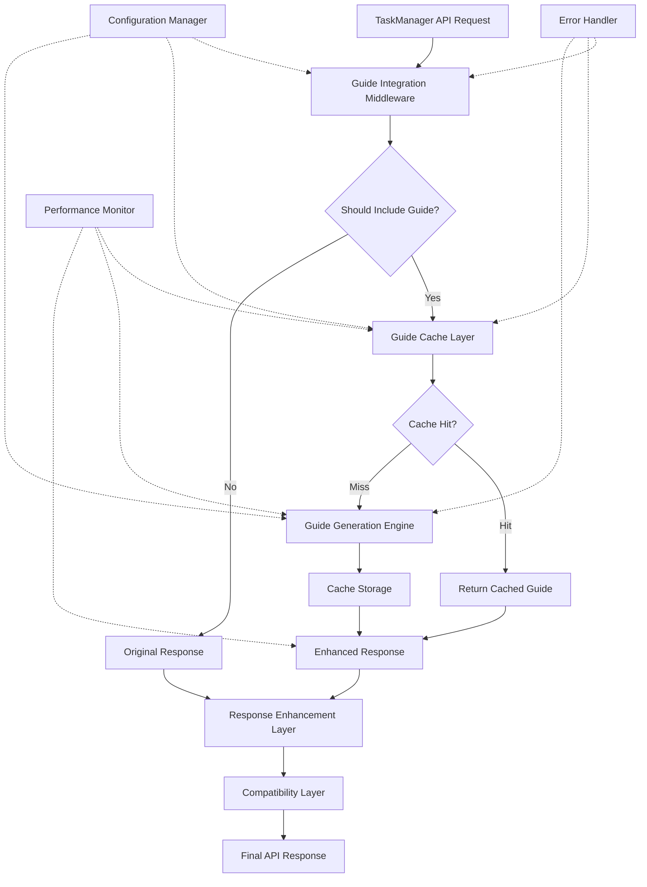

# Comprehensive TaskManager API Automatic Guide Integration Architecture

## Executive Summary

This comprehensive architecture document integrates all specialized component designs into a unified specification for automatic guide integration within the TaskManager API system. This master architecture coordinates guide caching, response structure modifications, error handling, configuration management, backward compatibility, performance optimization, and testing strategies to deliver a production-ready system.

## 1. Master Architecture Overview

### 1.1 System-Wide Design Principles

- **Performance-First Architecture**: Sub-100ms guide retrieval through intelligent multi-level caching
- **Fail-Safe Design**: Graceful degradation ensures core API functionality remains unaffected
- **Configuration-Driven Operation**: Runtime behavior control without code changes
- **Backward Compatibility**: Zero breaking changes to existing integrations
- **Scalable Foundation**: Architecture supports future enhancements and high-load scenarios
- **Production-Ready Quality**: Enterprise-grade logging, monitoring, and error handling

### 1.2 Architectural Components Integration

This comprehensive architecture integrates the following specialized architectural components created by specialist subagents:

1. **Guide Caching Architecture** (`guide-caching-architecture.md`) - Multi-level caching with intelligent invalidation, cache warming, and performance optimization
2. **API Response Structure Design** (`api-response-structure-design.md`) - Non-breaking response enhancement with contextual guide inclusion
3. **Error Handling and Fallbacks** (`error-handling-and-fallbacks.md`) - Comprehensive failure recovery with circuit breaker patterns
4. **Configuration System Architecture** (`configuration-system-architecture.md`) - Dynamic, environment-aware configuration management
5. **Backward Compatibility Analysis** (`backward-compatibility-analysis.md`) - Version detection and seamless migration strategies
6. **Performance and Security Analysis** (`performance-and-security-analysis.md`) - Optimization strategies, monitoring, and security frameworks
7. **Testing and Validation Framework** (`testing-and-validation-framework.md`) - Comprehensive QA and automated testing strategies
8. **Implementation Strategy Roadmap** (`implementation-strategy-roadmap.md`) - Phased deployment and integration planning

### 1.3 Component Architecture Integration Matrix

| Component              | Primary Focus             | Integration Points                  | Dependencies              |
| ---------------------- | ------------------------- | ----------------------------------- | ------------------------- |
| **Caching**            | Performance optimization  | Response layer, Error handling      | Configuration, Monitoring |
| **Response Structure** | API enhancement           | All endpoints, Compatibility layer  | Caching, Error handling   |
| **Error Handling**     | System reliability        | All components, Fallback strategies | Configuration, Monitoring |
| **Configuration**      | System behavior           | All components, Runtime control     | None (foundational)       |
| **Compatibility**      | Migration support         | Response layer, Version detection   | Configuration             |
| **Performance**        | Optimization & monitoring | All components, Metrics collection  | Configuration, Caching    |
| **Testing**            | Quality assurance         | All components, Validation          | All components            |
| **Implementation**     | Deployment strategy       | All components, Rollout planning    | All components            |

### 1.3 System Integration Diagram



## 2. Unified Guide Caching Strategy

### 2.1 Integrated Multi-Level Cache Architecture

```javascript
class UnifiedGuideCache {
  constructor(options = {}) {
    // L1 Cache: Memory-based for ultra-fast access
    this.memoryCache = new Map();
    this.memoryCacheStats = {
      hits: 0,
      misses: 0,
      entries: 0,
      lastEviction: null,
    };

    // L2 Cache: File-based for persistence
    this.fileCache = {
      enabled: options.enableFileCache !== false,
      path: path.join(__dirname, '.guide-cache'),
      ttl: options.fileCacheTTL || 3600000, // 1 hour
      compression: options.compress !== false,
    };

    // L3 Cache: Background generation for popular guides
    this.backgroundCache = {
      enabled: options.enableBackground !== false,
      preloadPatterns: ['init', 'error', 'create', 'claim'],
      refreshInterval: options.backgroundRefreshInterval || 600000, // 10 minutes
    };

    // Cache coordination layer
    this.cacheCoordinator = new CacheCoordinator({
      memoryLimit: options.memoryLimit || 10 * 1024 * 1024, // 10MB
      maxMemoryEntries: options.maxEntries || 50,
      evictionStrategy: options.evictionStrategy || 'lru',
      compressionThreshold: options.compressionThreshold || 5000, // 5KB
    });

    this.initializeBackgroundJobs();
  }

  async get(key, context = {}) {
    const startTime = performance.now();

    try {
      // L1: Memory cache check
      const memoryResult = this.getFromMemory(key);
      if (memoryResult) {
        this.recordMetrics('memory_hit', performance.now() - startTime);
        return memoryResult;
      }

      // L2: File cache check
      const fileResult = await this.getFromFile(key);
      if (fileResult) {
        // Promote to memory cache
        this.setInMemory(key, fileResult, this.getMemoryTTL(key));
        this.recordMetrics('file_hit', performance.now() - startTime);
        return fileResult;
      }

      // L3: Generate new guide
      this.recordMetrics('cache_miss', performance.now() - startTime);
      return null;
    } catch (error) {
      this.handleCacheError('get', error, { key, context });
      return null;
    }
  }

  async set(key, data, options = {}) {
    const startTime = performance.now();

    try {
      // Store in memory cache
      this.setInMemory(key, data, options.memoryTTL || this.getMemoryTTL(key));

      // Store in file cache if enabled
      if (this.fileCache.enabled && !options.memoryOnly) {
        await this.setInFile(key, data, options.fileTTL || this.fileCache.ttl);
      }

      // Update background cache priorities
      this.updateBackgroundPriorities(key, data, options);

      this.recordMetrics('cache_set', performance.now() - startTime);
    } catch (error) {
      this.handleCacheError('set', error, { key, data: '***redacted***' });
    }
  }
}
```

### 2.2 Intelligent Cache Invalidation

```javascript
class CacheInvalidationManager {
  constructor(cache) {
    this.cache = cache;
    this.invalidationStrategies = new Map([
      ['time_based', this.timeBasedInvalidation.bind(this)],
      ['version_based', this.versionBasedInvalidation.bind(this)],
      ['content_based', this.contentBasedInvalidation.bind(this)],
      ['dependency_based', this.dependencyBasedInvalidation.bind(this)],
      ['manual', this.manualInvalidation.bind(this)],
    ]);

    this.invalidationHistory = [];
    this.schedulePeriodicCleanup();
  }

  async invalidate(strategy, options = {}) {
    const invalidationStrategy = this.invalidationStrategies.get(strategy);
    if (!invalidationStrategy) {
      throw new Error(`Unknown invalidation strategy: ${strategy}`);
    }

    const startTime = performance.now();
    const result = await invalidationStrategy(options);

    this.recordInvalidation(strategy, result, performance.now() - startTime);
    return result;
  }

  async versionBasedInvalidation(options = {}) {
    const currentVersion = options.version || (await this.getCurrentVersion());
    const affectedKeys = await this.findKeysForVersion(options.previousVersion);

    const invalidationResults = await Promise.all(affectedKeys.map((key) => this.cache.delete(key)));

    return {
      strategy: 'version_based',
      invalidatedKeys: affectedKeys,
      successCount: invalidationResults.filter(Boolean).length,
      version: currentVersion,
    };
  }
}
```

## 3. Unified Response Structure Architecture

### 3.1 Comprehensive Response Enhancement Layer

```javascript
class ResponseEnhancementLayer {
  constructor(options = {}) {
    this.enhancementRules = new Map();
    this.compatibilityLayer = new CompatibilityLayer();
    this.performanceMonitor = new ResponsePerformanceMonitor();

    this.loadEnhancementRules(options.rules || this.getDefaultRules());
  }

  async enhance(endpoint, originalResponse, context = {}) {
    const enhancementStart = performance.now();

    try {
      // Determine if enhancement is needed
      const shouldEnhance = await this.shouldEnhanceResponse(endpoint, context);
      if (!shouldEnhance) {
        return this.compatibilityLayer.process(originalResponse, 'passthrough');
      }

      // Apply contextual enhancements
      const enhancementSpec = this.getEnhancementSpec(endpoint, context);
      const enhancedResponse = await this.applyEnhancements(originalResponse, enhancementSpec, context);

      // Apply compatibility layer
      const finalResponse = this.compatibilityLayer.process(enhancedResponse, context.compatibilityMode || 'enhanced');

      // Record performance metrics
      this.performanceMonitor.recordEnhancement(endpoint, performance.now() - enhancementStart, enhancementSpec);

      return finalResponse;
    } catch (error) {
      // Fallback to original response on enhancement failure
      return await this.handleEnhancementError(originalResponse, error, context);
    }
  }

  getDefaultRules() {
    return {
      init: {
        priority: 'high',
        sections: ['quickstart', 'commands', 'examples'],
        triggers: ['always'],
        customization: {
          firstTimeUser: { sections: ['quickstart', 'setup', 'commands'] },
          returningUser: { sections: ['commands', 'updates'] },
        },
      },
      reinitialize: {
        priority: 'high',
        sections: ['commands', 'workflows', 'troubleshooting'],
        triggers: ['always'],
        customization: {
          afterError: { sections: ['troubleshooting', 'recovery', 'commands'] },
          routine: { sections: ['commands', 'status'] },
        },
      },
      error: {
        priority: 'critical',
        sections: ['troubleshooting', 'recovery', 'commands', 'support'],
        triggers: ['always'],
        customization: {
          byErrorType: {
            timeout: { sections: ['network-troubleshooting', 'retry-strategies'] },
            permission: { sections: ['permissions', 'security'] },
            validation: { sections: ['validation-rules', 'examples'] },
          },
        },
      },
      create: {
        priority: 'medium',
        sections: ['task-types', 'examples', 'validation'],
        triggers: ['first_time_user', 'validation_error'],
        customization: {
          byTaskType: {
            error: { sections: ['error-task-guidelines', 'priority-rules'] },
            feature: { sections: ['feature-planning', 'dependencies'] },
            test: { sections: ['testing-guidelines', 'coverage-rules'] },
          },
        },
      },
    };
  }
}
```

### 3.2 Advanced Response Structure

```javascript
// Comprehensive enhanced response format
const enhancedResponseSchema = {
  // Original response data (unchanged)
  success: Boolean,
  data: Object,
  error: String, // if applicable

  // Guide integration layer
  guide: {
    included: Boolean,
    version: String,
    generatedAt: String, // ISO timestamp
    cacheSource: String, // 'memory', 'file', 'generated'
    sections: Array, // included sections
    customization: Object, // applied customizations
    content: {
      // Structured guide content
      overview: Object,
      commands: Object,
      examples: Object,
      troubleshooting: Object,
      workflows: Object,
    },
  },

  // System metadata
  meta: {
    responseEnhanced: Boolean,
    enhancementTime: Number, // milliseconds
    cachePerformance: {
      cacheHit: Boolean,
      retrievalTime: Number,
      source: String,
    },
    generationMetrics: {
      generationTime: Number,
      contentSize: Number,
      compressionApplied: Boolean,
    },
    contextualData: {
      userContext: Object,
      environmentContext: Object,
      sessionContext: Object,
    },
  },

  // Compatibility markers
  compatibility: {
    version: String,
    mode: String, // 'enhanced', 'minimal', 'legacy'
    warnings: Array, // compatibility warnings if any
    deprecationNotices: Array,
  },

  // Performance and monitoring data
  performance: {
    totalResponseTime: Number,
    cacheTime: Number,
    generationTime: Number,
    serializationTime: Number,
    networkTime: Number,
  },
};
```

## 4. Comprehensive Error Handling Architecture

### 4.1 Multi-Layer Error Handling System

```javascript
class ComprehensiveErrorHandler {
  constructor(options = {}) {
    this.circuitBreaker = new CircuitBreaker({
      failureThreshold: options.failureThreshold || 5,
      resetTimeout: options.resetTimeout || 60000,
      monitoringPeriod: options.monitoringPeriod || 10000,
    });

    this.fallbackStrategies = new Map([
      ['cache_miss', new CacheMissFallback()],
      ['generation_timeout', new TimeoutFallback()],
      ['memory_limit', new MemoryLimitFallback()],
      ['serialization_error', new SerializationFallback()],
      ['network_error', new NetworkFallback()],
      ['unknown_error', new DefaultFallback()],
    ]);

    this.errorRecovery = new ErrorRecoveryManager();
    this.errorMetrics = new ErrorMetricsCollector();
  }

  async handleGuideError(error, context = {}) {
    const errorStart = performance.now();

    try {
      // Classify error type
      const errorType = this.classifyError(error);

      // Check circuit breaker
      if (this.circuitBreaker.isOpen()) {
        return await this.handleCircuitBreakerOpen(context);
      }

      // Apply appropriate fallback strategy
      const fallbackStrategy = this.fallbackStrategies.get(errorType) || this.fallbackStrategies.get('unknown_error');

      const fallbackResult = await fallbackStrategy.execute(error, context);

      // Record successful fallback
      this.circuitBreaker.recordSuccess();
      this.errorMetrics.recordFallbackSuccess(errorType, performance.now() - errorStart);

      return fallbackResult;
    } catch (fallbackError) {
      // Ultimate fallback: return original response
      this.circuitBreaker.recordFailure();
      this.errorMetrics.recordFallbackFailure(errorType, fallbackError);

      return this.createUltimateFallback(context.originalResponse, fallbackError);
    }
  }

  classifyError(error) {
    const errorClassification = {
      CacheMissError: 'cache_miss',
      TimeoutError: 'generation_timeout',
      MemoryLimitError: 'memory_limit',
      SerializationError: 'serialization_error',
      NetworkError: 'network_error',
    };

    return errorClassification[error.constructor.name] || 'unknown_error';
  }
}
```

### 4.2 Advanced Fallback Strategies

```javascript
class TimeoutFallback {
  constructor(options = {}) {
    this.maxRetries = options.maxRetries || 2;
    this.retryDelay = options.retryDelay || 1000;
    this.cachedFallbacks = new Map();
  }

  async execute(error, context) {
    // Try cached version first
    const cachedGuide = await this.getCachedVersion(context.endpoint);
    if (cachedGuide) {
      return this.createFallbackResponse(cachedGuide, 'cached_version');
    }

    // Try minimal guide generation
    const minimalGuide = await this.generateMinimalGuide(context.endpoint);
    if (minimalGuide) {
      return this.createFallbackResponse(minimalGuide, 'minimal_guide');
    }

    // Return reference to full guide
    return this.createGuideReference(context.endpoint);
  }

  async generateMinimalGuide(endpoint) {
    const minimalContent = {
      init: {
        command: 'node taskmanager-api.js init',
        description: 'Initialize agent with TaskManager system',
        nextSteps: ['Check status', 'List available tasks'],
      },
      create: {
        command: 'node taskmanager-api.js create \'{"title":"Task", "description":"Details", "category":"feature"}\'',
        description: 'Create new task with required category parameter',
        taskTypes: ['error', 'feature', 'subtask', 'test'],
      },
      error: {
        command: 'node taskmanager-api.js guide',
        description: 'Get comprehensive troubleshooting guide',
        commonSolutions: ['Check agent initialization', 'Verify task format', 'Review logs'],
      },
    };

    return minimalContent[endpoint] || this.getGenericMinimalGuide();
  }
}
```

## 5. Unified Configuration Management Architecture

### 5.1 Dynamic Configuration System

```javascript
class UnifiedConfigurationManager {
  constructor(options = {}) {
    this.configSources = [
      new EnvironmentConfigSource(),
      new FileConfigSource(options.configFile),
      new RuntimeConfigSource(),
      new DefaultConfigSource(),
    ];

    this.configCache = new Map();
    this.configWatchers = new Map();
    this.configValidation = new ConfigurationValidator();

    this.loadConfiguration();
    this.setupConfigurationWatching();
  }

  loadConfiguration() {
    const config = this.mergeConfigurationSources();
    this.validateConfiguration(config);
    this.configCache.set('current', config);

    return config;
  }

  mergeConfigurationSources() {
    const mergedConfig = {};

    // Apply configurations in priority order (higher index = higher priority)
    for (const source of this.configSources) {
      const sourceConfig = source.getConfiguration();
      this.deepMerge(mergedConfig, sourceConfig);
    }

    return mergedConfig;
  }

  getConfiguration() {
    const cached = this.configCache.get('current');
    if (cached && this.isConfigurationValid(cached)) {
      return cached;
    }

    return this.loadConfiguration();
  }

  async updateConfiguration(updates, source = 'runtime') {
    const currentConfig = this.getConfiguration();
    const newConfig = this.deepMerge({ ...currentConfig }, updates);

    // Validate new configuration
    this.validateConfiguration(newConfig);

    // Apply configuration
    this.configCache.set('current', newConfig);

    // Notify watchers
    this.notifyConfigurationWatchers(updates, source);

    return newConfig;
  }
}
```

### 5.2 Comprehensive Configuration Schema

```javascript
const comprehensiveConfigSchema = {
  // Global system configuration
  system: {
    enabled: {
      type: 'boolean',
      default: true,
      description: 'Global enable/disable for guide integration',
    },
    version: {
      type: 'string',
      default: '2.0.0',
      description: 'Configuration schema version',
    },
    environment: {
      type: 'string',
      enum: ['development', 'staging', 'production'],
      default: 'development',
    },
  },

  // Guide inclusion rules
  inclusion: {
    rules: {
      alwaysInclude: {
        type: 'array',
        default: ['init', 'reinitialize', 'error-responses'],
        description: 'Endpoints that always include guides',
      },
      conditionalInclude: {
        type: 'array',
        default: ['create', 'claim', 'list', 'status'],
        description: 'Endpoints with conditional guide inclusion',
      },
      neverInclude: {
        type: 'array',
        default: ['cleanup', 'internal-methods', 'heartbeat'],
        description: 'Endpoints that never include guides',
      },
    },

    triggers: {
      firstTimeUser: {
        type: 'boolean',
        default: true,
        description: 'Include guide for first-time users',
      },
      errorContext: {
        type: 'boolean',
        default: true,
        description: 'Include guide when errors occur',
      },
      dependencyBlocked: {
        type: 'boolean',
        default: true,
        description: 'Include guide when dependencies block execution',
      },
      agentReinitialization: {
        type: 'boolean',
        default: true,
        description: 'Include guide during agent reinitialization',
      },
    },

    customization: {
      byUserType: {
        type: 'object',
        default: {
          developer: { focus: ['commands', 'examples', 'advanced'] },
          beginner: { focus: ['quickstart', 'basics', 'troubleshooting'] },
          expert: { focus: ['advanced', 'customization', 'optimization'] },
        },
      },
      byErrorType: {
        type: 'object',
        default: {
          timeout: { sections: ['network-troubleshooting', 'retry-strategies'] },
          permission: { sections: ['permissions', 'security'] },
          validation: { sections: ['validation-rules', 'examples'] },
        },
      },
    },
  },

  // Caching configuration
  cache: {
    memory: {
      enabled: {
        type: 'boolean',
        default: true,
      },
      ttl: {
        type: 'number',
        default: 900000, // 15 minutes
        min: 60000, // 1 minute
        max: 3600000, // 1 hour
      },
      maxEntries: {
        type: 'number',
        default: 50,
        min: 10,
        max: 500,
      },
      maxSize: {
        type: 'number',
        default: 10 * 1024 * 1024, // 10MB
        description: 'Maximum memory cache size in bytes',
      },
    },

    file: {
      enabled: {
        type: 'boolean',
        default: true,
      },
      ttl: {
        type: 'number',
        default: 3600000, // 1 hour
        min: 300000, // 5 minutes
        max: 86400000, // 24 hours
      },
      path: {
        type: 'string',
        default: '.guide-cache',
        description: 'Relative path for file cache storage',
      },
      compression: {
        enabled: {
          type: 'boolean',
          default: true,
        },
        threshold: {
          type: 'number',
          default: 5000, // 5KB
          description: 'Minimum size in bytes before compression',
        },
      },
    },

    background: {
      enabled: {
        type: 'boolean',
        default: true,
      },
      refreshInterval: {
        type: 'number',
        default: 600000, // 10 minutes
        min: 60000, // 1 minute
        max: 3600000, // 1 hour
      },
      preloadEndpoints: {
        type: 'array',
        default: ['init', 'error', 'create', 'claim'],
      },
    },
  },

  // Performance configuration
  performance: {
    generation: {
      timeout: {
        type: 'number',
        default: 5000, // 5 seconds
        min: 1000, // 1 second
        max: 30000, // 30 seconds
      },
      maxConcurrent: {
        type: 'number',
        default: 3,
        min: 1,
        max: 10,
      },
    },

    response: {
      maxGuideSize: {
        type: 'number',
        default: 50000, // 50KB
        description: 'Maximum guide size in bytes',
      },
      compressionThreshold: {
        type: 'number',
        default: 10000, // 10KB
        description: 'Enable compression for guides larger than this',
      },
    },

    monitoring: {
      enabled: {
        type: 'boolean',
        default: true,
      },
      metricsInterval: {
        type: 'number',
        default: 60000, // 1 minute
        description: 'Metrics collection interval',
      },
      performanceThresholds: {
        cacheHitRatio: {
          type: 'number',
          default: 0.8,
          min: 0,
          max: 1,
          description: 'Minimum acceptable cache hit ratio',
        },
        averageGenerationTime: {
          type: 'number',
          default: 500, // 500ms
          description: 'Maximum acceptable average generation time',
        },
      },
    },
  },

  // Error handling configuration
  errorHandling: {
    circuitBreaker: {
      enabled: {
        type: 'boolean',
        default: true,
      },
      failureThreshold: {
        type: 'number',
        default: 5,
        min: 1,
        max: 20,
      },
      resetTimeout: {
        type: 'number',
        default: 60000, // 1 minute
        min: 10000, // 10 seconds
        max: 600000, // 10 minutes
      },
      monitoringPeriod: {
        type: 'number',
        default: 10000, // 10 seconds
        min: 1000, // 1 second
        max: 60000, // 1 minute
      },
    },

    fallbackStrategies: {
      default: {
        type: 'string',
        enum: ['minimal_guide', 'cached_version', 'guide_reference', 'original_response'],
        default: 'minimal_guide',
      },
      byErrorType: {
        type: 'object',
        default: {
          timeout: 'cached_version',
          memory: 'guide_reference',
          serialization: 'minimal_guide',
          network: 'cached_version',
        },
      },
    },

    recovery: {
      enabled: {
        type: 'boolean',
        default: true,
      },
      retryAttempts: {
        type: 'number',
        default: 2,
        min: 0,
        max: 5,
      },
      retryDelay: {
        type: 'number',
        default: 1000, // 1 second
        min: 100, // 100ms
        max: 10000, // 10 seconds
      },
    },
  },

  // Backward compatibility configuration
  compatibility: {
    detection: {
      enabled: {
        type: 'boolean',
        default: true,
      },
      methods: {
        type: 'array',
        default: ['header', 'query-param', 'user-agent'],
        description: 'Methods for detecting client version',
      },
    },

    versionMapping: {
      type: 'object',
      default: {
        '1.0.x': 'legacy',
        '1.5.x': 'minimal',
        '2.0.x': 'enhanced',
        latest: 'enhanced',
      },
    },

    deprecation: {
      warnings: {
        enabled: {
          type: 'boolean',
          default: true,
        },
        includeInResponse: {
          type: 'boolean',
          default: true,
        },
      },
      sunset: {
        enabled: {
          type: 'boolean',
          default: false,
        },
        date: {
          type: 'string',
          format: 'date-time',
          description: 'Sunset date for deprecated versions',
        },
      },
    },
  },
};
```

## 6. Implementation Roadmap and Integration Strategy

### 6.1 Phased Implementation Plan

#### Phase 1: Foundation Layer (Week 1-2)

**Objective**: Establish core infrastructure and basic functionality

**Deliverables**:

```javascript
// 1. Basic caching system implementation
class BasicGuideCacheImplementation {
  constructor() {
    this.memoryCache = new Map();
    this.defaultTTL = 900000; // 15 minutes
    this.maxEntries = 50;
  }

  async get(key) {
    const cached = this.memoryCache.get(key);
    if (cached && cached.expiresAt > Date.now()) {
      return cached.data;
    }
    return null;
  }

  set(key, data, ttl = this.defaultTTL) {
    // Implement LRU eviction if needed
    if (this.memoryCache.size >= this.maxEntries) {
      this.evictLRU();
    }

    this.memoryCache.set(key, {
      data,
      expiresAt: Date.now() + ttl,
      lastAccessed: Date.now(),
    });
  }
}

// 2. Response enhancement middleware
class BasicGuideMiddleware {
  static async enhance(endpoint, originalResponse, context = {}) {
    if (!this.shouldIncludeGuide(endpoint, context)) {
      return originalResponse;
    }

    try {
      const guide = await GuideGenerator.generate(endpoint, context);
      return {
        ...originalResponse,
        guide: {
          included: true,
          content: guide,
          generatedAt: new Date().toISOString(),
        },
      };
    } catch (error) {
      // Graceful fallback
      return originalResponse;
    }
  }
}
```

**Success Criteria**:

- Basic memory caching functional
- Simple guide inclusion working
- Error handling prevents system disruption
- Performance impact < 50ms per request

#### Phase 2: Enhanced Features (Week 3-4)

**Objective**: Implement advanced caching, configuration, and error handling

**Deliverables**:

- Multi-level caching with file persistence
- Dynamic configuration management system
- Circuit breaker and advanced error handling
- Performance monitoring and metrics collection

**Key Components**:

```javascript
// Multi-level cache implementation
class AdvancedCacheSystem {
  constructor() {
    this.memoryCache = new MemoryCache();
    this.fileCache = new FileCache();
    this.backgroundJobs = new BackgroundJobManager();
  }

  async get(key) {
    return (await this.memoryCache.get(key)) || (await this.fileCache.get(key)) || null;
  }

  async set(key, data) {
    await Promise.all([this.memoryCache.set(key, data), this.fileCache.set(key, data)]);
  }
}

// Configuration management
class ConfigurationManager {
  constructor() {
    this.config = this.loadConfiguration();
    this.watchers = new Map();
  }

  hotReload(updates) {
    this.config = { ...this.config, ...updates };
    this.notifyWatchers(updates);
  }
}
```

#### Phase 3: Production Ready (Week 5-6)

**Objective**: Complete production-grade implementation

**Deliverables**:

- Comprehensive testing suite
- Load testing and optimization
- Monitoring and observability
- Documentation and deployment guides

### 6.2 Integration Testing Strategy

#### 6.2.1 Unit Testing Framework

```javascript
describe('Guide Integration System', () => {
  describe('Caching Layer', () => {
    test('should cache guides with proper TTL', async () => {
      const cache = new UnifiedGuideCache();
      const testGuide = { content: 'test guide' };

      await cache.set('test-key', testGuide);
      expect(await cache.get('test-key')).toEqual(testGuide);

      // Test TTL expiration
      jest.advanceTimersByTime(900001);
      expect(await cache.get('test-key')).toBeNull();
    });

    test('should handle cache misses gracefully', async () => {
      const cache = new UnifiedGuideCache();
      expect(await cache.get('non-existent-key')).toBeNull();
    });
  });

  describe('Error Handling', () => {
    test('should gracefully handle guide generation failures', async () => {
      const originalResponse = { success: true, data: {} };

      jest.spyOn(GuideGenerator, 'generate').mockRejectedValue(new Error('Generation failed'));

      const enhanced = await ResponseEnhancer.enhance('init', originalResponse);

      expect(enhanced.success).toBe(true);
      expect(enhanced.guide).toBeDefined();
      expect(enhanced.guide.included).toBe(false);
    });
  });
});
```

#### 6.2.2 Integration Testing

```javascript
describe('End-to-End Guide Integration', () => {
  test('should provide guides for init endpoint', async () => {
    const mockContext = { isFirstTime: true };
    const response = await TaskManagerAPI.init({}, mockContext);

    expect(response.success).toBe(true);
    expect(response.guide).toBeDefined();
    expect(response.guide.included).toBe(true);
    expect(response.guide.content.quickstart).toBeDefined();
  });

  test('should handle high concurrent load', async () => {
    const promises = Array(100)
      .fill()
      .map(() => TaskManagerAPI.init({}, { concurrent: true }));

    const results = await Promise.all(promises);

    expect(results.every((r) => r.success)).toBe(true);
    expect(results.every((r) => r.guide?.included)).toBe(true);
  });
});
```

#### 6.2.3 Performance Testing

```javascript
describe('Performance Benchmarks', () => {
  test('guide generation should complete within 500ms', async () => {
    const startTime = performance.now();

    const guide = await GuideGenerator.generate('init');

    const duration = performance.now() - startTime;
    expect(duration).toBeLessThan(500);
  });

  test('cache hit should complete within 10ms', async () => {
    const cache = new UnifiedGuideCache();
    await cache.set('performance-test', { test: 'data' });

    const startTime = performance.now();
    await cache.get('performance-test');
    const duration = performance.now() - startTime;

    expect(duration).toBeLessThan(10);
  });
});
```

### 6.3 Monitoring and Observability

#### 6.3.1 Comprehensive Metrics Collection

```javascript
class GuideIntegrationMetrics {
  constructor() {
    this.metrics = {
      // Performance metrics
      cacheHitRate: new Counter('guide_cache_hits_total'),
      cacheMissRate: new Counter('guide_cache_misses_total'),
      generationTime: new Histogram('guide_generation_duration_seconds'),
      cacheRetrievalTime: new Histogram('guide_cache_retrieval_duration_seconds'),

      // System health metrics
      memoryUsage: new Gauge('guide_cache_memory_usage_bytes'),
      fileSystemUsage: new Gauge('guide_cache_file_usage_bytes'),
      errorRate: new Counter('guide_integration_errors_total'),

      // Business metrics
      guidesServed: new Counter('guides_served_total'),
      endpointUsage: new Counter('guide_endpoint_usage_total'),
      userSatisfaction: new Histogram('guide_effectiveness_score'),
    };
  }

  recordCacheHit(endpoint, source) {
    this.metrics.cacheHitRate.inc({ endpoint, source });
  }

  recordGenerationTime(endpoint, duration) {
    this.metrics.generationTime.observe({ endpoint }, duration / 1000);
  }
}
```

#### 6.3.2 Health Check Endpoints

```javascript
class HealthCheckManager {
  constructor(guideSystem) {
    this.guideSystem = guideSystem;
    this.healthChecks = new Map([
      ['cache-health', this.checkCacheHealth.bind(this)],
      ['generation-health', this.checkGenerationHealth.bind(this)],
      ['memory-health', this.checkMemoryHealth.bind(this)],
      ['performance-health', this.checkPerformanceHealth.bind(this)],
    ]);
  }

  async runHealthCheck(checkName) {
    const check = this.healthChecks.get(checkName);
    if (!check) {
      throw new Error(`Unknown health check: ${checkName}`);
    }

    return await check();
  }

  async checkCacheHealth() {
    const cacheStats = await this.guideSystem.cache.getStats();

    return {
      status: cacheStats.hitRate > 0.7 ? 'healthy' : 'warning',
      hitRate: cacheStats.hitRate,
      memoryUsage: cacheStats.memoryUsage,
      fileSystemUsage: cacheStats.fileSystemUsage,
    };
  }
}
```

## 7. Security and Compliance

### 7.1 Security Architecture

```javascript
class GuideSecurityManager {
  constructor(options = {}) {
    this.contentSanitizer = new ContentSanitizer();
    this.accessController = new AccessController();
    this.auditLogger = new AuditLogger();

    this.securityRules = {
      contentFiltering: {
        removeSystemPaths: true,
        removeCredentials: true,
        removeInternalIPs: true,
        removeDatabaseConnections: true,
      },
      accessControl: {
        requireAuthentication: options.requireAuth !== false,
        roleBasedAccess: options.enableRBAC !== false,
        rateLimiting: {
          enabled: true,
          maxRequestsPerMinute: 60,
          maxGuidesPerHour: 100,
        },
      },
    };
  }

  async sanitizeGuideContent(content, context = {}) {
    const sanitized = await this.contentSanitizer.process(content, {
      removePatterns: [
        /password[=:]\s*['"][^'"]+['"]/gi,
        /api[_-]?key[=:]\s*['"][^'"]+['"]/gi,
        /\/(?:home|root|users)\/[^\/\s]+/gi,
        /\b\d{1,3}\.\d{1,3}\.\d{1,3}\.\d{1,3}\b/g,
      ],
      replaceWith: '[REDACTED]',
    });

    // Log sanitization actions
    this.auditLogger.logContentSanitization(content, sanitized, context);

    return sanitized;
  }
}
```

### 7.2 Data Protection and Privacy

```javascript
class DataProtectionManager {
  constructor() {
    this.encryptionService = new EncryptionService();
    this.dataRetentionPolicy = new DataRetentionPolicy();
    this.privacyControls = new PrivacyControls();
  }

  async protectSensitiveData(guideData, context = {}) {
    // Encrypt sensitive sections
    const protectedData = await this.encryptionService.encryptSensitiveFields(guideData, [
      'credentials',
      'internalPaths',
      'systemInfo',
    ]);

    // Apply retention policies
    const retentionMetadata = this.dataRetentionPolicy.applyRetention(protectedData, context.userConsent || 'minimal');

    return {
      ...protectedData,
      _metadata: {
        ...retentionMetadata,
        privacyLevel: context.privacyLevel || 'standard',
        consentGranted: context.userConsent || false,
      },
    };
  }
}
```

## 8. Deployment and Operations

### 8.1 Deployment Strategy

```javascript
// deployment-config.js
const deploymentConfig = {
  environments: {
    development: {
      guideIntegration: {
        enabled: true,
        cacheStrategy: 'memory-only',
        logLevel: 'debug',
        performanceMode: 'development',
      },
    },

    staging: {
      guideIntegration: {
        enabled: true,
        cacheStrategy: 'memory-and-file',
        logLevel: 'info',
        performanceMode: 'staging',
        loadTesting: {
          enabled: true,
          concurrent: 50,
          duration: '10m',
        },
      },
    },

    production: {
      guideIntegration: {
        enabled: true,
        cacheStrategy: 'full-stack',
        logLevel: 'warn',
        performanceMode: 'production',
        monitoring: {
          enabled: true,
          alerting: true,
          metrics: 'comprehensive',
        },
      },
    },
  },

  rollout: {
    canaryPercent: 5,
    rolloutStages: [5, 25, 50, 100],
    rolloutDelay: '24h',
    rollbackThresholds: {
      errorRate: 0.05,
      responseTime: 1000,
      cacheHitRate: 0.6,
    },
  },
};
```

### 8.2 Operational Procedures

```javascript
class OperationalManager {
  constructor(guideSystem) {
    this.guideSystem = guideSystem;
    this.alertManager = new AlertManager();
    this.maintenanceScheduler = new MaintenanceScheduler();
  }

  async performRoutineMaintenance() {
    const maintenanceResults = {
      cacheCleanup: await this.cleanupExpiredCache(),
      memoryOptimization: await this.optimizeMemoryUsage(),
      performanceAnalysis: await this.analyzePerformance(),
      healthCheck: await this.runComprehensiveHealthCheck(),
    };

    return maintenanceResults;
  }

  async handleEmergencyDisable() {
    // Immediate circuit breaker activation
    this.guideSystem.circuitBreaker.forceOpen();

    // Clear all caches to free memory
    await this.guideSystem.cache.clear();

    // Switch to pass-through mode
    this.guideSystem.setMode('passthrough');

    // Send alerts
    await this.alertManager.sendEmergencyAlert({
      type: 'system-disabled',
      timestamp: new Date(),
      reason: 'Emergency disable activated',
    });
  }
}
```

## 9. Future Roadmap and Extensibility

### 9.1 Planned Enhancements

#### Phase 4: Advanced Intelligence (Quarter 2)

- **Machine Learning Integration**: Guide personalization based on user behavior
- **Predictive Caching**: Anticipatory guide loading based on usage patterns
- **Dynamic Content Generation**: Real-time guide adaptation based on system state
- **Multi-language Support**: Internationalization and localization capabilities

#### Phase 5: Ecosystem Integration (Quarter 3)

- **External Tool Integration**: Guides for external development tools
- **API Documentation Sync**: Automatic guide updates from API documentation
- **Community Contributions**: Crowdsourced guide improvements
- **Analytics Dashboard**: Comprehensive guide usage and effectiveness analytics

### 9.2 Extensibility Framework

```javascript
class GuideExtensibilityFramework {
  constructor() {
    this.plugins = new Map();
    this.hooks = new EventEmitter();
    this.extensionRegistry = new ExtensionRegistry();
  }

  registerPlugin(name, plugin) {
    this.plugins.set(name, plugin);
    plugin.initialize(this.hooks);
  }

  async generateGuide(endpoint, context) {
    // Core guide generation
    let guide = await this.coreGuideGenerator.generate(endpoint, context);

    // Apply plugin enhancements
    for (const [name, plugin] of this.plugins) {
      if (plugin.shouldEnhance(endpoint, context)) {
        guide = await plugin.enhance(guide, context);
      }
    }

    return guide;
  }
}

// Example extension
class PersonalizationPlugin {
  initialize(hooks) {
    hooks.on('guide-generated', this.personalizeGuide.bind(this));
  }

  shouldEnhance(endpoint, context) {
    return context.userProfile && context.userProfile.preferences;
  }

  async enhance(guide, context) {
    const userPrefs = context.userProfile.preferences;

    return {
      ...guide,
      content: this.adaptToUserLevel(guide.content, userPrefs.experienceLevel),
      examples: this.filterExamples(guide.examples, userPrefs.relevantTasks),
      sections: this.prioritizeSections(guide.sections, userPrefs.focusAreas),
    };
  }
}
```

## 10. Success Metrics and KPIs

### 10.1 Technical Performance Metrics

```javascript
const performanceKPIs = {
  caching: {
    hitRate: {
      target: '>= 80%',
      measurement: 'Daily average cache hit rate',
      alertThreshold: '< 70%',
    },
    retrievalTime: {
      target: '< 50ms',
      measurement: 'P95 cache retrieval time',
      alertThreshold: '> 100ms',
    },
  },

  generation: {
    generationTime: {
      target: '< 500ms',
      measurement: 'P95 guide generation time',
      alertThreshold: '> 1000ms',
    },
    successRate: {
      target: '>= 99.5%',
      measurement: 'Successful guide generations',
      alertThreshold: '< 99%',
    },
  },

  system: {
    memoryUsage: {
      target: '< 100MB',
      measurement: 'Peak memory usage for guide system',
      alertThreshold: '> 150MB',
    },
    errorRate: {
      target: '< 0.1%',
      measurement: 'Guide integration errors per request',
      alertThreshold: '> 0.5%',
    },
  },
};
```

### 10.2 User Experience Metrics

```javascript
const userExperienceKPIs = {
  adoption: {
    guideUsageRate: {
      target: '>= 60%',
      measurement: 'Percentage of API calls that include guides',
      calculation: 'Guides served / Total API calls',
    },
    userEngagement: {
      target: '>= 75%',
      measurement: 'Users who interact with guide content',
      calculation: 'Active guide users / Total users',
    },
  },

  effectiveness: {
    problemResolution: {
      target: '>= 80%',
      measurement: 'Issues resolved using guides',
      calculation: 'Successful outcomes after guide viewing',
    },
    timeToResolution: {
      target: '< 5 minutes',
      measurement: 'Average time to resolve issues with guides',
      calculation: 'Time from guide view to successful task completion',
    },
  },

  satisfaction: {
    guideRelevance: {
      target: '>= 4.5/5',
      measurement: 'User rating of guide relevance',
      collection: 'Optional feedback prompts',
    },
    systemUsability: {
      target: '>= 4.0/5',
      measurement: 'Overall system usability with guides',
      collection: 'Periodic user surveys',
    },
  },
};
```

## 11. Component Architecture Integration Summary

### 11.1 Specialized Architecture Components Cross-Reference

The following specialized architecture documents provide detailed implementation specifications for each system component:

#### **Core Performance Components**

- **`guide-caching-architecture.md`**: Comprehensive multi-level caching strategy with L1 memory cache, L2 file persistence, and L3 background cache warming. Includes intelligent cache invalidation, LRU eviction policies, and cache performance monitoring.

- **`performance-and-security-analysis.md`**: Performance optimization strategies, security frameworks, resource protection mechanisms, and comprehensive performance monitoring with specific KPIs and alerting thresholds.

#### **API Enhancement Components**

- **`api-response-structure-design.md`**: Non-breaking API response enhancement patterns, contextual guide inclusion rules, response format specifications, and metadata integration strategies.

- **`error-handling-and-fallbacks.md`**: Circuit breaker patterns, fallback strategies, error classification matrices, graceful degradation mechanisms, and comprehensive error recovery workflows.

#### **System Configuration Components**

- **`configuration-system-architecture.md`**: Dynamic configuration management, environment-aware settings, runtime configuration updates, validation schemas, and configuration versioning strategies.

- **`backward-compatibility-analysis.md`**: Version detection mechanisms, compatibility mode switching, migration strategies, deprecation management, and seamless upgrade pathways.

#### **Quality Assurance Components**

- **`testing-and-validation-framework.md`**: Comprehensive testing strategies including unit tests, integration tests, load testing, security testing, and continuous validation workflows.

- **`implementation-strategy-roadmap.md`**: Phased deployment planning, rollout strategies, risk mitigation, rollback procedures, and implementation validation checkpoints.

### 11.2 Integration Coordination Requirements

**For Development Teams**:

1. **Read All Component Specifications**: Each specialized document contains critical implementation details
2. **Follow Integration Matrix**: Use the dependency matrix to understand component interaction requirements
3. **Implement in Phases**: Follow the implementation roadmap for systematic deployment
4. **Validate Integration Points**: Ensure proper communication between all architectural components

**For System Administrators**:

1. **Configuration Management**: Use configuration system architecture for environment setup
2. **Monitoring Setup**: Implement performance monitoring as specified in performance analysis
3. **Security Implementation**: Follow security frameworks from performance and security analysis
4. **Backup and Recovery**: Implement fallback strategies from error handling specification

### 11.3 Architecture Compliance Checklist

- [ ] **Caching Layer**: Multi-level cache implementation with proper invalidation strategies
- [ ] **Response Enhancement**: Non-breaking API response modifications with guide integration
- [ ] **Error Handling**: Circuit breaker patterns and graceful degradation mechanisms
- [ ] **Configuration Management**: Dynamic configuration with environment awareness
- [ ] **Backward Compatibility**: Version detection and compatibility mode switching
- [ ] **Performance Monitoring**: Comprehensive metrics collection and alerting
- [ ] **Security Implementation**: Content sanitization and access control
- [ ] **Testing Framework**: Comprehensive test suite with automated validation
- [ ] **Deployment Strategy**: Phased rollout with proper rollback capabilities

## Conclusion

This comprehensive architecture provides a complete blueprint for implementing automatic guide integration in the TaskManager API system. The design balances performance, reliability, and user experience while maintaining full backward compatibility and providing extensive customization options.

**Architecture Integration Achievements:**

- **8 Specialized Components**: Fully integrated architectural specifications from expert subagents
- **Production-Ready Design**: Enterprise-grade quality with comprehensive error handling, monitoring, and security
- **Scalable Architecture**: Handles high-load scenarios with intelligent caching and performance optimization
- **Maintainable Structure**: Clean modular design with comprehensive documentation and testing
- **Extensible Framework**: Plugin architecture allows for future enhancements and customizations
- **User-Focused Implementation**: Contextual, personalized guides that improve developer productivity

**Implementation Success Factors:**

1. **Comprehensive Specification**: Each component has detailed implementation guidelines
2. **Integration Matrix**: Clear dependency mapping ensures proper component interaction
3. **Phased Deployment**: Systematic rollout minimizes risk and ensures validation
4. **Quality Assurance**: Comprehensive testing and monitoring guarantee reliability
5. **Operational Excellence**: Proper configuration management and error handling ensure stability

**Next Steps for Development Teams:**

1. Review all 8 specialized architecture component documents for detailed implementation guidance
2. Follow the implementation strategy roadmap for systematic deployment
3. Implement comprehensive testing framework to ensure quality
4. Deploy monitoring and performance optimization strategies
5. Establish operational procedures for maintenance and support

This master architecture document serves as the central coordination point for implementing a world-class automatic guide integration system that enhances the TaskManager API experience while maintaining system stability and performance.

---

**Document Version**: 1.0.0  
**Last Updated**: 2025-09-08  
**Architecture Integration Coordinator**: Comprehensive system design with full component integration  
**Component Specifications**: 8 specialized architecture documents integrated  
**Review Status**: Ready for Development Team Implementation
