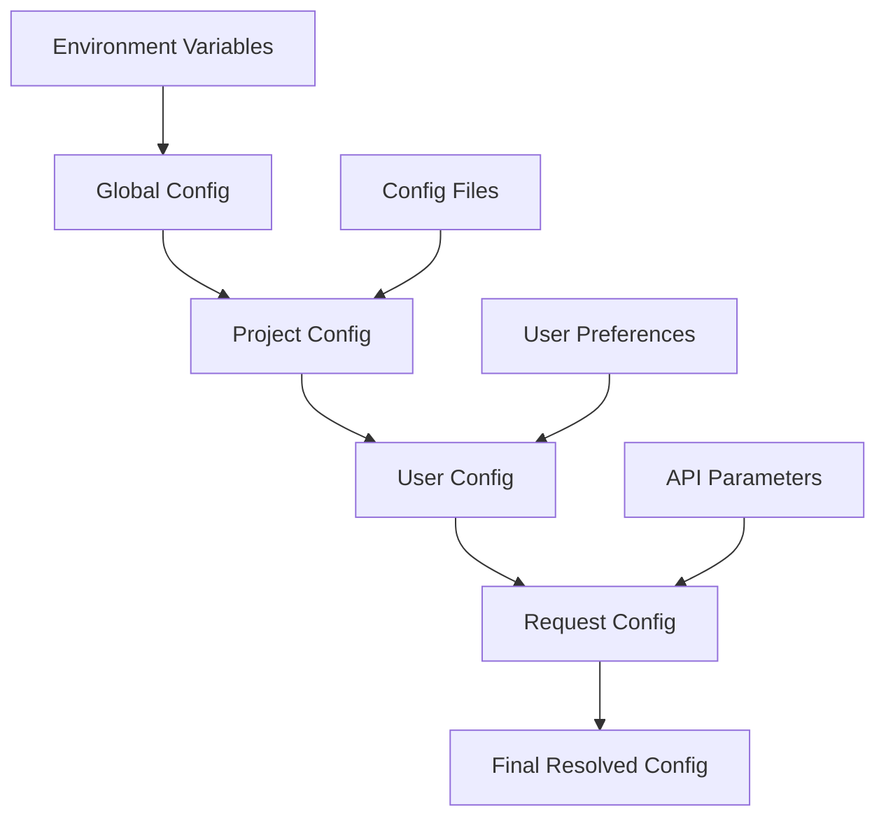

# Configuration System Architecture for TaskManager API

## Executive Summary

This document specifies a comprehensive, hierarchical configuration system for the TaskManager API that provides flexible customization options, automatic guide integration controls, performance tuning capabilities, and robust configuration management. The system supports runtime updates, environment-specific overrides, and maintains backward compatibility while enabling advanced customization for diverse deployment scenarios.

## 1. Architecture Overview

### 1.1 Design Principles

- **Hierarchical Override System**: Global → Project → User → Request level configurations
- **Runtime Configurability**: Hot-reload configuration changes without service restart
- **Type Safety & Validation**: Comprehensive schema validation with detailed error messages
- **Performance First**: Minimal overhead with intelligent caching and lazy loading
- **Environment Awareness**: Automatic environment-specific configuration adaptation
- **Developer Experience**: Clear documentation, sensible defaults, and intuitive configuration structure

### 1.2 Configuration Hierarchy



## 2. Configuration Schema Definition

### 2.1 Complete Configuration Schema

```typescript
interface TaskManagerConfiguration {
  // System-level configuration
  system: {
    version: string;
    environment: 'development' | 'staging' | 'production';
    debug: boolean;
    logLevel: 'error' | 'warn' | 'info' | 'debug' | 'trace';
    timezone: string;
  };

  // Guide integration configuration
  guides: {
    enabled: boolean;
    autoInclude: {
      init: boolean;
      reinitialize: boolean;
      error: boolean;
      taskCreation: boolean;
      dependencies: boolean;
    };
    customization: {
      includeSections: string[];
      excludeSections: string[];
      responseFormat: 'full' | 'compact' | 'reference';
      contextualFiltering: boolean;
      userRoleBasedContent: boolean;
    };
    generation: {
      timeout: number;
      maxSize: number;
      compressionEnabled: boolean;
      backgroundGeneration: boolean;
      preGenerateCommon: boolean;
    };
  };

  // Caching system configuration
  cache: {
    enabled: boolean;
    levels: {
      memory: {
        enabled: boolean;
        ttl: number;
        maxEntries: number;
        evictionPolicy: 'lru' | 'lfu' | 'ttl';
      };
      file: {
        enabled: boolean;
        path: string;
        ttl: number;
        maxSizeBytes: number;
        compressionEnabled: boolean;
      };
      redis: {
        enabled: boolean;
        url: string;
        ttl: number;
        keyPrefix: string;
        maxRetries: number;
      };
    };
    invalidation: {
      strategies: string[];
      webhookUrl?: string;
      versionBased: boolean;
      contentHashBased: boolean;
      manualEndpoints: boolean;
    };
  };

  // Performance tuning configuration
  performance: {
    timeouts: {
      apiOperations: number;
      guideGeneration: number;
      cacheOperations: number;
      databaseQueries: number;
    };
    concurrency: {
      maxConcurrentAgents: number;
      maxConcurrentTasks: number;
      taskClaimingTimeout: number;
      heartbeatInterval: number;
    };
    optimization: {
      enableCircuitBreaker: boolean;
      circuitBreakerThreshold: number;
      circuitBreakerTimeout: number;
      enableBulkOperations: boolean;
      lazyLoadingEnabled: boolean;
    };
  };

  // Agent management configuration
  agents: {
    registration: {
      autoExpiry: boolean;
      expiryInterval: number;
      maxAgentsPerProject: number;
      allowAnonymousAgents: boolean;
      roleBasedCapabilities: boolean;
    };
    coordination: {
      distributedLocking: boolean;
      lockTimeout: number;
      conflictResolution: 'priority' | 'timestamp' | 'random';
      workloadBalancing: boolean;
    };
    monitoring: {
      heartbeatRequired: boolean;
      activityTracking: boolean;
      performanceMetrics: boolean;
      alertThresholds: {
        staleAgentMinutes: number;
        highMemoryUsagePercent: number;
        slowResponseTime: number;
      };
    };
  };

  // Task management configuration
  tasks: {
    creation: {
      requireTaskType: boolean;
      validateDependencies: boolean;
      autoAssignPriority: boolean;
      allowBulkCreation: boolean;
    };
    execution: {
      claimTimeout: number;
      executionTimeout: number;
      retryAttempts: number;
      retryBackoff: 'linear' | 'exponential';
    };
    validation: {
      strictTypeValidation: boolean;
      customValidators: string[];
      businessRuleValidation: boolean;
    };
  };

  // Security configuration
  security: {
    authentication: {
      required: boolean;
      tokenValidation: boolean;
      roleBasedAccess: boolean;
    };
    authorization: {
      enableRBAC: boolean;
      defaultRole: string;
      adminRoles: string[];
      taskTypePermissions: Record<string, string[]>;
    };
    dataProtection: {
      encryptSensitiveData: boolean;
      maskLogs: boolean;
      auditTrail: boolean;
      dataRetention: {
        taskHistoryDays: number;
        logRetentionDays: number;
        agentHistoryDays: number;
      };
    };
  };

  // Integration configuration
  integrations: {
    webhooks: {
      enabled: boolean;
      endpoints: {
        taskCreated?: string;
        taskCompleted?: string;
        agentRegistered?: string;
        systemError?: string;
      };
      retryPolicy: {
        maxRetries: number;
        backoffMultiplier: number;
        timeout: number;
      };
    };
    monitoring: {
      metricsEnabled: boolean;
      metricsEndpoint?: string;
      healthCheckEndpoint?: string;
      alertingEnabled: boolean;
    };
    external: {
      databaseUrl?: string;
      redisUrl?: string;
      messagingService?: {
        type: 'rabbitmq' | 'kafka' | 'sqs';
        connectionString: string;
      };
    };
  };
}
```

### 2.2 Configuration Source Priorities

```typescript
enum ConfigurationSource {
  DEFAULT = 0, // Built-in defaults
  GLOBAL_FILE = 1, // Global configuration file
  PROJECT_FILE = 2, // Project-specific configuration
  ENVIRONMENT = 3, // Environment variables
  USER_PREFERENCES = 4, // User-specific settings
  REQUEST_OVERRIDE = 5, // API request parameters
}

class ConfigurationResolver {
  static resolve(sources: Map<ConfigurationSource, any>): TaskManagerConfiguration {
    // Higher numbers take precedence
    const sortedSources = Array.from(sources.entries()).sort(([a], [b]) => a - b);

    return this.deepMergeConfigurations(sortedSources.map(([_, config]) => config));
  }
}
```

## 3. Configuration Management System

### 3.1 Configuration Manager Implementation

```typescript
class TaskManagerConfigurationManager {
  private config: TaskManagerConfiguration;
  private watchers: Map<string, ConfigWatcher[]> = new Map();
  private validator: ConfigurationValidator;
  private cache: ConfigurationCache;

  constructor(options: ConfigManagerOptions = {}) {
    this.validator = new ConfigurationValidator();
    this.cache = new ConfigurationCache(options.cacheConfig);
    this.config = this.loadInitialConfiguration(options);
    this.setupFileWatchers();
    this.setupEnvironmentMonitoring();
  }

  /**
   * Load configuration from multiple sources with proper precedence
   */
  private loadInitialConfiguration(options: ConfigManagerOptions): TaskManagerConfiguration {
    const sources = new Map<ConfigurationSource, any>();

    // 1. Load defaults
    sources.set(ConfigurationSource.DEFAULT, this.getDefaultConfiguration());

    // 2. Load global configuration file
    try {
      const globalConfig = this.loadConfigFile(options.globalConfigPath);
      if (globalConfig) sources.set(ConfigurationSource.GLOBAL_FILE, globalConfig);
    } catch (error) {
      this.logConfigError('Failed to load global config', error);
    }

    // 3. Load project configuration
    try {
      const projectConfig = this.loadConfigFile(options.projectConfigPath);
      if (projectConfig) sources.set(ConfigurationSource.PROJECT_FILE, projectConfig);
    } catch (error) {
      this.logConfigError('Failed to load project config', error);
    }

    // 4. Load environment variables
    const envConfig = this.loadEnvironmentConfiguration();
    if (envConfig) sources.set(ConfigurationSource.ENVIRONMENT, envConfig);

    // 5. Load user preferences
    try {
      const userConfig = this.loadUserConfiguration(options.userId);
      if (userConfig) sources.set(ConfigurationSource.USER_PREFERENCES, userConfig);
    } catch (error) {
      this.logConfigError('Failed to load user config', error);
    }

    const resolvedConfig = ConfigurationResolver.resolve(sources);
    this.validator.validateConfiguration(resolvedConfig);

    return resolvedConfig;
  }

  /**
   * Update configuration at runtime with validation and notifications
   */
  async updateConfiguration(
    updates: Partial<TaskManagerConfiguration>,
    source: ConfigurationSource = ConfigurationSource.REQUEST_OVERRIDE,
    options: UpdateOptions = {}
  ): Promise<ConfigUpdateResult> {
    try {
      // Create candidate configuration
      const candidateConfig = this.deepMerge(this.config, updates);

      // Validate candidate configuration
      const validationResult = await this.validator.validateConfiguration(candidateConfig);
      if (!validationResult.valid) {
        return {
          success: false,
          errors: validationResult.errors,
          rollback: null,
        };
      }

      // Create rollback point
      const rollback = options.createRollback ? this.createRollbackPoint() : null;

      // Apply configuration
      const previousConfig = this.config;
      this.config = candidateConfig;

      // Update cache
      this.cache.invalidate('current-config');
      this.cache.set('current-config', candidateConfig);

      // Notify watchers
      await this.notifyConfigurationChange(previousConfig, candidateConfig, source);

      // Log configuration change
      this.logConfigurationChange(updates, source);

      return {
        success: true,
        errors: [],
        rollback,
        appliedAt: new Date(),
        affectedSections: this.getAffectedSections(updates),
      };
    } catch (error) {
      return {
        success: false,
        errors: [error.message],
        rollback: null,
      };
    }
  }

  /**
   * Get configuration with request-specific overrides
   */
  getConfiguration(overrides: Partial<TaskManagerConfiguration> = {}): TaskManagerConfiguration {
    if (Object.keys(overrides).length === 0) {
      return this.config;
    }

    return this.deepMerge(this.config, overrides);
  }

  /**
   * Hot-reload configuration from files
   */
  async reloadConfiguration(): Promise<void> {
    const reloadedConfig = this.loadInitialConfiguration({
      globalConfigPath: this.options.globalConfigPath,
      projectConfigPath: this.options.projectConfigPath,
      userId: this.options.userId,
    });

    await this.updateConfiguration(reloadedConfig, ConfigurationSource.GLOBAL_FILE, {
      createRollback: true,
      notifyWatchers: true,
    });
  }
}
```

### 3.2 Configuration Validation System

```typescript
class ConfigurationValidator {
  private schema: JSONSchema7;
  private customValidators: Map<string, CustomValidator>;

  constructor() {
    this.schema = this.buildConfigurationSchema();
    this.customValidators = this.setupCustomValidators();
  }

  async validateConfiguration(config: TaskManagerConfiguration): Promise<ValidationResult> {
    const errors: ValidationError[] = [];
    const warnings: ValidationWarning[] = [];

    // JSON Schema validation
    const schemaValidation = this.validateAgainstSchema(config);
    errors.push(...schemaValidation.errors);
    warnings.push(...schemaValidation.warnings);

    // Custom business logic validation
    const businessValidation = await this.validateBusinessLogic(config);
    errors.push(...businessValidation.errors);
    warnings.push(...businessValidation.warnings);

    // Cross-section validation
    const crossValidation = this.validateCrossSectionConsistency(config);
    errors.push(...crossValidation.errors);
    warnings.push(...crossValidation.warnings);

    // Performance impact validation
    const performanceValidation = this.validatePerformanceImpact(config);
    warnings.push(...performanceValidation.warnings);

    return {
      valid: errors.length === 0,
      errors,
      warnings,
      validatedAt: new Date(),
    };
  }

  private validateBusinessLogic(config: TaskManagerConfiguration): Promise<ValidationResult> {
    const errors: ValidationError[] = [];
    const warnings: ValidationWarning[] = [];

    // Cache configuration consistency
    if (
      config.cache.enabled &&
      !config.cache.levels.memory.enabled &&
      !config.cache.levels.file.enabled &&
      !config.cache.levels.redis.enabled
    ) {
      errors.push({
        path: 'cache',
        message: 'Cache is enabled but no cache levels are configured',
        severity: 'error',
        suggestion: 'Enable at least one cache level or disable caching',
      });
    }

    // Performance configuration validation
    if (config.performance.timeouts.guideGeneration > config.performance.timeouts.apiOperations) {
      warnings.push({
        path: 'performance.timeouts',
        message: 'Guide generation timeout exceeds API operation timeout',
        severity: 'warning',
        suggestion: 'Consider reducing guide generation timeout for better user experience',
      });
    }

    // Agent limits validation
    if (config.agents.registration.maxAgentsPerProject < 1) {
      errors.push({
        path: 'agents.registration.maxAgentsPerProject',
        message: 'Maximum agents per project must be at least 1',
        severity: 'error',
      });
    }

    return Promise.resolve({ valid: errors.length === 0, errors, warnings });
  }
}
```

## 4. Configuration File Formats and Storage

### 4.1 Configuration File Locations

```typescript
interface ConfigurationPaths {
  global: {
    primary: '/etc/taskmanager/config.json';
    fallback: '~/.taskmanager/config.json';
    environment: process.env.TASKMANAGER_GLOBAL_CONFIG;
  };
  project: {
    primary: './taskmanager.config.json';
    fallback: './.taskmanager/config.json';
    environment: process.env.TASKMANAGER_PROJECT_CONFIG;
  };
  user: {
    primary: '~/.taskmanager/user-config.json';
    environment: process.env.TASKMANAGER_USER_CONFIG;
  };
}
```

### 4.2 Supported Configuration Formats

```typescript
enum ConfigurationFormat {
  JSON = 'json',
  YAML = 'yaml',
  TOML = 'toml',
  JavaScript = 'js',
  TypeScript = 'ts',
}

class ConfigurationLoader {
  static async loadConfig(filePath: string): Promise<TaskManagerConfiguration | null> {
    const format = this.detectFormat(filePath);

    switch (format) {
      case ConfigurationFormat.JSON:
        return this.loadJSONConfig(filePath);

      case ConfigurationFormat.YAML:
        return this.loadYAMLConfig(filePath);

      case ConfigurationFormat.TOML:
        return this.loadTOMLConfig(filePath);

      case ConfigurationFormat.JavaScript:
        return this.loadJavaScriptConfig(filePath);

      case ConfigurationFormat.TypeScript:
        return this.loadTypeScriptConfig(filePath);

      default:
        throw new Error(`Unsupported configuration format: ${format}`);
    }
  }
}
```

### 4.3 Default Configuration Template

```json
{
  "system": {
    "version": "2.0.0",
    "environment": "development",
    "debug": true,
    "logLevel": "info",
    "timezone": "UTC"
  },
  "guides": {
    "enabled": true,
    "autoInclude": {
      "init": true,
      "reinitialize": true,
      "error": true,
      "taskCreation": false,
      "dependencies": true
    },
    "customization": {
      "includeSections": ["quickstart", "commands", "examples"],
      "excludeSections": [],
      "responseFormat": "full",
      "contextualFiltering": true,
      "userRoleBasedContent": true
    },
    "generation": {
      "timeout": 5000,
      "maxSize": 51200,
      "compressionEnabled": true,
      "backgroundGeneration": false,
      "preGenerateCommon": true
    }
  },
  "cache": {
    "enabled": true,
    "levels": {
      "memory": {
        "enabled": true,
        "ttl": 900000,
        "maxEntries": 100,
        "evictionPolicy": "lru"
      },
      "file": {
        "enabled": true,
        "path": "./.taskmanager-cache",
        "ttl": 3600000,
        "maxSizeBytes": 52428800,
        "compressionEnabled": true
      },
      "redis": {
        "enabled": false,
        "url": "redis://localhost:6379",
        "ttl": 3600000,
        "keyPrefix": "taskmanager:",
        "maxRetries": 3
      }
    },
    "invalidation": {
      "strategies": ["time", "version", "manual"],
      "versionBased": true,
      "contentHashBased": true,
      "manualEndpoints": true
    }
  },
  "performance": {
    "timeouts": {
      "apiOperations": 10000,
      "guideGeneration": 5000,
      "cacheOperations": 1000,
      "databaseQueries": 5000
    },
    "concurrency": {
      "maxConcurrentAgents": 50,
      "maxConcurrentTasks": 100,
      "taskClaimingTimeout": 30000,
      "heartbeatInterval": 60000
    },
    "optimization": {
      "enableCircuitBreaker": true,
      "circuitBreakerThreshold": 5,
      "circuitBreakerTimeout": 300000,
      "enableBulkOperations": true,
      "lazyLoadingEnabled": true
    }
  }
}
```

## 5. Runtime Configuration Updates

### 5.1 Hot Configuration Reload

```typescript
class ConfigurationHotReload {
  private watchers: Map<string, FSWatcher> = new Map();
  private configManager: TaskManagerConfigurationManager;

  constructor(configManager: TaskManagerConfigurationManager) {
    this.configManager = configManager;
  }

  setupFileWatchers(configPaths: string[]): void {
    configPaths.forEach((configPath) => {
      if (fs.existsSync(configPath)) {
        const watcher = fs.watch(configPath, (eventType, filename) => {
          if (eventType === 'change') {
            this.handleConfigFileChange(configPath);
          }
        });

        this.watchers.set(configPath, watcher);
      }
    });
  }

  private async handleConfigFileChange(configPath: string): Promise<void> {
    try {
      // Debounce multiple changes
      await this.debounce(`file-change-${configPath}`, 1000);

      // Reload configuration
      const newConfig = await ConfigurationLoader.loadConfig(configPath);
      if (newConfig) {
        const updateResult = await this.configManager.updateConfiguration(newConfig, ConfigurationSource.PROJECT_FILE, {
          createRollback: true,
          validateBeforeApply: true,
        });

        if (!updateResult.success) {
          this.logConfigError('Hot reload failed', updateResult.errors);
        } else {
          this.logConfigInfo('Configuration hot reloaded successfully', configPath);
        }
      }
    } catch (error) {
      this.logConfigError('Error during hot reload', error);
    }
  }
}
```

### 5.2 Configuration API Endpoints

```typescript
class ConfigurationAPI {
  constructor(private configManager: TaskManagerConfigurationManager) {}

  /**
   * GET /config - Retrieve current configuration
   */
  async getConfiguration(req: Request, res: Response): Promise<void> {
    try {
      const includeDefaults = req.query.includeDefaults === 'true';
      const section = req.query.section as string;

      let config = this.configManager.getConfiguration();

      if (section) {
        config = this.extractSection(config, section);
      }

      if (!includeDefaults) {
        config = this.removeDefaults(config);
      }

      res.json({
        success: true,
        data: config,
        meta: {
          source: 'current',
          lastModified: this.configManager.getLastModified(),
          version: config.system.version,
        },
      });
    } catch (error) {
      this.handleConfigError(res, error);
    }
  }

  /**
   * PUT /config - Update configuration
   */
  async updateConfiguration(req: Request, res: Response): Promise<void> {
    try {
      const updates = req.body as Partial<TaskManagerConfiguration>;
      const source = (req.body.source as ConfigurationSource) || ConfigurationSource.REQUEST_OVERRIDE;

      const updateResult = await this.configManager.updateConfiguration(updates, source, {
        createRollback: true,
        validateBeforeApply: true,
        notifyWatchers: true,
      });

      if (updateResult.success) {
        res.json({
          success: true,
          data: {
            appliedAt: updateResult.appliedAt,
            affectedSections: updateResult.affectedSections,
            rollbackId: updateResult.rollback?.id,
          },
          message: 'Configuration updated successfully',
        });
      } else {
        res.status(400).json({
          success: false,
          errors: updateResult.errors,
          message: 'Configuration validation failed',
        });
      }
    } catch (error) {
      this.handleConfigError(res, error);
    }
  }

  /**
   * POST /config/validate - Validate configuration without applying
   */
  async validateConfiguration(req: Request, res: Response): Promise<void> {
    try {
      const config = req.body as TaskManagerConfiguration;
      const validationResult = await this.configManager.validateConfiguration(config);

      res.json({
        success: true,
        data: validationResult,
        message: validationResult.valid ? 'Configuration is valid' : 'Configuration has errors',
      });
    } catch (error) {
      this.handleConfigError(res, error);
    }
  }

  /**
   * POST /config/rollback - Rollback to previous configuration
   */
  async rollbackConfiguration(req: Request, res: Response): Promise<void> {
    try {
      const rollbackId = req.body.rollbackId as string;
      const rollbackResult = await this.configManager.rollbackConfiguration(rollbackId);

      if (rollbackResult.success) {
        res.json({
          success: true,
          data: rollbackResult,
          message: 'Configuration rolled back successfully',
        });
      } else {
        res.status(400).json({
          success: false,
          errors: rollbackResult.errors,
          message: 'Rollback failed',
        });
      }
    } catch (error) {
      this.handleConfigError(res, error);
    }
  }
}
```

## 6. Environment-Specific Configuration

### 6.1 Environment Detection and Adaptation

```typescript
class EnvironmentConfigurationAdapter {
  private static readonly ENVIRONMENT_CONFIGS = {
    development: {
      system: {
        debug: true,
        logLevel: 'debug',
      },
      guides: {
        enabled: true,
        generation: {
          timeout: 10000,
          backgroundGeneration: false,
        },
      },
      cache: {
        levels: {
          memory: { ttl: 300000 }, // 5 minutes
          file: { enabled: false },
        },
      },
      performance: {
        optimization: {
          enableCircuitBreaker: false,
        },
      },
    },

    staging: {
      system: {
        debug: false,
        logLevel: 'info',
      },
      guides: {
        generation: {
          timeout: 7500,
          backgroundGeneration: true,
        },
      },
      cache: {
        levels: {
          memory: { ttl: 600000 }, // 10 minutes
          file: { enabled: true },
        },
      },
      performance: {
        optimization: {
          enableCircuitBreaker: true,
          circuitBreakerThreshold: 3,
        },
      },
    },

    production: {
      system: {
        debug: false,
        logLevel: 'warn',
      },
      guides: {
        generation: {
          timeout: 5000,
          backgroundGeneration: true,
          preGenerateCommon: true,
        },
      },
      cache: {
        levels: {
          memory: { ttl: 1800000 }, // 30 minutes
          file: { enabled: true },
          redis: { enabled: true },
        },
      },
      performance: {
        optimization: {
          enableCircuitBreaker: true,
          circuitBreakerThreshold: 5,
        },
        concurrency: {
          maxConcurrentAgents: 100,
          maxConcurrentTasks: 200,
        },
      },
      security: {
        authentication: {
          required: true,
        },
        dataProtection: {
          encryptSensitiveData: true,
          auditTrail: true,
        },
      },
    },
  };

  static adaptForEnvironment(baseConfig: TaskManagerConfiguration, environment: string): TaskManagerConfiguration {
    const envOverrides = this.ENVIRONMENT_CONFIGS[environment as keyof typeof this.ENVIRONMENT_CONFIGS];
    if (!envOverrides) {
      return baseConfig;
    }

    return this.deepMerge(baseConfig, envOverrides);
  }
}
```

## 7. Configuration Migration and Versioning

### 7.1 Configuration Version Management

```typescript
class ConfigurationVersionManager {
  private static readonly MIGRATIONS = new Map<string, ConfigurationMigration>([
    ['1.0.0->2.0.0', new Migration_1_0_to_2_0()],
    ['2.0.0->2.1.0', new Migration_2_0_to_2_1()],
  ]);

  static async migrateConfiguration(
    config: any,
    fromVersion: string,
    toVersion: string
  ): Promise<TaskManagerConfiguration> {
    const migrationPath = this.findMigrationPath(fromVersion, toVersion);

    let currentConfig = config;
    for (const migration of migrationPath) {
      currentConfig = await migration.migrate(currentConfig);
    }

    return currentConfig;
  }

  static detectConfigurationVersion(config: any): string {
    // Legacy detection (no version field)
    if (!config.system || !config.system.version) {
      if (config.guideIntegration) return '1.5.0';
      if (config.caching) return '1.0.0';
      return '0.9.0';
    }

    return config.system.version;
  }
}

class Migration_1_0_to_2_0 implements ConfigurationMigration {
  async migrate(oldConfig: any): Promise<TaskManagerConfiguration> {
    return {
      system: {
        version: '2.0.0',
        environment: oldConfig.environment || 'development',
        debug: oldConfig.debug || false,
        logLevel: oldConfig.logLevel || 'info',
        timezone: 'UTC',
      },
      guides: {
        enabled: oldConfig.guideIntegration?.enabled ?? true,
        autoInclude: {
          init: oldConfig.guideIntegration?.autoIncludeOnInit ?? true,
          reinitialize: oldConfig.guideIntegration?.autoIncludeOnReinit ?? true,
          error: oldConfig.guideIntegration?.autoIncludeOnError ?? true,
          taskCreation: false,
          dependencies: true,
        },
        // ... migrate other sections
      },
      // ... complete migration
    };
  }
}
```

## 8. Performance and Monitoring

### 8.1 Configuration Performance Impact Monitoring

```typescript
class ConfigurationPerformanceMonitor {
  private metrics: Map<string, ConfigMetric> = new Map();

  recordConfigurationAccess(section: string, duration: number): void {
    const metric = this.metrics.get(section) || {
      accessCount: 0,
      totalDuration: 0,
      maxDuration: 0,
      minDuration: Infinity,
    };

    metric.accessCount++;
    metric.totalDuration += duration;
    metric.maxDuration = Math.max(metric.maxDuration, duration);
    metric.minDuration = Math.min(metric.minDuration, duration);

    this.metrics.set(section, metric);
  }

  getPerformanceReport(): ConfigurationPerformanceReport {
    const report: ConfigurationPerformanceReport = {
      generatedAt: new Date(),
      sections: {},
      overall: {
        totalAccesses: 0,
        averageAccessTime: 0,
        slowestSection: null,
        fastestSection: null,
      },
    };

    // Generate detailed performance report
    for (const [section, metric] of this.metrics) {
      const avgDuration = metric.totalDuration / metric.accessCount;
      report.sections[section] = {
        ...metric,
        averageDuration: avgDuration,
      };

      report.overall.totalAccesses += metric.accessCount;

      if (
        !report.overall.slowestSection ||
        avgDuration > report.sections[report.overall.slowestSection].averageDuration
      ) {
        report.overall.slowestSection = section;
      }
    }

    return report;
  }
}
```

## 9. Security and Access Control

### 9.1 Configuration Access Control

```typescript
interface ConfigurationPermissions {
  read: string[]; // Roles that can read configuration
  write: string[]; // Roles that can modify configuration
  admin: string[]; // Roles that can perform admin operations
}

class ConfigurationSecurityManager {
  private permissions: ConfigurationPermissions;

  constructor(permissions: ConfigurationPermissions) {
    this.permissions = permissions;
  }

  canAccessConfigurationSection(
    userRole: string,
    section: keyof TaskManagerConfiguration,
    operation: 'read' | 'write' | 'admin'
  ): boolean {
    const sectionPermissions = this.getSectionPermissions(section);
    const allowedRoles = sectionPermissions[operation];

    return allowedRoles.includes(userRole) || allowedRoles.includes('*');
  }

  maskSensitiveConfiguration(config: TaskManagerConfiguration, userRole: string): Partial<TaskManagerConfiguration> {
    const masked = { ...config };

    // Mask sensitive sections based on role
    if (!this.canAccessConfigurationSection(userRole, 'security', 'read')) {
      delete masked.security;
    }

    if (!this.canAccessConfigurationSection(userRole, 'integrations', 'read')) {
      if (masked.integrations?.external?.databaseUrl) {
        masked.integrations.external.databaseUrl = '***MASKED***';
      }
    }

    return masked;
  }
}
```

## 10. Testing Strategy

### 10.1 Configuration System Testing

```typescript
describe('Configuration System', () => {
  describe('Configuration Hierarchy', () => {
    test('should correctly resolve configuration from multiple sources', async () => {
      const configManager = new TaskManagerConfigurationManager({
        sources: {
          default: defaultConfig,
          project: { guides: { enabled: false } },
          environment: { system: { debug: true } },
          user: { performance: { timeouts: { apiOperations: 15000 } } },
        },
      });

      const resolved = configManager.getConfiguration();

      expect(resolved.guides.enabled).toBe(false); // Project override
      expect(resolved.system.debug).toBe(true); // Environment override
      expect(resolved.performance.timeouts.apiOperations).toBe(15000); // User override
    });
  });

  describe('Configuration Validation', () => {
    test('should validate configuration schema', async () => {
      const invalidConfig = {
        cache: { enabled: true, levels: {} }, // Invalid: no cache levels
      };

      const validator = new ConfigurationValidator();
      const result = await validator.validateConfiguration(invalidConfig);

      expect(result.valid).toBe(false);
      expect(result.errors).toHaveLength(1);
      expect(result.errors[0].path).toBe('cache');
    });
  });

  describe('Hot Reload', () => {
    test('should hot-reload configuration when file changes', async (done) => {
      const configPath = './test-config.json';
      const configManager = new TaskManagerConfigurationManager({
        projectConfigPath: configPath,
      });

      configManager.onConfigurationChange((oldConfig, newConfig) => {
        expect(newConfig.guides.enabled).toBe(false);
        done();
      });

      // Modify config file
      fs.writeFileSync(
        configPath,
        JSON.stringify({
          guides: { enabled: false },
        })
      );
    });
  });
});
```

## 11. Documentation and Developer Experience

### 11.1 Configuration Documentation Generation

```typescript
class ConfigurationDocumentationGenerator {
  static generateMarkdownDocumentation(schema: JSONSchema7): string {
    let documentation = '# TaskManager Configuration Reference\n\n';

    // Generate table of contents
    documentation += this.generateTableOfContents(schema);

    // Generate detailed sections
    for (const [sectionName, sectionSchema] of Object.entries(schema.properties || {})) {
      documentation += this.generateSectionDocumentation(sectionName, sectionSchema);
    }

    // Generate examples
    documentation += this.generateConfigurationExamples();

    return documentation;
  }

  static generateConfigurationExamples(): string {
    return `
## Configuration Examples

### Development Environment
\`\`\`json
${JSON.stringify(this.getDevelopmentExample(), null, 2)}
\`\`\`

### Production Environment
\`\`\`json
${JSON.stringify(this.getProductionExample(), null, 2)}
\`\`\`
    `;
  }
}
```

## 12. Implementation Roadmap

### Phase 1: Core Configuration System (Week 1-2)

- [ ] Implement basic configuration schema and validation
- [ ] Create configuration manager with file loading
- [ ] Implement hierarchical configuration resolution
- [ ] Add basic environment variable support
- [ ] Create unit tests for core functionality

### Phase 2: Advanced Features (Week 3-4)

- [ ] Implement hot-reload configuration system
- [ ] Add configuration API endpoints
- [ ] Create configuration migration system
- [ ] Implement caching for configuration access
- [ ] Add comprehensive error handling and fallbacks

### Phase 3: Integration and Optimization (Week 5-6)

- [ ] Integrate with existing TaskManager API system
- [ ] Add performance monitoring and optimization
- [ ] Implement security and access control
- [ ] Create comprehensive test suite
- [ ] Generate documentation and examples

### Phase 4: Production Readiness (Week 7-8)

- [ ] Performance testing and optimization
- [ ] Security audit and hardening
- [ ] Load testing with multiple configuration sources
- [ ] Deploy monitoring and alerting
- [ ] Create deployment and rollback procedures

## Conclusion

This configuration system architecture provides a comprehensive, flexible, and robust foundation for customizing the TaskManager API system. The hierarchical configuration model ensures predictable behavior while allowing fine-grained control at every level. The hot-reload capabilities, validation system, and migration framework ensure the system can evolve with changing requirements while maintaining stability and reliability.

The implementation roadmap provides a clear path to production deployment, with each phase building upon the previous to create a complete, enterprise-ready configuration management system.
