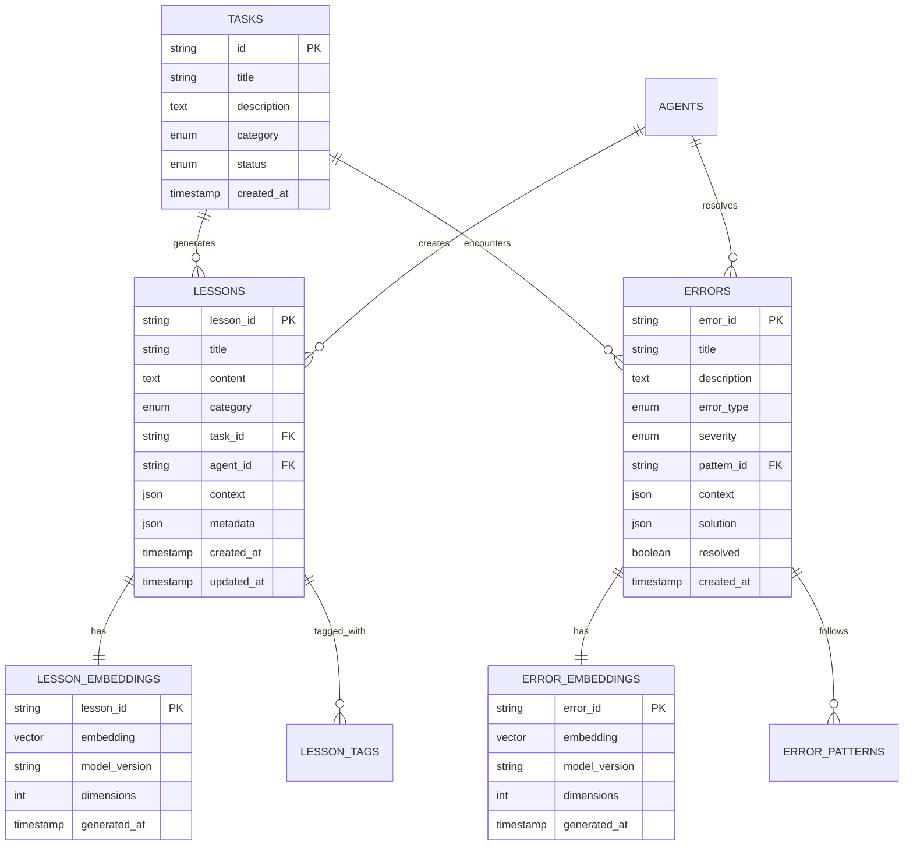

# RAG Database Architecture

## 🏗️ Overview

The RAG database architecture extends the existing TaskManager database design with specialized tables for semantic search, embedding storage, and intelligent lesson management. This design integrates seamlessly with the current system while adding powerful AI-driven capabilities.

## 📊 Enhanced Entity Relationship Model



## 🗃️ Database Schema

### Core RAG Tables

#### 1. LESSONS Table

```sql
CREATE TABLE lessons (
    lesson_id VARCHAR(255) PRIMARY KEY,
    title VARCHAR(500) NOT NULL,
    content TEXT NOT NULL,
    category ENUM('errors', 'features', 'optimization', 'decisions', 'patterns') NOT NULL,
    subcategory VARCHAR(100),
    task_id VARCHAR(255),
    agent_id VARCHAR(255),
    project_path VARCHAR(1000),

    -- Context information
    context JSON, -- Task context, file paths, error details
    metadata JSON, -- Difficulty, time to resolve, effectiveness

    -- Effectiveness tracking
    times_accessed INT DEFAULT 0,
    effectiveness_score DECIMAL(3,2) DEFAULT 0.0, -- 0.0 to 1.0
    last_accessed TIMESTAMP NULL,

    -- Versioning
    version INT DEFAULT 1,
    parent_lesson_id VARCHAR(255) NULL,

    -- Timestamps
    created_at TIMESTAMP DEFAULT CURRENT_TIMESTAMP,
    updated_at TIMESTAMP DEFAULT CURRENT_TIMESTAMP ON UPDATE CURRENT_TIMESTAMP,

    -- Indexes for performance
    INDEX idx_lessons_category (category),
    INDEX idx_lessons_task (task_id),
    INDEX idx_lessons_agent (agent_id),
    INDEX idx_lessons_project (project_path),
    INDEX idx_lessons_created (created_at),
    INDEX idx_lessons_effectiveness (effectiveness_score),
    INDEX idx_lessons_accessed (times_accessed),

    -- Full-text search index
    FULLTEXT INDEX ft_lessons_content (title, content),

    -- Foreign key constraints
    FOREIGN KEY (task_id) REFERENCES tasks(id) ON DELETE SET NULL,
    FOREIGN KEY (agent_id) REFERENCES agents(id) ON DELETE SET NULL,
    FOREIGN KEY (parent_lesson_id) REFERENCES lessons(lesson_id) ON DELETE SET NULL
);
```

#### 2. LESSON_EMBEDDINGS Table

```sql
CREATE TABLE lesson_embeddings (
    lesson_id VARCHAR(255) PRIMARY KEY,
    embedding VECTOR(1536), -- OpenAI text-embedding-3-small dimensions
    model_version VARCHAR(100) NOT NULL DEFAULT 'text-embedding-3-small',
    dimensions INT NOT NULL DEFAULT 1536,
    embedding_hash VARCHAR(64), -- For deduplication

    -- Performance metrics
    generation_time_ms INT,
    input_tokens INT,

    -- Timestamps
    generated_at TIMESTAMP DEFAULT CURRENT_TIMESTAMP,
    updated_at TIMESTAMP DEFAULT CURRENT_TIMESTAMP ON UPDATE CURRENT_TIMESTAMP,

    -- Indexes for vector similarity search
    INDEX idx_embedding_hash (embedding_hash),
    INDEX idx_embedding_model (model_version),

    -- Foreign key constraints
    FOREIGN KEY (lesson_id) REFERENCES lessons(lesson_id) ON DELETE CASCADE
);
```

#### 3. ERRORS Table

```sql
CREATE TABLE errors (
    error_id VARCHAR(255) PRIMARY KEY,
    title VARCHAR(500) NOT NULL,
    description TEXT NOT NULL,
    error_type ENUM('linter_error', 'build_error', 'runtime_error', 'test_error', 'integration_error') NOT NULL,
    severity ENUM('low', 'medium', 'high', 'critical') DEFAULT 'medium',
    category ENUM('code_quality', 'security', 'performance', 'functionality', 'compatibility') NOT NULL,

    -- Pattern and context
    pattern_id VARCHAR(255),
    task_id VARCHAR(255),
    agent_id VARCHAR(255),
    project_path VARCHAR(1000),

    -- Error details
    context JSON, -- File path, line number, stack trace, environment
    solution JSON, -- Resolution steps, prevention strategies

    -- Resolution tracking
    resolved BOOLEAN DEFAULT FALSE,
    resolution_time_seconds INT,
    resolution_agent_id VARCHAR(255),
    resolution_method VARCHAR(100), -- 'auto', 'manual', 'ai_assisted'

    -- Frequency tracking
    occurrence_count INT DEFAULT 1,
    first_seen TIMESTAMP DEFAULT CURRENT_TIMESTAMP,
    last_seen TIMESTAMP DEFAULT CURRENT_TIMESTAMP,

    -- Timestamps
    created_at TIMESTAMP DEFAULT CURRENT_TIMESTAMP,
    updated_at TIMESTAMP DEFAULT CURRENT_TIMESTAMP ON UPDATE CURRENT_TIMESTAMP,
    resolved_at TIMESTAMP NULL,

    -- Indexes for performance
    INDEX idx_errors_type (error_type),
    INDEX idx_errors_severity (severity),
    INDEX idx_errors_category (category),
    INDEX idx_errors_pattern (pattern_id),
    INDEX idx_errors_resolved (resolved),
    INDEX idx_errors_project (project_path),
    INDEX idx_errors_frequency (occurrence_count),

    -- Full-text search index
    FULLTEXT INDEX ft_errors_content (title, description),

    -- Foreign key constraints
    FOREIGN KEY (pattern_id) REFERENCES error_patterns(pattern_id) ON DELETE SET NULL,
    FOREIGN KEY (task_id) REFERENCES tasks(id) ON DELETE SET NULL,
    FOREIGN KEY (agent_id) REFERENCES agents(id) ON DELETE SET NULL,
    FOREIGN KEY (resolution_agent_id) REFERENCES agents(id) ON DELETE SET NULL
);
```

#### 4. ERROR_EMBEDDINGS Table

```sql
CREATE TABLE error_embeddings (
    error_id VARCHAR(255) PRIMARY KEY,
    embedding VECTOR(1536),
    model_version VARCHAR(100) NOT NULL DEFAULT 'text-embedding-3-small',
    dimensions INT NOT NULL DEFAULT 1536,
    embedding_hash VARCHAR(64),

    -- Performance metrics
    generation_time_ms INT,
    input_tokens INT,

    -- Timestamps
    generated_at TIMESTAMP DEFAULT CURRENT_TIMESTAMP,
    updated_at TIMESTAMP DEFAULT CURRENT_TIMESTAMP ON UPDATE CURRENT_TIMESTAMP,

    -- Indexes
    INDEX idx_error_embedding_hash (embedding_hash),
    INDEX idx_error_embedding_model (model_version),

    -- Foreign key constraints
    FOREIGN KEY (error_id) REFERENCES errors(error_id) ON DELETE CASCADE
);
```

### Supporting Tables

#### 5. ERROR_PATTERNS Table

```sql
CREATE TABLE error_patterns (
    pattern_id VARCHAR(255) PRIMARY KEY,
    name VARCHAR(255) NOT NULL,
    description TEXT NOT NULL,
    pattern_signature VARCHAR(500), -- Regex or identifier for automatic detection
    category ENUM('code_quality', 'security', 'performance', 'functionality', 'compatibility') NOT NULL,

    -- Statistics
    occurrence_count INT DEFAULT 0,
    resolution_success_rate DECIMAL(3,2) DEFAULT 0.0,
    avg_resolution_time_seconds INT DEFAULT 0,

    -- Common solutions
    common_solutions JSON, -- Array of frequently successful solutions
    prevention_strategies JSON, -- Array of prevention recommendations

    -- Automated detection
    detection_rules JSON, -- Rules for automatic pattern matching
    auto_fix_available BOOLEAN DEFAULT FALSE,
    auto_fix_command TEXT,

    -- Timestamps
    created_at TIMESTAMP DEFAULT CURRENT_TIMESTAMP,
    updated_at TIMESTAMP DEFAULT CURRENT_TIMESTAMP ON UPDATE CURRENT_TIMESTAMP,

    -- Indexes
    INDEX idx_patterns_category (category),
    INDEX idx_patterns_success_rate (resolution_success_rate),
    INDEX idx_patterns_auto_fix (auto_fix_available),

    -- Unique constraint
    UNIQUE KEY unique_pattern_name (name)
);
```

#### 6. LESSON_TAGS Table

```sql
CREATE TABLE lesson_tags (
    id INT AUTO_INCREMENT PRIMARY KEY,
    lesson_id VARCHAR(255) NOT NULL,
    tag VARCHAR(100) NOT NULL,
    weight DECIMAL(3,2) DEFAULT 1.0, -- Tag importance/relevance
    auto_generated BOOLEAN DEFAULT FALSE,

    -- Timestamps
    created_at TIMESTAMP DEFAULT CURRENT_TIMESTAMP,

    -- Indexes
    INDEX idx_lesson_tags_lesson (lesson_id),
    INDEX idx_lesson_tags_tag (tag),
    INDEX idx_lesson_tags_weight (weight),

    -- Unique constraint
    UNIQUE KEY unique_lesson_tag (lesson_id, tag),

    -- Foreign key constraints
    FOREIGN KEY (lesson_id) REFERENCES lessons(lesson_id) ON DELETE CASCADE
);
```

#### 7. SIMILARITY_CACHE Table

```sql
CREATE TABLE similarity_cache (
    id INT AUTO_INCREMENT PRIMARY KEY,
    content_hash VARCHAR(64) NOT NULL,
    content_type ENUM('lesson', 'error') NOT NULL,
    similar_content_id VARCHAR(255) NOT NULL,
    similarity_score DECIMAL(5,4) NOT NULL, -- 0.0000 to 1.0000

    -- Performance optimization
    cache_valid_until TIMESTAMP NOT NULL,
    access_count INT DEFAULT 0,
    last_accessed TIMESTAMP DEFAULT CURRENT_TIMESTAMP,

    -- Timestamps
    created_at TIMESTAMP DEFAULT CURRENT_TIMESTAMP,
    updated_at TIMESTAMP DEFAULT CURRENT_TIMESTAMP ON UPDATE CURRENT_TIMESTAMP,

    -- Indexes
    INDEX idx_similarity_hash (content_hash),
    INDEX idx_similarity_type (content_type),
    INDEX idx_similarity_score (similarity_score),
    INDEX idx_similarity_valid (cache_valid_until),

    -- Unique constraint
    UNIQUE KEY unique_similarity_cache (content_hash, similar_content_id)
);
```

#### 8. LEARNING_ANALYTICS Table

```sql
CREATE TABLE learning_analytics (
    id INT AUTO_INCREMENT PRIMARY KEY,
    metric_name VARCHAR(100) NOT NULL,
    metric_value DECIMAL(10,4) NOT NULL,
    metric_unit VARCHAR(50),

    -- Context
    agent_id VARCHAR(255),
    project_path VARCHAR(1000),
    category VARCHAR(100),
    time_period ENUM('hour', 'day', 'week', 'month') NOT NULL,

    -- Dimensions
    dimensions JSON, -- Additional metric dimensions

    -- Timestamps
    period_start TIMESTAMP NOT NULL,
    period_end TIMESTAMP NOT NULL,
    calculated_at TIMESTAMP DEFAULT CURRENT_TIMESTAMP,

    -- Indexes
    INDEX idx_analytics_metric (metric_name),
    INDEX idx_analytics_agent (agent_id),
    INDEX idx_analytics_project (project_path),
    INDEX idx_analytics_period (period_start, period_end),
    INDEX idx_analytics_category (category),

    -- Unique constraint for time series data
    UNIQUE KEY unique_analytics_period (metric_name, agent_id, project_path, category, period_start),

    -- Foreign key constraints
    FOREIGN KEY (agent_id) REFERENCES agents(id) ON DELETE CASCADE
);
```

## 🔍 Vector Search Configuration

### Vector Index Configuration

```sql
-- Create vector search index for lesson embeddings
CREATE VECTOR INDEX idx_lesson_embeddings_vector
ON lesson_embeddings(embedding)
USING HNSW
WITH (
    M = 16,           -- Maximum connections per node
    efConstruction = 200,  -- Size of dynamic candidate list
    efSearch = 100    -- Size of candidate list during search
);

-- Create vector search index for error embeddings
CREATE VECTOR INDEX idx_error_embeddings_vector
ON error_embeddings(embedding)
USING HNSW
WITH (
    M = 16,
    efConstruction = 200,
    efSearch = 100
);
```

### Vector Search Functions

```sql
-- Function for semantic lesson search
DELIMITER //
CREATE FUNCTION semantic_lesson_search(
    query_embedding VECTOR(1536),
    similarity_threshold DECIMAL(3,2) DEFAULT 0.7,
    result_limit INT DEFAULT 10
)
RETURNS TABLE (
    lesson_id VARCHAR(255),
    similarity_score DECIMAL(5,4)
)
READS SQL DATA
DETERMINISTIC
BEGIN
    RETURN (
        SELECT
            le.lesson_id,
            VECTOR_COSINE_SIMILARITY(le.embedding, query_embedding) as similarity_score
        FROM lesson_embeddings le
        WHERE VECTOR_COSINE_SIMILARITY(le.embedding, query_embedding) >= similarity_threshold
        ORDER BY similarity_score DESC
        LIMIT result_limit
    );
END //
DELIMITER ;

-- Function for semantic error search
DELIMITER //
CREATE FUNCTION semantic_error_search(
    query_embedding VECTOR(1536),
    similarity_threshold DECIMAL(3,2) DEFAULT 0.7,
    result_limit INT DEFAULT 10
)
RETURNS TABLE (
    error_id VARCHAR(255),
    similarity_score DECIMAL(5,4)
)
READS SQL DATA
DETERMINISTIC
BEGIN
    RETURN (
        SELECT
            ee.error_id,
            VECTOR_COSINE_SIMILARITY(ee.embedding, query_embedding) as similarity_score
        FROM error_embeddings ee
        WHERE VECTOR_COSINE_SIMILARITY(ee.embedding, query_embedding) >= similarity_threshold
        ORDER BY similarity_score DESC
        LIMIT result_limit
    );
END //
DELIMITER ;
```

## 📈 Performance Optimization

### Indexing Strategy

1. **Primary Indexes**: All foreign keys and frequently queried columns
2. **Composite Indexes**: Multi-column indexes for common query patterns
3. **Vector Indexes**: HNSW indexes for efficient similarity search
4. **Full-text Indexes**: For traditional text search as fallback

### Query Optimization

```sql
-- Optimized lesson search query
SELECT
    l.lesson_id,
    l.title,
    l.content,
    l.category,
    l.effectiveness_score,
    ss.similarity_score
FROM lessons l
JOIN (
    SELECT * FROM semantic_lesson_search(@query_embedding, 0.7, 20)
) ss ON l.lesson_id = ss.lesson_id
WHERE
    (@category IS NULL OR l.category = @category)
    AND (@project_path IS NULL OR l.project_path = @project_path)
    AND l.effectiveness_score >= @min_effectiveness
ORDER BY
    ss.similarity_score DESC,
    l.effectiveness_score DESC,
    l.times_accessed DESC
LIMIT @result_limit;
```

### Caching Strategy

1. **Query Result Caching**: Cache frequent similarity searches
2. **Embedding Caching**: Cache generated embeddings to avoid regeneration
3. **Pattern Caching**: Cache error pattern detection results
4. **Analytics Caching**: Cache computed analytics for dashboard display

## 🔧 Data Migration Strategy

### Phase 1: Schema Setup

```sql
-- Create all RAG tables
SOURCE rag_schema_setup.sql;

-- Insert default error patterns
INSERT INTO error_patterns (pattern_id, name, description, category) VALUES
('pattern_eslint_unused', 'ESLint Unused Variables', 'Variables declared but never used', 'code_quality'),
('pattern_build_dependency', 'Build Dependency Errors', 'Missing or incompatible dependencies', 'functionality'),
('pattern_auth_jwt', 'JWT Authentication Issues', 'JWT token related authentication problems', 'security');
```

### Phase 2: Data Migration

```python
# Python migration script example
import json
import os
from pathlib import Path

def migrate_file_based_lessons():
    lessons_dir = Path("development/lessons")
    for category_dir in lessons_dir.iterdir():
        if category_dir.is_dir():
            for lesson_file in category_dir.glob("*.md"):
                # Parse lesson file
                lesson_data = parse_lesson_file(lesson_file)

                # Generate embedding
                embedding = generate_embedding(lesson_data['content'])

                # Store in database
                store_lesson_with_embedding(lesson_data, embedding)
```

### Phase 3: Integration

1. Update TaskManager API to use RAG endpoints
2. Implement real-time lesson generation during task execution
3. Enable automatic error pattern detection
4. Activate semantic search in agent workflows

## 🔐 Security Considerations

### Access Control

```sql
-- Create role-based access control
CREATE ROLE rag_read_only;
CREATE ROLE rag_read_write;
CREATE ROLE rag_admin;

-- Grant appropriate permissions
GRANT SELECT ON lessons, errors, error_patterns TO rag_read_only;
GRANT SELECT, INSERT, UPDATE ON lessons, errors TO rag_read_write;
GRANT ALL PRIVILEGES ON rag_database.* TO rag_admin;
```

### Data Protection

1. **Encryption**: All embedding vectors encrypted at rest
2. **Audit Logging**: Track all access to sensitive lesson data
3. **Input Validation**: Sanitize all inputs before embedding generation
4. **Rate Limiting**: Prevent abuse of embedding generation endpoints

## 📊 Monitoring and Metrics

### Key Performance Indicators

1. **Search Performance**: Average query response time < 200ms
2. **Embedding Generation**: < 2 seconds per lesson
3. **Cache Hit Rate**: > 80% for frequent queries
4. **Storage Efficiency**: Embedding compression ratio
5. **Learning Effectiveness**: Lesson success rate tracking

### Monitoring Queries

```sql
-- Monitor system performance
SELECT
    'lessons' as table_name,
    COUNT(*) as total_records,
    AVG(times_accessed) as avg_access_frequency,
    AVG(effectiveness_score) as avg_effectiveness
FROM lessons
UNION ALL
SELECT
    'errors' as table_name,
    COUNT(*) as total_records,
    COUNT(CASE WHEN resolved = TRUE THEN 1 END) as resolved_count,
    AVG(resolution_time_seconds) as avg_resolution_time
FROM errors;
```

## 🎯 Future Enhancements

### Planned Features

1. **Multi-modal Embeddings**: Support for code, images, and documents
2. **Graph-based Relationships**: Lesson and error relationship graphs
3. **Predictive Analytics**: Predict likely solutions based on context
4. **Cross-project Learning**: Share knowledge between related projects
5. **Automated Pattern Discovery**: AI-driven error pattern identification

### Scalability Considerations

1. **Horizontal Partitioning**: Partition large tables by project or date
2. **Read Replicas**: Distribute read load across multiple database instances
3. **Embedding Compression**: Use quantization to reduce storage requirements
4. **Incremental Learning**: Update embeddings incrementally rather than full regeneration

---

*This database architecture provides a robust foundation for the RAG-based lessons and error database system, enabling intelligent knowledge management and continuous learning for AI development agents.*