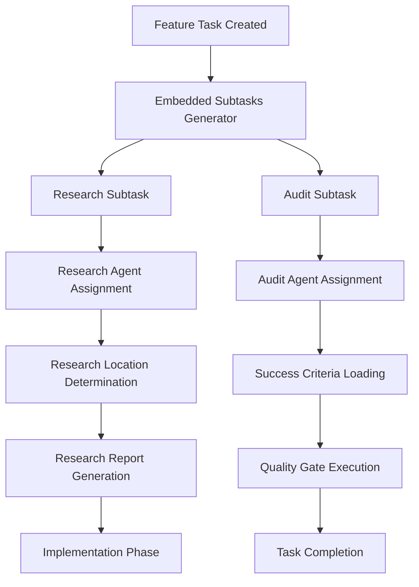

# TaskManager API - Embedded Subtasks & Success Criteria Documentation

## Table of Contents
1. [Overview](#overview)
2. [Architecture](#architecture)
3. [Embedded Subtasks System](#embedded-subtasks-system)
4. [Success Criteria Management](#success-criteria-management)
5. [Research Task Configuration](#research-task-configuration)
6. [Audit System Workflows](#audit-system-workflows)
7. [API Reference](#api-reference)
8. [Integration Examples](#integration-examples)
9. [Configuration Guide](#configuration-guide)
10. [Troubleshooting](#troubleshooting)

## Overview

The TaskManager API now includes a comprehensive embedded subtasks system that automatically generates research and audit subtasks for feature tasks. This system ensures quality control, comprehensive research, and independent validation of all implementations.

### Key Features
- **Automatic Subtask Generation**: Research and audit subtasks automatically created for feature tasks
- **Research Task Routing**: Intelligent research location determination and agent assignment
- **Independent Audit System**: Separate agents for objective quality validation
- **Success Criteria Templates**: Standardized completion criteria from `development/essentials/`
- **Quality Gate Execution**: Automated validation of success criteria
- **Agent Assignment Logic**: Specialized agent roles and prevention of self-review

### System Requirements
- Node.js 14+ with TaskManager API v2.0.0+
- Access to `development/essentials/audit-criteria.md`
- Multi-agent environment for independent auditing
- Project structure with TODO.json support

## Architecture

### Core Components



### Data Flow

1. **Task Creation**: Feature task created with embedded subtask generation
2. **Subtask Generation**: Automatic research and audit subtask creation
3. **Agent Assignment**: Specialized agents assigned based on task type
4. **Research Phase**: Comprehensive research conducted if required
5. **Implementation Phase**: Primary feature implementation
6. **Audit Phase**: Independent quality validation
7. **Completion**: Task marked complete after all subtasks pass

## Embedded Subtasks System

### Automatic Generation

The system automatically generates embedded subtasks for all feature tasks unless explicitly disabled:

```javascript
/**
 * Generate embedded subtasks for feature tasks
 * @param {Object} taskData - Original task data
 * @param {string} parentTaskId - ID of the parent task
 * @param {string} taskCategory - Category of the parent task
 * @returns {Promise<Array>} Array of embedded subtasks
 */
async _generateEmbeddedSubtasks(taskData, parentTaskId, taskCategory) {
    const subtasks = [...(taskData.subtasks || [])];
    
    // Only generate embedded subtasks for feature tasks
    if (taskCategory !== 'feature') {
        return subtasks;
    }
    
    // Skip auto-generation if explicitly disabled
    if (taskData.skip_embedded_subtasks) {
        return subtasks;
    }
    
    const timestamp = Date.now();
    const shortId = crypto.randomBytes(4).toString('hex');
    
    // Generate research subtask if needed
    if (this._shouldGenerateResearchSubtask(taskData)) {
        const researchSubtask = this._createResearchSubtask(taskData, parentTaskId, timestamp, shortId);
        subtasks.push(researchSubtask);
    }
    
    // Generate audit subtask for all feature tasks
    const auditSubtask = await this._createAuditSubtask(taskData, parentTaskId, timestamp, shortId);
    subtasks.push(auditSubtask);
    
    return subtasks;
}
```

### Research Subtask Creation

Research subtasks are generated for complex implementation tasks based on keyword analysis:

```javascript
/**
 * Determine if a research subtask should be generated
 * @param {Object} taskData - Original task data
 * @returns {boolean} True if research subtask should be generated
 */
_shouldGenerateResearchSubtask(taskData) {
    // Skip if research already exists or was explicitly disabled
    if (taskData.requires_research === false || taskData.skip_research) {
        return false;
    }
    
    // Generate research for complex implementation tasks
    const title = (taskData.title || '').toLowerCase();
    const description = (taskData.description || '').toLowerCase();
    const complexKeywords = [
        'api', 'integration', 'database', 'authentication', 'security',
        'performance', 'architecture', 'framework', 'library', 'migration',
        'refactor', 'optimize', 'implement', 'design', 'system',
    ];
    
    return complexKeywords.some(keyword =>
        title.includes(keyword) || description.includes(keyword)
    );
}
```

### Audit Subtask Creation

All feature tasks automatically receive audit subtasks for quality validation:

```javascript
/**
 * Create audit subtask with standard criteria
 * @param {Object} taskData - Original task data
 * @param {string} parentTaskId - ID of the parent task
 * @param {number} timestamp - Creation timestamp
 * @param {string} shortId - Short identifier
 * @returns {Promise<Object>} Audit subtask object
 */
async _createAuditSubtask(taskData, parentTaskId, timestamp, shortId) {
    const auditId = `audit_${timestamp}_${shortId}`;
    
    // Load standard audit criteria from development/essentials/audit-criteria.md
    const auditCriteria = await this._loadAuditCriteria();
    
    return {
        id: auditId,
        type: 'audit',
        title: `Audit: ${taskData.title}`,
        description: `Comprehensive quality audit and review of the completed feature: ${taskData.title}\n\nOriginal Description: ${taskData.description || 'No description provided'}`,
        status: 'pending',
        estimated_hours: 0.5,
        success_criteria: auditCriteria,
        prevents_completion: true, // Parent task cannot be completed until audit passes
        original_implementer: null, // Will be set when parent task is assigned
        prevents_self_review: true, // Audit agent must be different from implementer
        audit_type: 'embedded_quality_gate',
        created_at: new Date().toISOString(),
    };
}
```

## Success Criteria Management

### Standard Criteria Loading

The system loads standardized success criteria from `development/essentials/audit-criteria.md`:

```javascript
/**
 * Load audit criteria from development/essentials/audit-criteria.md
 * @returns {Promise<Array>} Array of standard audit criteria
 */
async _loadAuditCriteria() {
    try {
        const fs = require('fs').promises;
        const path = require('path');
        const auditCriteriaPath = path.join(process.cwd(), 'development/essentials/audit-criteria.md');
        
        const content = await fs.readFile(auditCriteriaPath, 'utf8');
        
        // Parse markdown checklist items to extract criteria
        const criteriaLines = content
            .split('\n')
            .filter(line => line.trim().startsWith('- [ ]'))
            .map(line => line.replace(/^- \[ \]\s*\*\*([^*]+)\*\*.*/, '$1').trim())
            .filter(criteria => criteria && criteria !== '- [ ]');
        
        return criteriaLines.length > 0 ? criteriaLines : this._getDefaultAuditCriteria();
    } catch (error) {
        console.warn('Could not load audit criteria file, using defaults:', error.message);
        return this._getDefaultAuditCriteria();
    }
}
```

### Quality Gate Execution

Success criteria can be automatically validated through quality gates:

```javascript
/**
 * Execute quality gates for task validation
 * @param {string} taskId - Task ID
 * @returns {Object} Quality gate execution results
 */
async executeQualityGates(taskId) {
    const todoData = await this.readTodoFast();
    const task = todoData.tasks.find((t) => t.id === taskId);
    
    if (!task || !task.success_criteria) {
        return { success: false, error: 'Task not found or no success criteria' };
    }
    
    // Execute all quality gates in parallel for better performance
    const qualityGatePromises = task.success_criteria.map(async (criterion) => {
        const result = await this._executeQualityGate(criterion);
        return {
            criterion,
            passed: result.success,
            output: result.output,
            error: result.error,
        };
    });
    
    const results = await Promise.all(qualityGatePromises);
    const allPassed = results.every((r) => r.passed);
    
    return {
        success: allPassed,
        results,
        summary: {
            total: results.length,
            passed: results.filter((r) => r.passed).length,
            failed: results.filter((r) => !r.passed).length,
        },
    };
}
```

## Research Task Configuration

### Research Location Determination

The system intelligently determines research locations based on task content:

```javascript
/**
 * Determine research locations based on task content
 * @param {Object} taskData - Original task data
 * @returns {Array} Array of research location objects
 */
_determineResearchLocations(taskData) {
    const locations = [];
    const title = (taskData.title || '').toLowerCase();
    const description = (taskData.description || '').toLowerCase();
    const content = `${title} ${description}`;
    
    // Always include codebase analysis
    locations.push({
        type: 'codebase',
        paths: this._getCodebasePaths(content),
        focus: 'Existing implementation patterns and architecture'
    });
    
    // Add internet research for complex topics
    if (this._requiresInternetResearch(content)) {
        locations.push({
            type: 'internet',
            keywords: this._extractResearchKeywords(content),
            focus: 'Best practices, industry standards, and technical specifications'
        });
    }
    
    // Add documentation research
    locations.push({
        type: 'documentation',
        sources: ['README.md', 'docs/', 'API documentation', 'package.json'],
        focus: 'Project configuration and existing documentation'
    });
    
    return locations;
}
```

### Research Subtask Structure

Research subtasks follow a standardized structure:

```json
{
  "id": "research_1757781329361_673f402c",
  "type": "research",
  "title": "Research: [Parent Task Title]",
  "description": "Comprehensive research for [Parent Task Title] to support implementation",
  "status": "pending",
  "estimated_hours": 1,
  "research_locations": [
    {
      "type": "codebase",
      "paths": ["/api", "/routes", "/controllers"],
      "focus": "Existing implementation patterns and architecture"
    },
    {
      "type": "internet", 
      "keywords": ["api", "documentation", "best practices"],
      "focus": "Industry standards and technical specifications"
    },
    {
      "type": "documentation",
      "sources": ["README.md", "docs/", "API documentation"],
      "focus": "Project configuration and existing documentation"
    }
  ],
  "deliverables": [
    "Technical analysis report",
    "Implementation recommendations", 
    "Risk assessment",
    "Alternative approaches evaluation"
  ],
  "prevents_implementation": true,
  "created_at": "2025-09-13T16:35:29.361Z"
}
```

## Audit System Workflows

### Independent Agent Assignment

The audit system ensures independent validation by preventing self-review:

```javascript
// Audit subtask creation includes prevents_self_review flag
{
    prevents_completion: true, // Parent task cannot be completed until audit passes
    original_implementer: null, // Will be set when parent task is assigned
    prevents_self_review: true, // Audit agent must be different from implementer
    audit_type: 'embedded_quality_gate'
}
```

### Standard Audit Criteria

All audit subtasks use standardized criteria from `development/essentials/audit-criteria.md`:

#### Mandatory Quality Gates
1. **Linter Perfection**: Zero linting warnings or errors
2. **Build Success**: Project builds without errors or warnings  
3. **Runtime Success**: Application starts and serves without errors
4. **Test Integrity**: All preexisting tests continue to pass

#### Code Quality Requirements
5. **Function Documentation**: All public functions have comprehensive documentation
6. **API Documentation**: All public interfaces documented with usage examples
7. **Architecture Documentation**: System design decisions documented
8. **Decision Rationale**: Major technical decisions explained and justified
9. **Error Handling**: Comprehensive error handling implemented
10. **Performance Metrics**: Execution timing and bottleneck identification

#### Security and Compliance
11. **Security Review**: No security vulnerabilities introduced
12. **No Credential Exposure**: No secrets, keys, or credentials in code or logs
13. **Input Validation**: Proper input validation and sanitization
14. **Authentication/Authorization**: Proper security controls where applicable

### Audit Task Execution

Audit tasks follow a structured workflow:

1. **Assignment**: Audit agent (different from implementer) claims audit task
2. **Validation**: Execute all success criteria and quality gates
3. **Documentation**: Document all findings and validation results
4. **Decision**: Pass/fail determination with detailed feedback
5. **Remediation**: Create fix tasks for any failures
6. **Completion**: Mark audit complete only when all criteria pass

## API Reference

### Core Endpoints

#### Task Creation with Embedded Subtasks

```bash
# Create feature task with automatic embedded subtasks
timeout 10s node "/Users/jeremyparker/infinite-continue-stop-hook/taskmanager-api.js" create '{
  "title": "Implement user authentication system",
  "description": "Create comprehensive user authentication with JWT tokens",
  "category": "feature",
  "requires_research": true
}'
```

#### Research Subtask Management

```bash
# List research subtasks for a task
timeout 10s node "/Users/jeremyparker/infinite-continue-stop-hook/taskmanager-api.js" list '{
  "type": "research",
  "parent_task": "feature_123_abc"
}'

# Complete research subtask
timeout 10s node "/Users/jeremyparker/infinite-continue-stop-hook/taskmanager-api.js" complete research_123_def '{
  "research_report": "path/to/report.md",
  "recommendations": ["Use JWT tokens", "Implement rate limiting"],
  "status": "completed"
}'
```

#### Audit Subtask Management

```bash
# List audit subtasks for a task  
timeout 10s node "/Users/jeremyparker/infinite-continue-stop-hook/taskmanager-api.js" list '{
  "type": "audit", 
  "parent_task": "feature_123_abc"
}'

# Execute quality gates for audit validation
timeout 10s node "/Users/jeremyparker/infinite-continue-stop-hook/taskmanager-api.js" execute-quality-gates audit_123_ghi

# Complete audit with validation results
timeout 10s node "/Users/jeremyparker/infinite-continue-stop-hook/taskmanager-api.js" complete audit_123_ghi '{
  "quality_gates_passed": true,
  "validation_results": {...},
  "status": "completed"
}'
```

#### Success Criteria Management

```bash
# Add success criteria to task
timeout 10s node "/Users/jeremyparker/infinite-continue-stop-hook/taskmanager-api.js" add-success-criteria task_123 "All tests pass with 90%+ coverage"

# Execute quality gates
timeout 10s node "/Users/jeremyparker/infinite-continue-stop-hook/taskmanager-api.js" execute-quality-gates task_123

# Get quality gate results
timeout 10s node "/Users/jeremyparker/infinite-continue-stop-hook/taskmanager-api.js" get-quality-results task_123
```

### Configuration Options

#### Disable Embedded Subtasks

```bash
# Create task without embedded subtasks
timeout 10s node "/Users/jeremyparker/infinite-continue-stop-hook/taskmanager-api.js" create '{
  "title": "Simple feature task",
  "description": "Basic implementation",
  "category": "feature", 
  "skip_embedded_subtasks": true
}'
```

#### Skip Research Generation

```bash
# Create task without research subtask
timeout 10s node "/Users/jeremyparker/infinite-continue-stop-hook/taskmanager-api.js" create '{
  "title": "Implementation task",
  "description": "Direct implementation",
  "category": "feature",
  "skip_research": true
}'
```

#### Custom Research Locations

```bash
# Create task with custom research configuration
timeout 10s node "/Users/jeremyparker/infinite-continue-stop-hook/taskmanager-api.js" create '{
  "title": "Database integration",
  "category": "feature",
  "research_locations": [
    {
      "type": "codebase",
      "paths": ["/database", "/models", "/migrations"],
      "focus": "Existing database patterns"
    },
    {
      "type": "internet", 
      "keywords": ["database", "ORM", "migrations"],
      "focus": "Best practices for database design"
    }
  ]
}'
```

## Integration Examples

### Basic Feature Implementation Workflow

```javascript
// 1. Create feature task (automatically generates embedded subtasks)
const taskResponse = await fetch('http://localhost:3000/api/tasks', {
    method: 'POST',
    headers: { 'Content-Type': 'application/json' },
    body: JSON.stringify({
        title: 'Implement user dashboard',
        description: 'Create comprehensive user dashboard with analytics',
        category: 'feature'
    })
});

const task = await taskResponse.json();
console.log('Created task with subtasks:', task.subtasks);

// 2. Claim and complete research subtask (if generated)
const researchSubtask = task.subtasks.find(st => st.type === 'research');
if (researchSubtask) {
    // Research agent claims and completes research
    await claimTask(researchSubtask.id, 'research_agent_123');
    await completeResearch(researchSubtask.id, {
        report_path: 'development/reports/research_dashboard.md',
        recommendations: ['Use Chart.js for analytics', 'Implement lazy loading'],
        risks: ['Data privacy considerations', 'Performance with large datasets']
    });
}

// 3. Implement main feature (implementation agent)
await claimTask(task.id, 'implementation_agent_456'); 
// ... implement dashboard functionality ...
await completeTask(task.id, { status: 'completed' });

// 4. Independent audit validation (different agent)
const auditSubtask = task.subtasks.find(st => st.type === 'audit');
await claimTask(auditSubtask.id, 'audit_agent_789'); // Different from implementer

// 5. Execute quality gates
const qualityResults = await executeQualityGates(auditSubtask.id);
if (qualityResults.success) {
    await completeTask(auditSubtask.id, { 
        quality_validation: 'passed',
        audit_results: qualityResults 
    });
}
```

### Multi-Agent Coordination Example

```javascript
/**
 * Coordinate multiple agents for feature implementation
 */
async function coordinateFeatureImplementation(taskId) {
    const task = await getTask(taskId);
    const agents = {
        research: 'research_specialist_001',
        implementation: 'fullstack_developer_002', 
        audit: 'quality_assurance_003'
    };
    
    // Phase 1: Research (if required)
    const researchSubtask = task.subtasks.find(st => st.type === 'research');
    if (researchSubtask) {
        console.log('Starting research phase...');
        await assignAndWaitForCompletion(researchSubtask.id, agents.research);
        console.log('Research completed, proceeding to implementation...');
    }
    
    // Phase 2: Implementation
    console.log('Starting implementation phase...');
    await assignAndWaitForCompletion(task.id, agents.implementation);
    console.log('Implementation completed, starting audit...');
    
    // Phase 3: Independent Audit
    const auditSubtask = task.subtasks.find(st => st.type === 'audit');
    if (auditSubtask) {
        // Ensure audit agent is different from implementer
        if (agents.audit === agents.implementation) {
            throw new Error('Audit agent must be different from implementation agent');
        }
        
        console.log('Starting independent audit phase...');
        await assignAndWaitForCompletion(auditSubtask.id, agents.audit);
        console.log('Audit completed, feature ready for deployment');
    }
    
    return { status: 'completed', phases_completed: ['research', 'implementation', 'audit'] };
}
```

## Configuration Guide

### Project Setup

#### 1. Required Directory Structure

```
project/
├── development/
│   ├── essentials/
│   │   ├── audit-criteria.md          # Standard audit criteria
│   │   ├── success-criteria.md        # Success criteria templates
│   │   ├── research-guidelines.md     # Research configuration
│   │   └── task-requirements.md       # Task completion requirements
│   ├── reports/                       # Task-specific reports
│   └── research-reports/              # Research output
├── TODO.json                          # Task management data
└── taskmanager-api.js                 # API endpoint
```

#### 2. Essential Configuration Files

**audit-criteria.md** - Standard completion criteria for all tasks:
```markdown
# Task Audit Criteria - Universal Standards

## Standard Completion Criteria

### Mandatory Quality Gates
- [ ] **Linter Perfection**: Zero linting warnings or errors
- [ ] **Build Success**: Project builds without errors or warnings  
- [ ] **Runtime Success**: Application starts and serves without errors
- [ ] **Test Integrity**: All preexisting tests continue to pass

### Code Quality Requirements  
- [ ] **Function Documentation**: All public functions have comprehensive documentation
- [ ] **API Documentation**: All public interfaces documented with usage examples
- [ ] **Error Handling**: Comprehensive error handling implemented
- [ ] **Security Review**: No security vulnerabilities introduced
```

**research-guidelines.md** - Research task configuration:
```markdown
# Research Guidelines

## Research Location Types

### Codebase Analysis
- Focus on existing patterns and architecture
- Identify reusable components and utilities
- Document current implementation approaches

### Internet Research
- Industry best practices and standards
- Framework-specific recommendations
- Security considerations and compliance

### Documentation Review
- Existing project documentation
- Third-party API documentation
- Configuration and setup guides
```

#### 3. Agent Configuration

Configure specialized agent roles in your system:

```json
{
  "agents": {
    "research_specialists": {
      "capabilities": ["codebase_analysis", "internet_research", "documentation_review"],
      "restrictions": ["cannot_implement", "cannot_audit_own_research"]
    },
    "implementation_developers": {
      "capabilities": ["feature_development", "code_implementation", "testing"],
      "restrictions": ["cannot_audit_own_work", "cannot_modify_audit_criteria"]
    },
    "audit_validators": {
      "capabilities": ["quality_validation", "security_review", "compliance_check"],
      "restrictions": ["cannot_audit_own_implementations", "must_be_independent"]
    }
  }
}
```

### TaskManager Configuration

#### 1. Enable Embedded Subtasks

Embedded subtasks are enabled by default for feature tasks. Configure behavior:

```javascript
// taskmanager-api.js configuration
const EMBEDDED_SUBTASKS_CONFIG = {
    enabled: true,
    auto_research: true,          // Generate research subtasks for complex tasks
    auto_audit: true,             // Generate audit subtasks for all feature tasks  
    research_keywords: [          // Keywords that trigger research generation
        'api', 'integration', 'database', 'authentication', 'security',
        'performance', 'architecture', 'framework', 'library', 'migration'
    ],
    audit_criteria_file: 'development/essentials/audit-criteria.md',
    research_report_directory: 'development/research-reports/',
    prevent_self_audit: true      // Audit agents must be different from implementers
};
```

#### 2. Quality Gate Configuration

Configure automated quality gate execution:

```javascript
const QUALITY_GATES = {
    linting: {
        javascript: 'eslint',
        typescript: 'eslint', 
        python: 'ruff check',
        go: 'golint',
        rust: 'clippy'
    },
    building: {
        javascript: 'npm run build',
        typescript: 'npm run build',
        python: 'python -m build',
        go: 'go build',
        rust: 'cargo build'
    },
    testing: {
        javascript: 'npm test',
        typescript: 'npm test', 
        python: 'pytest',
        go: 'go test ./...',
        rust: 'cargo test'
    },
    runtime: {
        javascript: 'npm start',
        python: 'python -m app',
        go: './app',
        rust: 'cargo run'
    }
};
```

## Troubleshooting

### Common Issues and Solutions

#### 1. Embedded Subtasks Not Generated

**Problem**: Feature tasks created without embedded subtasks

**Solutions**:
```bash
# Check if embedded subtasks are enabled
timeout 10s node "/Users/jeremyparker/infinite-continue-stop-hook/taskmanager-api.js" status

# Verify task category is 'feature'
timeout 10s node "/Users/jeremyparker/infinite-continue-stop-hook/taskmanager-api.js" list '{"id": "task_123"}'

# Check for skip flags
# Ensure task data doesn't include skip_embedded_subtasks: true
```

#### 2. Research Subtasks Not Generated  

**Problem**: Complex tasks not getting research subtasks

**Diagnostic**:
```bash
# Check if task contains research keywords
grep -i "api\|integration\|database\|security\|performance" task_description.txt

# Verify research is not explicitly disabled
# Ensure requires_research: false or skip_research: true are not set
```

**Solutions**:
```bash
# Force research subtask creation
timeout 10s node "/Users/jeremyparker/infinite-continue-stop-hook/taskmanager-api.js" create '{
  "title": "Complex feature",
  "category": "feature", 
  "requires_research": true
}'
```

#### 3. Audit Criteria Loading Issues

**Problem**: Audit subtasks created with default criteria instead of custom

**Diagnostic**:
```bash
# Check if audit criteria file exists
ls -la development/essentials/audit-criteria.md

# Verify file permissions
ls -l development/essentials/audit-criteria.md
```

**Solutions**:
```bash
# Create missing audit criteria file
mkdir -p development/essentials
cp template-audit-criteria.md development/essentials/audit-criteria.md

# Fix file permissions
chmod 644 development/essentials/audit-criteria.md
```

#### 4. Quality Gate Execution Failures

**Problem**: Quality gates failing or not executing

**Diagnostic**:
```bash
# Test quality gates manually
npm run lint
npm run build  
npm test
npm start

# Check if commands exist in package.json
cat package.json | grep -A 10 scripts
```

**Solutions**:
```bash
# Add missing script commands to package.json
npm pkg set scripts.lint="eslint ."
npm pkg set scripts.build="tsc"
npm pkg set scripts.test="jest"

# Install missing dependencies
npm install --save-dev eslint typescript jest
```

#### 5. Agent Assignment Issues

**Problem**: Same agent assigned to implementation and audit

**Diagnostic**:
```bash
# Check agent assignment history
timeout 10s node "/Users/jeremyparker/infinite-continue-stop-hook/taskmanager-api.js" list '{
  "id": "audit_task_123"
}' 

# Verify prevents_self_review flag
grep -A 5 -B 5 prevents_self_review TODO.json
```

**Solutions**:
```bash
# Reassign audit to different agent
timeout 10s node "/Users/jeremyparker/infinite-continue-stop-hook/taskmanager-api.js" reassign audit_task_123 different_agent_456

# Configure agent restrictions in system
# Implement agent capability matrix to prevent conflicts
```

### Performance Optimization

#### 1. Large Task Trees

For projects with many embedded subtasks:

```javascript
// Enable subtask batching for better performance
const PERFORMANCE_CONFIG = {
    batch_subtask_creation: true,
    batch_size: 50,
    parallel_quality_gates: true,
    cache_audit_criteria: true,
    lazy_load_research_locations: true
};
```

#### 2. Quality Gate Optimization

Optimize quality gate execution:

```bash
# Run quality gates in parallel
timeout 10s node "/Users/jeremyparker/infinite-continue-stop-hook/taskmanager-api.js" execute-quality-gates-parallel task_123

# Cache quality gate results
timeout 10s node "/Users/jeremyparker/infinite-continue-stop-hook/taskmanager-api.js" enable-quality-gate-caching
```

### Error Recovery

#### 1. Failed Embedded Subtask Creation

```bash
# Retry embedded subtask generation
timeout 10s node "/Users/jeremyparker/infinite-continue-stop-hook/taskmanager-api.js" regenerate-subtasks feature_task_123

# Manual subtask creation as fallback
timeout 10s node "/Users/jeremyparker/infinite-continue-stop-hook/taskmanager-api.js" create '{
  "title": "Research: Manual research task", 
  "category": "research",
  "parent_task": "feature_task_123"
}'
```

#### 2. Corrupted Task Data

```bash
# Validate task data structure
timeout 10s node "/Users/jeremyparker/infinite-continue-stop-hook/taskmanager-api.js" validate-task-data feature_task_123

# Repair corrupted subtask references
timeout 10s node "/Users/jeremyparker/infinite-continue-stop-hook/taskmanager-api.js" repair-task-references feature_task_123
```

### Best Practices

#### 1. Task Creation
- Always specify clear, descriptive task titles and descriptions
- Include relevant keywords to trigger appropriate research generation  
- Set realistic estimates for research and audit phases
- Provide comprehensive success criteria beyond the standard set

#### 2. Agent Assignment
- Maintain separate agent pools for research, implementation, and audit
- Ensure audit agents have different specializations from implementers
- Rotate agent assignments to prevent bias and improve quality

#### 3. Research Guidelines
- Create detailed research location specifications
- Provide clear deliverable expectations
- Include both technical and business considerations
- Document assumptions and constraints

#### 4. Quality Assurance
- Regularly update audit criteria based on project evolution
- Monitor quality gate success rates and adjust thresholds
- Implement feedback loops from audit failures to improve standards
- Maintain traceability from requirements to validation

This comprehensive documentation covers all aspects of the embedded subtasks system, providing both technical reference and practical guidance for implementation teams.