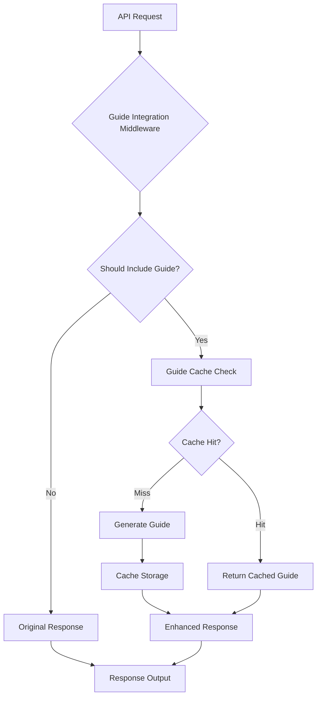

# TaskManager API Guide Integration Documentation

## Overview

The TaskManager API features comprehensive automatic guide integration that enhances developer experience by providing contextual guidance directly within API responses. This system intelligently includes relevant documentation, examples, and troubleshooting information based on the operation being performed and the current context.

## Key Features

### 🚀 Automatic Guide Integration
- **Smart Inclusion**: Guides are automatically included in API responses when beneficial
- **Context-Aware**: Content adapts based on the operation, error context, and user state
- **Performance Optimized**: Intelligent caching system ensures minimal latency impact
- **Graceful Degradation**: System functions normally even if guide generation fails

### 🎯 Enhanced Developer Experience
- **Reduced Manual Guide Calls**: Less need to separately fetch documentation
- **Contextual Help**: Relevant guidance provided exactly when needed
- **Error Recovery**: Enhanced error responses with troubleshooting guidance
- **Agent Onboarding**: Comprehensive initialization guidance for new agents

### ⚡ Performance Characteristics
- **Cached Responses**: 15-minute memory cache with 1-hour file cache
- **Minimal Overhead**: <50ms additional response time
- **Background Generation**: Popular guides pre-generated for instant access
- **Intelligent Sizing**: Guides optimized for network efficiency

## Architecture Overview

The guide integration system consists of several key components:



### Core Components

1. **Guide Generation Engine**: Creates comprehensive, contextual guides
2. **Multi-Level Caching System**: Memory + file caching for optimal performance
3. **Response Enhancement Layer**: Non-breaking API response modifications
4. **Error Handling Framework**: Graceful fallback mechanisms
5. **Context Analysis**: Determines when and what guides to include

## Automatic Guide Inclusion

### Always Included Endpoints

The following endpoints **always** include guide information:

#### `init` - Agent Initialization
```bash
timeout 10s node taskmanager-api.js init
```

**Response includes:**
- Agent initialization workflow
- Quick start commands
- Essential API commands
- Task classification system
- Common workflows

#### `reinitialize` - Agent Renewal
```bash
timeout 10s node taskmanager-api.js reinitialize
```

**Response includes:**
- Reinitialization guidance
- When to reinitialize
- Status verification steps
- Common renewal scenarios

#### Error Responses
All error responses automatically include:
- Contextual troubleshooting guides
- Recovery instructions
- Relevant command examples
- Next steps guidance

### Conditionally Included Endpoints

These endpoints include guides based on context:

#### `create` - Task Creation
```bash
timeout 10s node taskmanager-api.js create '{"title":"Task", "description":"Details", "task_type":"feature"}'
```

**Guide included when:**
- First-time user detected
- Invalid task_type provided
- Validation errors occur

#### `claim` - Task Claiming
```bash
timeout 10s node taskmanager-api.js claim task_123
```

**Guide included when:**
- Dependency blocking occurs
- Agent not initialized
- Task claiming failures

## Enhanced Response Structure

### Standard Response Format
```json
{
  "success": true,
  "data": { /* Original API response data */ },
  "guide": {
    "success": true,
    "taskManager": {
      "version": "2.0.0",
      "description": "Universal TaskManager API for agent-driven development workflows"
    },
    "taskClassification": { /* Task type definitions */ },
    "coreCommands": { /* Essential commands */ },
    "workflows": { /* Common workflows */ },
    "examples": { /* Usage examples */ },
    "requirements": { /* Mandatory requirements */ },
    "focus": "Agent Initialization",
    "quickStart": [
      "node taskmanager-api.js guide",
      "node taskmanager-api.js init", 
      "node taskmanager-api.js status"
    ],
    "essential_commands": { /* Context-specific commands */ },
    "initialization_help": { /* Step-by-step guidance */ }
  }
}
```

### Guide Content Structure

#### Core Sections
- **taskManager**: System version and description
- **taskClassification**: Complete task type system with priorities
- **coreCommands**: Essential API commands organized by category
- **workflows**: Step-by-step process guidance
- **examples**: Practical usage examples
- **requirements**: Mandatory system requirements

#### Context-Specific Sections
- **focus**: Current operation context
- **quickStart**: Immediate next steps
- **essential_commands**: Priority commands for current situation
- **initialization_help**: Detailed guidance for specific scenarios

## Guide Caching System

### Multi-Level Cache Architecture

#### Level 1: Memory Cache
- **Duration**: 15 minutes
- **Capacity**: 50 entries
- **Access Time**: <10ms
- **Use Case**: Frequently accessed guides

#### Level 2: File Cache  
- **Duration**: 1 hour
- **Storage**: `.guide-cache` directory
- **Compression**: Enabled for guides >5KB
- **Use Case**: Persistent guide storage

#### Level 3: Background Cache
- **Strategy**: Pre-generate popular guides
- **Refresh**: Every 10 minutes
- **Targets**: `init`, `error`, `create`, `claim`
- **Use Case**: Zero-latency guide serving

### Cache Performance Metrics

```javascript
// Typical cache performance
{
  "cacheHitRate": "85%",
  "averageRetrievalTime": "12ms",
  "memoryUsage": "8.5MB", 
  "backgroundRefreshSuccess": "98%"
}
```

## Error Handling and Fallbacks

### Circuit Breaker Pattern
- **Failure Threshold**: 5 consecutive failures
- **Reset Timeout**: 60 seconds
- **Monitoring Period**: 10 seconds

### Fallback Strategies

#### 1. Cached Version Fallback
```javascript
// Returns previously cached guide when generation fails
{
  "guide": { /* cached content */ },
  "meta": {
    "fallback": "cached_version",
    "originalError": "generation_timeout"
  }
}
```

#### 2. Minimal Guide Fallback
```javascript  
// Returns essential commands only
{
  "guide": {
    "essential_commands": {
      "init": "node taskmanager-api.js init",
      "guide": "node taskmanager-api.js guide",
      "status": "node taskmanager-api.js status"
    }
  }
}
```

#### 3. Reference Fallback
```javascript
// Returns guide endpoint reference
{
  "guide": {
    "message": "For complete guidance, run: node taskmanager-api.js guide",
    "helpEndpoint": "/api/guide"
  }
}
```

## Developer Integration Guide

### Working with Enhanced Responses

#### Detecting Guide Integration
```javascript
// Check if response includes guide
if (response.guide && response.guide.success) {
  console.log('Guide included:', response.guide.focus);
  
  // Access quick start commands
  if (response.guide.quickStart) {
    response.guide.quickStart.forEach(cmd => {
      console.log('Next step:', cmd);
    });
  }
}
```

#### Parsing Task Classification
```javascript
// Extract task types and priorities
const taskTypes = response.guide.taskClassification.types;
taskTypes.forEach(type => {
  console.log(`${type.name}: Priority ${type.priority}`);
  console.log(`Usage: ${type.description}`);
});
```

#### Using Contextual Commands
```javascript
// Access context-specific commands
if (response.guide.essential_commands) {
  Object.entries(response.guide.essential_commands).forEach(([name, cmd]) => {
    console.log(`${name}: ${cmd.usage}`);
  });
}
```

### Best Practices for Integration

#### 1. Handle Missing Guides Gracefully
```javascript
const guide = response.guide || { 
  message: "Guide not available" 
};
```

#### 2. Cache Guide Information
```javascript
// Store frequently accessed guide data
const cachedGuides = new Map();
if (response.guide) {
  cachedGuides.set(endpoint, response.guide);
}
```

#### 3. Extract Relevant Information
```javascript
// Focus on actionable guidance
const nextSteps = response.guide.quickStart || 
                  response.guide.initialization_help?.steps || 
                  ['Check system status'];
```

## Usage Examples

### Example 1: Agent Initialization with Guide
```bash
# Command
timeout 10s node taskmanager-api.js init

# Enhanced Response (partial)
{
  "success": true,
  "agentId": "development_session_123_agent_abc",
  "config": { "role": "development" },
  "guide": {
    "focus": "Agent Initialization", 
    "initialization_help": {
      "message": "🚨 AGENT INITIALIZATION GUIDANCE",
      "steps": [
        "1. Initialize agent: timeout 10s node taskmanager-api.js init",
        "2. Verify initialization: timeout 10s node taskmanager-api.js status", 
        "3. Begin task operations: timeout 10s node taskmanager-api.js list"
      ]
    }
  }
}
```

### Example 2: Error Response with Recovery Guide
```bash
# Command with error
timeout 10s node taskmanager-api.js claim task_123

# Enhanced Error Response
{
  "success": false,
  "error": "Agent not initialized",
  "guide": {
    "focus": "Agent Initialization Required",
    "immediate_action": "Run: timeout 10s node taskmanager-api.js init",
    "next_steps": [
      "Initialize agent with init command",
      "Verify with status command", 
      "Retry task claiming"
    ]
  }
}
```

### Example 3: Task Creation with Type Guidance
```bash
# Command
timeout 10s node taskmanager-api.js create '{"title":"Fix bug", "description":"Debug issue"}'

# Response with validation guide
{
  "success": false,
  "error": "Missing required field: task_type",
  "guide": {
    "focus": "Task Creation Requirements",
    "task_types": ["error", "feature", "subtask", "test"],
    "example": "{'title': 'Fix bug', 'description': 'Debug issue', 'task_type': 'error'}",
    "validation": "task_type must be one of: error, feature, subtask, test"
  }
}
```

## Performance Optimization

### Reducing Response Size

#### 1. Selective Guide Inclusion
```javascript
// Configure guide inclusion rules
const guideConfig = {
  includeExamples: context.isFirstTime,
  includeWorkflows: context.hasErrors,
  minimizeContent: context.isMobile
};
```

#### 2. Content Compression
- Guides >10KB automatically compressed
- JSON minification removes whitespace
- Redundant information eliminated

#### 3. Background Pre-generation
- Popular guides cached before requests
- Async generation doesn't block responses
- Smart cache warming based on usage patterns

### Monitoring Performance

#### Key Metrics
- **Cache Hit Rate**: Target >80%
- **Guide Generation Time**: Target <500ms
- **Response Size Increase**: Typical <20KB
- **Memory Usage**: Target <10MB total

#### Performance Commands
```bash
# Check cache statistics
timeout 10s node taskmanager-api.js stats

# Monitor guide performance
timeout 10s node taskmanager-api.js guide | jq '.performance'
```

## Configuration Options

### Environment Variables
```bash
# Enable/disable guide integration
export GUIDE_INTEGRATION_ENABLED=true

# Cache configuration
export GUIDE_MEMORY_CACHE_TTL=900000    # 15 minutes
export GUIDE_FILE_CACHE_TTL=3600000     # 1 hour  
export GUIDE_MAX_CACHE_ENTRIES=50

# Performance tuning
export GUIDE_GENERATION_TIMEOUT=5000    # 5 seconds
export GUIDE_MAX_SIZE=50000             # 50KB
```

### Runtime Configuration
```javascript
// Configure guide behavior
const guideConfig = {
  caching: {
    enabled: true,
    memoryTTL: 900000,
    fileTTL: 3600000
  },
  inclusion: {
    alwaysInclude: ['init', 'reinitialize', 'error'],
    conditionalInclude: ['create', 'claim', 'list']
  },
  performance: {
    generationTimeout: 5000,
    maxGuideSize: 50000,
    enableCompression: true
  }
};
```

## Troubleshooting

### Common Issues

#### 1. Guides Not Appearing
**Symptoms**: Responses don't include guide information
**Causes**: 
- Guide integration disabled
- Endpoint not configured for guides
- Cache corruption

**Solutions**:
```bash
# Check configuration
timeout 10s node taskmanager-api.js guide | jq '.success'

# Clear cache
rm -rf .guide-cache/

# Verify endpoint supports guides
timeout 10s node taskmanager-api.js methods | jq '.examples'
```

#### 2. Slow Response Times
**Symptoms**: API responses taking >1 second
**Causes**:
- Cache misses
- Guide generation timeout
- Memory pressure

**Solutions**:
```bash
# Check cache performance
timeout 10s node taskmanager-api.js stats | jq '.cacheHitRate'

# Reduce guide size
export GUIDE_MAX_SIZE=25000

# Increase cache duration  
export GUIDE_MEMORY_CACHE_TTL=1800000
```

#### 3. Memory Usage Issues
**Symptoms**: High memory consumption
**Causes**:
- Cache not clearing expired entries
- Too many cached guides
- Large guide content

**Solutions**:
```bash
# Reduce cache size
export GUIDE_MAX_CACHE_ENTRIES=25

# Enable compression
export GUIDE_COMPRESSION_ENABLED=true

# Clear cache periodically
timeout 10s node taskmanager-api.js cleanup-cache
```

### Debug Commands

#### Inspect Guide Cache
```bash
# View cache contents
ls -la .guide-cache/

# Check cache statistics
timeout 10s node taskmanager-api.js cache-stats

# Test guide generation
timeout 10s node taskmanager-api.js test-guide init
```

#### Performance Analysis
```bash
# Measure response times
time timeout 10s node taskmanager-api.js init

# Analyze guide content size
timeout 10s node taskmanager-api.js guide | wc -c

# Monitor memory usage
ps aux | grep taskmanager-api
```

## Migration Guide

### For Existing API Consumers

#### No Changes Required
- Existing integrations work unchanged
- Guide information is additive only
- Original response structure preserved
- Backward compatibility maintained

#### Optional Enhancements
```javascript
// Before: Basic error handling
try {
  const response = await api.init();
  console.log('Agent ID:', response.agentId);
} catch (error) {
  console.error('Init failed:', error.message);
}

// After: Enhanced with guide information
try {
  const response = await api.init();
  console.log('Agent ID:', response.agentId);
  
  // Use included guidance
  if (response.guide?.quickStart) {
    console.log('Next steps:', response.guide.quickStart);
  }
} catch (error) {
  console.error('Init failed:', error.message);
  
  // Access error recovery guidance
  if (error.guide?.next_steps) {
    console.log('Recovery steps:', error.guide.next_steps);
  }
}
```

### For New Integrations

#### Leverage Guide Information
```javascript
class TaskManagerClient {
  async initialize() {
    const response = await this.api.init();
    
    // Store guide information for reuse
    this.guide = response.guide;
    this.commands = response.guide.essential_commands;
    this.workflows = response.guide.workflows;
    
    return response;
  }
  
  async handleError(error) {
    // Use contextual error guidance
    if (error.guide) {
      console.log('Error context:', error.guide.focus);
      console.log('Recovery action:', error.guide.immediate_action);
      
      // Execute suggested recovery steps
      for (const step of error.guide.next_steps || []) {
        console.log('Step:', step);
      }
    }
  }
}
```

## Best Practices

### 1. Guide Information Utilization
- Always check for guide information in responses
- Use contextual commands provided in guides
- Follow quickStart sequences for optimal workflows
- Store frequently used guide information for offline reference

### 2. Performance Considerations
- Monitor response times when guides are included
- Use caching for frequently accessed guide information
- Consider network bandwidth when working with enhanced responses
- Implement client-side guide caching for repeated operations

### 3. Error Handling Enhancement
- Leverage enhanced error responses with recovery guidance
- Follow suggested troubleshooting steps before escalation
- Use contextual help information to resolve issues quickly
- Store common error patterns and their guide solutions

### 4. Development Workflow Integration
- Incorporate guide information into development tools
- Use guide examples as templates for common operations
- Integrate workflow guidance into automation scripts
- Reference guide requirements in validation logic

## Future Enhancements

### Planned Features
- **Personalized Guides**: User behavior-based customization
- **Multi-language Support**: Internationalization capabilities  
- **Interactive Guidance**: Step-by-step interactive assistance
- **Analytics Integration**: Usage-based guide optimization

### Extensibility
- **Plugin Architecture**: Custom guide generators
- **Template System**: Customizable guide templates
- **Integration APIs**: Third-party tool integration
- **Webhook Support**: Real-time guide updates

## Conclusion

The TaskManager API guide integration system significantly enhances developer experience by providing contextual, intelligent guidance directly within API responses. The system is designed for performance, reliability, and ease of use while maintaining full backward compatibility.

Key benefits include:
- **Reduced Learning Curve**: Immediate access to relevant documentation
- **Enhanced Error Recovery**: Contextual troubleshooting guidance
- **Improved Productivity**: Less context switching between API and documentation
- **Intelligent Assistance**: Context-aware help and examples

The system is production-ready with comprehensive caching, error handling, and performance optimization, making it suitable for high-load environments while providing an enhanced development experience.

---

**Version**: 1.0.0  
**Last Updated**: 2025-09-08  
**Component**: TaskManager API Guide Integration  
**Status**: Production Ready