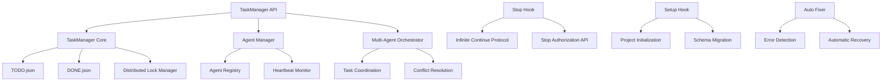
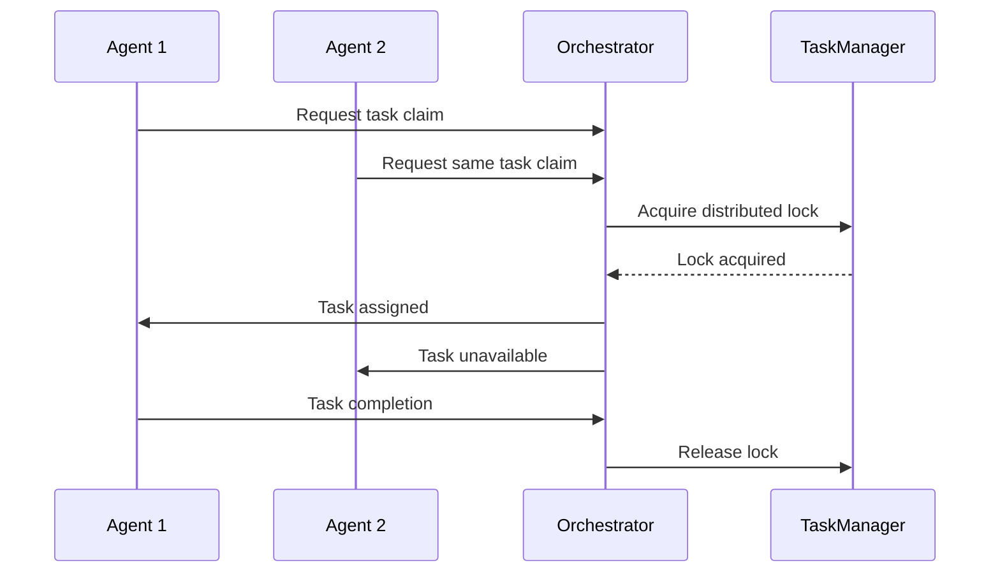
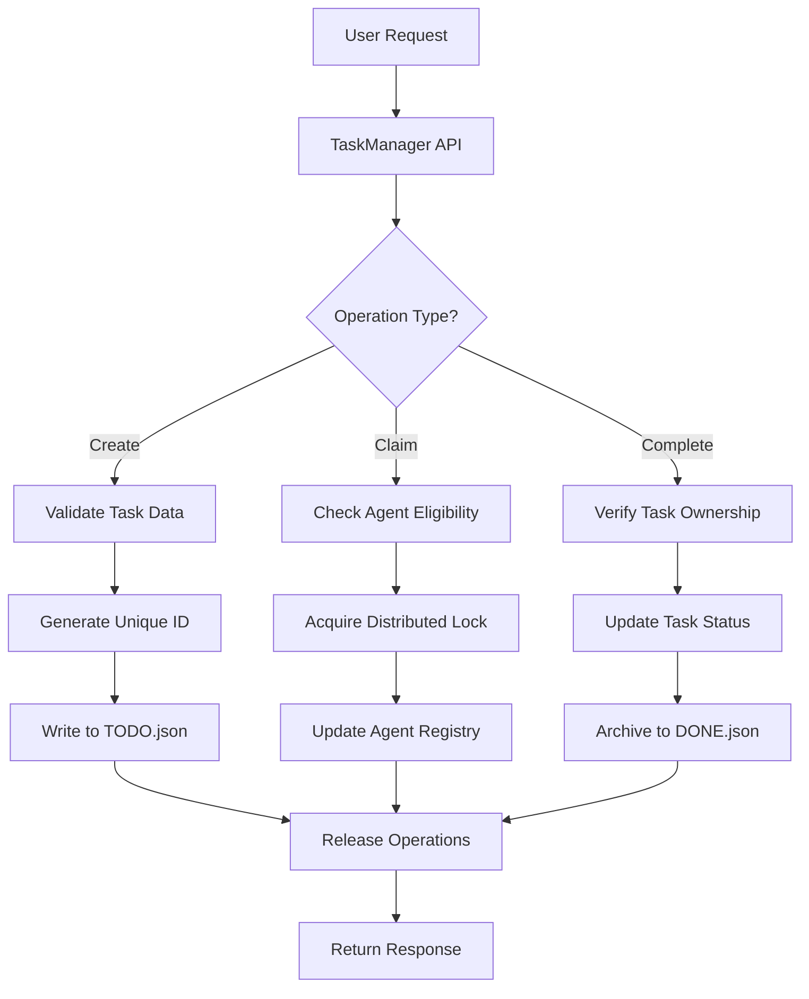
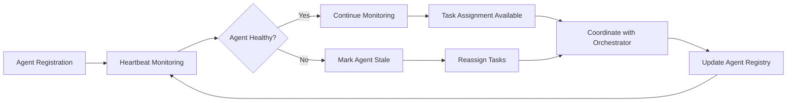

# Infinite Continue Stop Hook - System Architecture Documentation

## Overview

The **infinite-continue-stop-hook** is an advanced task management system designed for autonomous agent coordination and unlimited code execution workflows. The system provides a robust foundation for multi-agent development environments, featuring distributed task management, atomic operations, and intelligent continue/stop protocols.

## Architecture Overview

### Core Components



### System Layers

1. **API Layer** - User-facing interfaces and command-line tools
2. **Core Management Layer** - Task management, agent coordination, orchestration
3. **Storage Layer** - JSON-based persistence with atomic operations
4. **Infrastructure Layer** - Logging, monitoring, security, and system utilities

## Core Components Deep Dive

### 1. TaskManager API (`taskmanager-api.js`)

**Purpose**: Universal command-line interface providing comprehensive task management capabilities

**Key Features**:
- Universal project support (works with any codebase containing TODO.json)
- Agent lifecycle management (initialization, heartbeat renewal, status tracking)
- Task operations (create, claim, complete, list, filter, reorder)
- Dependency system with automatic detection and guidance
- Research workflow integration with intelligent task suggestions
- Multi-agent orchestration and coordination
- Performance optimized with 10-second timeouts and caching

**Architecture**:
```javascript
class TaskManagerAPI {
  constructor() {
    this.taskManager = new TaskManager(TODO_PATH);
    this.agentManager = new AgentManager();
    this.orchestrator = new MultiAgentOrchestrator();
    this.agentId = null; // Current agent session
  }
}
```

**Integration Patterns**:
- CLI tool integration via command-line arguments
- Programmatic usage via module imports  
- CI/CD pipeline integration for automated workflows
- Multi-agent orchestration for concurrent operations

### 2. TaskManager Core (`lib/taskManager.js`)

**Purpose**: Central component providing comprehensive task management with atomic operations and multi-agent coordination

**Key Features**:
- Atomic task operations with distributed locking
- Multi-agent coordination and conflict resolution
- Dependency management and validation
- Automatic error detection and recovery
- Performance optimization with caching and lazy loading
- Stale task monitoring and cleanup
- Category-based task organization
- Research workflow integration

**Task Lifecycle**:
1. **Creation** - Tasks created with unique IDs and metadata
2. **Assignment** - Tasks claimed by agents through coordination system
3. **Execution** - Task status updated through workflow states
4. **Completion** - Tasks marked complete with optional archiving
5. **Cleanup** - Completed tasks moved to DONE.json archive

**Multi-Agent Coordination**:
```javascript
// Task claiming with coordination
async claimTask(taskId, agentId, priority = 'normal', options = {}) {
  // 1. Acquire distributed lock
  const lockAcquired = await this.lockManager.acquireLock(`task_${taskId}`);
  
  // 2. Validate task availability and agent eligibility
  const task = await this.validateTaskClaim(taskId, agentId);
  
  // 3. Update task assignment with agent registry
  await this.agentManager.assignTask(agentId, taskId);
  
  // 4. Release lock and return assignment
  await this.lockManager.releaseLock(`task_${taskId}`);
  return task;
}
```

### 3. Agent Management System

**Purpose**: Manages agent lifecycle, registration, heartbeat monitoring, and task assignment

**Components**:
- **Agent Registry** (`lib/agentManager.js`): Central registry for all active agents
- **Heartbeat Monitor**: Monitors agent health and detects stale agents
- **Task Assignment**: Coordinates task distribution among agents

**Agent Lifecycle**:
```javascript
// Agent initialization
const agentConfig = {
  role: 'development',
  sessionId: 'session_timestamp',
  specialization: ['frontend', 'testing']
};

// Registration and heartbeat
const agentId = await agentManager.registerAgent(agentConfig);
await agentManager.startHeartbeat(agentId);
```

**Stale Agent Detection**:
- Configurable heartbeat intervals (default: 30 seconds)
- Automatic task reassignment on agent failure
- Cleanup of abandoned resources

### 4. Multi-Agent Orchestrator (`lib/multiAgentOrchestrator.js`)

**Purpose**: Coordinates multiple concurrent agents, prevents conflicts, and manages resource allocation

**Coordination Mechanisms**:
- **Distributed Locking**: Prevents concurrent modification conflicts
- **Task Queue Management**: Ensures proper task ordering and dependencies
- **Resource Allocation**: Manages system resources across multiple agents
- **Conflict Resolution**: Handles competing agent requests

**Orchestration Flow**:


### 5. Stop Hook System (`stop-hook.js`)

**Purpose**: Implements infinite continue protocol with intelligent stop authorization

**Core Mechanisms**:
- **Never-Stop Protocol**: Prevents natural termination of execution
- **Stop Authorization API**: Endpoint-based stop control
- **Task Guidance System**: Provides intelligent suggestions for continued work
- **Project Detection**: Automatically finds and works with TODO.json files

**Infinite Continue Logic**:
```javascript
function shouldStop() {
  // 1. Check if stop endpoint was triggered
  if (checkStopAuthorization()) {
    return allowOneTimeStop();
  }
  
  // 2. Analyze current task state
  const taskStatus = analyzeTaskStatus();
  
  // 3. Provide guidance for continued work
  if (taskStatus.hasAvailableTasks) {
    return provideTaskGuidance(taskStatus);
  }
  
  // 4. Never allow natural stops
  return false;
}
```

**Stop Authorization**:
- Single-use authorization tokens
- Endpoint-based trigger mechanism
- Automatic reset to never-stop mode

### 6. Setup Hook System (`setup-infinite-hook.js`)

**Purpose**: Project initialization, schema migration, and system configuration

**Key Features**:
- **Automatic Project Detection**: Finds and configures projects in directory trees
- **Schema Migration**: Updates TODO.json to latest format with backward compatibility
- **Feature-Based System Integration**: Migrates from task-only to feature+task hybrid
- **Batch Processing**: Handles multiple projects simultaneously
- **Interactive/Non-Interactive Modes**: Supports both CLI and automated deployment

**Migration Process**:
```javascript
function migrateToFeatureBasedSystem(projectPath) {
  // 1. Backup existing TODO.json
  createBackup(todoPath);
  
  // 2. Analyze existing tasks for feature grouping
  const analysis = analyzeTasksForFeatures(existingTasks);
  
  // 3. Create feature structures from task analysis
  const features = createFeaturesFromAnalysis(analysis);
  
  // 4. Update schema with new structure
  updateTodoSchema(features, tasks);
}
```

## Data Flow Architecture

### Task Management Flow



### Agent Coordination Flow



## Security Model

### Input Validation and Sanitization

**File Path Security**:
```javascript
// ESLint security rules enforced
// eslint-disable-next-line security/detect-non-literal-fs-filename -- validated path
const todoContent = fs.readFileSync(validatedPath, 'utf8');
```

**JSON Schema Validation**:
- Comprehensive schema validation for all TODO.json operations
- Input sanitization for all user-provided data
- Path traversal prevention for file operations

### Access Control

**Agent Authentication**:
- Unique agent IDs with session-based tracking
- Agent capability validation before task assignment
- Resource access control based on agent roles

**Operation Authorization**:
- Task ownership verification for modifications
- Distributed locking prevents unauthorized concurrent access
- Audit trail for all task operations

### Data Integrity

**Atomic Operations**:
```javascript
async performAtomicTaskOperation(operation) {
  const lockAcquired = await this.lockManager.acquireLock('todo_write');
  try {
    // Perform operation with full consistency
    const result = await operation();
    await this.validateDataIntegrity();
    return result;
  } finally {
    await this.lockManager.releaseLock('todo_write');
  }
}
```

**Backup and Recovery**:
- Automatic backup creation before schema migrations
- Corruption detection and recovery mechanisms
- Rollback capabilities for failed operations

## Integration Patterns

### CLI Integration

```bash
# Basic task operations
node taskmanager-api.js init
node taskmanager-api.js create '{"title": "Task", "category": "feature"}'
node taskmanager-api.js claim task_123 agent_456

# Project setup
node setup-infinite-hook.js /path/to/project --batch
```

### Programmatic Integration

```javascript
const TaskManagerAPI = require('./taskmanager-api.js');

class CustomAgent {
  constructor() {
    this.api = new TaskManagerAPI();
  }
  
  async initializeAgent() {
    const result = await this.api.initializeAgent({
      role: 'development',
      specialization: ['frontend']
    });
    this.agentId = result.agentId;
  }
  
  async processNextTask() {
    const task = await this.api.claimNextTask(this.agentId);
    // Process task...
    await this.api.completeTask(task.id, completionData);
  }
}
```

### CI/CD Integration

```yaml
# Example GitHub Actions workflow
- name: Initialize TaskManager
  run: node setup-infinite-hook.js ${{ github.workspace }} --batch

- name: Process Development Tasks
  run: |
    AGENT_ID=$(node taskmanager-api.js init | jq -r '.agentId')
    node taskmanager-api.js claim-next $AGENT_ID
```

## Performance Characteristics

### Optimization Strategies

**Caching**:
- File modification time tracking for TODO.json
- In-memory caching of frequently accessed tasks
- Lazy loading of heavy components (AutoFixer, LockManager)

**I/O Optimization**:
- Batch operations for multiple task modifications
- Efficient JSON parsing with validation skipping options
- Memory-efficient operation for large task sets

**Concurrency**:
- Non-blocking operations with proper async/await patterns
- Distributed locking with minimal lock duration
- Parallel processing support for independent operations

### Resource Management

**Memory Usage**:
- Efficient data structures for task management
- Automatic cleanup of completed tasks
- Configurable cache sizes and retention policies

**Network Operations**:
- 10-second timeout protection for all operations
- Retry mechanisms for transient failures
- Connection pooling for external services

## Monitoring and Observability

### Logging System

**Structured Logging**:
```javascript
const logger = Logger.getLogger('TaskManager');
logger.info('Task operation completed', {
  taskId: 'task_123',
  agentId: 'agent_456', 
  operation: 'complete',
  duration: 1250,
  success: true
});
```

**Log Levels**:
- **ERROR**: System errors, failures, exceptions
- **WARN**: Warnings, deprecated usage, performance issues
- **INFO**: General operations, state changes, completions
- **DEBUG**: Detailed execution flow, internal state

### Metrics and Analytics

**Task Metrics**:
- Task creation, completion, and failure rates
- Agent utilization and performance statistics
- System throughput and response times

**System Health**:
- Memory and CPU usage monitoring
- File system I/O performance
- Agent heartbeat and availability status

## Extension Points

### Custom Task Categories

```javascript
const customCategories = {
  'security-audit': {
    priority: 1,
    description: 'Security audit and vulnerability assessment',
    requiredFields: ['security_level', 'audit_scope']
  }
};

taskManager.registerTaskCategories(customCategories);
```

### Agent Specializations

```javascript
class SecurityAgent extends BaseAgent {
  constructor() {
    super({
      role: 'security',
      specialization: ['audit', 'penetration-testing'],
      capabilities: ['vulnerability-scanning', 'code-analysis']
    });
  }
  
  async canHandleTask(task) {
    return task.category === 'security-audit';
  }
}
```

### Custom Orchestration Strategies

```javascript
class PriorityOrchestrationStrategy {
  async assignTask(availableTasks, availableAgents) {
    // Custom logic for task assignment
    const highPriorityTasks = availableTasks.filter(t => t.priority === 'critical');
    const specializedAgents = availableAgents.filter(a => a.hasRequiredSkills(task));
    return this.optimizeAssignment(highPriorityTasks, specializedAgents);
  }
}
```

## Deployment and Configuration

### Environment Setup

**Requirements**:
- Node.js 18+ with ES2022 support
- File system write permissions for project directories
- Network access for distributed operations (optional)

**Configuration Files**:
- `TODO.json` - Primary task and feature database
- `DONE.json` - Completed task archive
- Agent registry files for persistent agent state

### Production Deployment

**Single Project Setup**:
```bash
node setup-infinite-hook.js /path/to/project --single --batch
```

**Multi-Project Setup**:
```bash
node setup-infinite-hook.js /projects/root --batch
```

**CI/CD Integration**:
```bash
node setup-infinite-hook.js $PROJECT_ROOT --batch --no-interactive \
  --task "Automated deployment tasks" \
  --mode "DEPLOYMENT"
```

## Troubleshooting

### Common Issues

**Task Order Violations**:
```bash
# Use order override for user-requested tasks
node taskmanager-api.js claim task_123 agent_456 --allow-out-of-order
```

**Agent Registration Failures**:
```bash
# Reinitialize agent with fresh session
node taskmanager-api.js reinitialize agent_456
```

**Schema Migration Issues**:
```bash
# Force schema update with backup
node setup-infinite-hook.js /project/path --force-update --backup
```

### Debugging Tools

**Verbose Logging**:
```bash
DEBUG=* node taskmanager-api.js list
```

**System Status**:
```bash
node taskmanager-api.js stats
node taskmanager-api.js status agent_123
```

**Schema Validation**:
```bash
node taskmanager-api.js validate-schema
```

## Future Enhancements

### Planned Features

1. **Real-time Log Streaming**: Live log monitoring and streaming capabilities
2. **Log Analytics Dashboard**: Visual log analysis and performance monitoring  
3. **Automated Error Detection**: Intelligent error pattern recognition and alerting
4. **Task Scheduling**: Time-based task scheduling and recurring task support
5. **Task Metrics**: Detailed analytics on task completion times and success rates
6. **Performance Monitoring**: Built-in performance profiling and optimization suggestions

### Integration Roadmap

1. **API Documentation Generator**: Automatic API documentation generation from code
2. **Security Auditing**: Automated security vulnerability scanning and reporting
3. **Cloud Integration**: Support for cloud-based agent coordination
4. **Real-time Collaboration**: Multi-user real-time task collaboration features

## Conclusion

The infinite-continue-stop-hook system provides a robust, scalable, and secure foundation for autonomous agent task management. Its architecture emphasizes reliability, performance, and extensibility while maintaining simplicity in core operations. The system's design supports both single-agent workflows and complex multi-agent orchestration scenarios, making it suitable for a wide range of development and automation use cases.

The combination of atomic operations, distributed locking, comprehensive monitoring, and intelligent continue/stop protocols creates a platform that can reliably manage long-running autonomous processes while providing the control and observability needed for production environments.