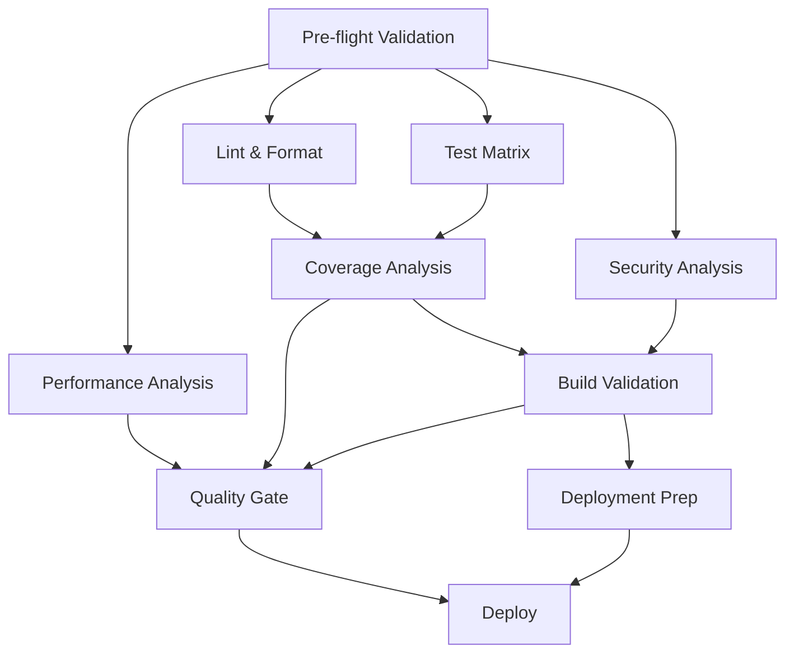

# Enhanced CI/CD Workflow Guide

## Overview

This document describes the comprehensive GitHub Actions CI/CD workflow implemented for the infinite-continue-stop-hook project. The workflow provides enterprise-grade quality gates, security scanning, and deployment automation.

## Workflow Structure

### 🚀 Pipeline Stages

The CI/CD pipeline consists of 10 main stages designed for maximum parallelization and efficiency:



### 📋 Job Descriptions

#### 1. Pre-flight Validation (5 mins)
- **Purpose**: Rapid feedback loop for basic validations
- **Actions**:
  - Syntax validation for core JavaScript files
  - Package.json structure validation
  - Quick security audit
  - Matrix configuration determination
- **Parallelization**: Sets up optimal test matrix based on branch and context

#### 2. Linting & Code Quality (10 mins)
- **Purpose**: Enforce code standards and style consistency
- **Tools**: ESLint with security plugins
- **Actions**:
  - ESLint validation with zero-tolerance policy
  - Code style consistency checks
  - Git hooks validation
  - Lint report generation

#### 3. Test Matrix (25 mins)
- **Purpose**: Comprehensive testing across environments
- **Matrix**:
  - **Node.js versions**: 18.x, 20.x, 22.x
  - **Operating Systems**: Ubuntu, Windows, macOS
  - **Optimizations**: Strategic exclusions for resource efficiency
- **Test Types**:
  - Unit tests
  - Integration tests
  - API comprehensive tests
  - RAG system tests
  - E2E tests (Ubuntu only)

#### 4. Security Analysis (15 mins)
- **Purpose**: Multi-layered security validation
- **Tools**:
  - NPM Audit (dependency vulnerabilities)
  - Semgrep SAST (static analysis)
  - CodeQL (comprehensive analysis - optional)
  - Gitleaks (secret scanning)
  - Dependency vulnerability scanning
- **Scan Levels**: Minimal, Standard, Comprehensive

#### 5. Performance Analysis (20 mins)
- **Purpose**: Performance monitoring and optimization insights
- **Actions**:
  - Performance benchmarks
  - Stress testing
  - RAG system performance validation
  - Memory profiling
  - Performance insights generation
- **Reporting**: Automated PR comments with performance metrics

#### 6. Coverage Analysis (15 mins)
- **Purpose**: Ensure comprehensive test coverage
- **Actions**:
  - Merge coverage reports from all test runs
  - Generate comprehensive coverage analysis
  - Validate against configurable thresholds
  - Create coverage badges
- **Thresholds**: Lines (80%), Branches (75%), Functions (80%), Statements (80%)

#### 7. Build Validation (15 mins)
- **Purpose**: Validate application integrity and startup
- **Actions**:
  - Application startup validation
  - Integration smoke tests
  - CLI commands validation
  - Package integrity checks

#### 8. Deployment Preparation (10 mins)
- **Purpose**: Prepare production-ready deployment packages
- **Actions**:
  - Create deployment package with production dependencies
  - Generate deployment metadata
  - Validate deployment package
  - Create deployment artifacts

#### 9. Quality Gate (5 mins)
- **Purpose**: Final validation before deployment approval
- **Evaluation**: Comprehensive status check of all critical jobs
- **Reporting**: Final quality report generation
- **Decision**: Pass/fail determination for deployment readiness

#### 10. Deployment (10 mins)
- **Purpose**: Deploy to target environment
- **Environments**: Staging, Production
- **Actions**:
  - Environment-specific deployment
  - Post-deployment validation
  - Success notifications

## 🎯 Trigger Conditions

### Automatic Triggers
- **Push to branches**: `main`, `develop`, `feature/*`, `hotfix/*`
- **Pull requests**: Against `main` or `develop`
- **Tags**: Version tags (`v*`)

### Manual Triggers
- **Workflow Dispatch**: With configurable options:
  - Performance tests toggle
  - Coverage threshold override
  - Deployment environment selection
  - Security scan level selection

## 🔧 Configuration Options

### Test Matrix Optimization
- **Main branch**: Full matrix (all OS + Node.js combinations)
- **Feature branches**: Optimized matrix (reduced combinations)
- **Pull requests**: Full validation matrix

### Security Scan Levels
- **Minimal**: NPM audit + dependency analysis + secret scanning
- **Standard**: + Semgrep SAST analysis
- **Comprehensive**: + CodeQL analysis

### Coverage Thresholds
- **Global**: Lines 80%, Branches 75%, Functions 80%, Statements 80%
- **Specific modules**: Higher thresholds for critical components
- **Override**: Manual threshold adjustment via workflow dispatch

## 📊 Caching Strategy

### Multi-level Caching
1. **NPM Dependencies**: `~/.npm` with lock file hash keys
2. **Node Modules**: Platform and Node.js version specific
3. **Pre-flight Cache**: Minimal dependency caching for rapid feedback
4. **Jest Cache**: Test execution optimization

### Cache Keys
```yaml
# NPM cache
key: npm-${{ runner.os }}-${{ hashFiles('package-lock.json') }}

# Node modules cache
key: ${{ runner.os }}-node${{ matrix.node-version }}-deps-${{ hashFiles('package-lock.json') }}

# Pre-flight cache
key: npm-preflight-${{ runner.os }}-${{ hashFiles('package-lock.json') }}
```

## 🛡️ Security Features

### Secret Scanning
- **Tool**: Gitleaks with custom configuration
- **Coverage**: API keys, tokens, certificates, database URLs
- **Allowlists**: Test fixtures and mock data excluded

### SAST Analysis
- **Tool**: Semgrep with multiple rulesets
- **Rulesets**: JavaScript, Node.js, security-audit
- **Output**: JSON reports for CI/CD integration

### Dependency Security
- **NPM Audit**: Production and development dependencies
- **Audit CI**: Configurable severity levels
- **Vulnerability Tracking**: Automated reporting and alerting

## 📈 Artifact Management

### Retention Policies
- **Test Results**: 30 days
- **Security Reports**: 90 days
- **Coverage Reports**: 90 days
- **Performance Reports**: 30 days
- **Quality Gate Reports**: 90 days
- **Deployment Packages**: 30 days

### Artifact Types
- **Test Results**: JUnit XML, LCOV, coverage summaries
- **Security Reports**: JSON reports from all security tools
- **Performance Reports**: Benchmarks, memory profiles, insights
- **Build Reports**: Validation summaries and metadata
- **Deployment Packages**: Production-ready application bundles

## 🔄 Branch Protection Integration

### Protection Levels

#### Minimal Protection
- Required status checks: Pre-flight + Linting
- Required reviews: 1
- Admin enforcement: Disabled

#### Standard Protection
- Required status checks: Core pipeline jobs
- Required reviews: 1 with code owner approval
- Admin enforcement: Disabled

#### Strict Protection
- Required status checks: All matrix combinations
- Required reviews: 2 with code owner approval
- Admin enforcement: Enabled

### CODEOWNERS Configuration
```
# Global code owners
* @owner

# Critical files
/.github/ @owner
/package.json @owner
/taskmanager-api.js @owner
```

## 📝 Usage Examples

### Manual Performance Testing
```bash
# Trigger performance tests manually
gh workflow run enhanced-ci-cd-pipeline.yml \
  -f run_performance_tests=true \
  -f security_scan_level=comprehensive
```

### Environment Deployment
```bash
# Deploy to production
gh workflow run enhanced-ci-cd-pipeline.yml \
  -f deploy_environment=production
```

### Coverage Threshold Override
```bash
# Temporarily lower coverage threshold
gh workflow run enhanced-ci-cd-pipeline.yml \
  -f coverage_threshold=75
```

## 🚨 Troubleshooting

### Common Issues

#### Coverage Threshold Failures
- **Symptom**: Coverage below required threshold
- **Solution**: Add more comprehensive tests or adjust thresholds
- **Command**: `npm run coverage:check:standalone`

#### Security Scan Failures
- **Symptom**: Security vulnerabilities detected
- **Solution**: Update dependencies or add to allowlist if false positive
- **Command**: `npm audit fix`

#### Performance Degradation
- **Symptom**: Performance warnings in PR comments
- **Solution**: Investigate bottlenecks and optimize critical paths
- **Command**: `npm run performance:test:verbose`

#### Build Validation Failures
- **Symptom**: Application fails to start
- **Solution**: Check logs and fix startup issues
- **Command**: `npm start`

### Debug Commands
```bash
# Local coverage validation
npm run coverage:check:strict

# Local performance testing
npm run performance:test:verbose

# Local security scanning
npm audit --audit-level=moderate

# Local lint validation
npm run lint
```

## 🎯 Best Practices

### For Developers
1. **Run tests locally** before pushing
2. **Check coverage** with `npm run coverage:check`
3. **Validate security** with `npm audit`
4. **Monitor performance** with `npm run performance:test`

### For Maintainers
1. **Configure branch protection** using the workflow
2. **Monitor security reports** regularly
3. **Review performance trends** in PR comments
4. **Update dependencies** proactively

### For CI/CD Management
1. **Monitor workflow duration** and optimize bottlenecks
2. **Review artifact storage** and adjust retention policies
3. **Update security tools** and rulesets regularly
4. **Optimize test matrix** based on project needs

## 📚 Additional Resources

- [GitHub Actions Documentation](https://docs.github.com/en/actions)
- [Jest Testing Framework](https://jestjs.io/)
- [ESLint Configuration](https://eslint.org/docs/user-guide/configuring/)
- [Semgrep Rules](https://semgrep.dev/docs/rules/)
- [CodeQL Documentation](https://codeql.github.com/docs/)

---

*This documentation is automatically updated with workflow changes. Last updated: 2025-09-23*