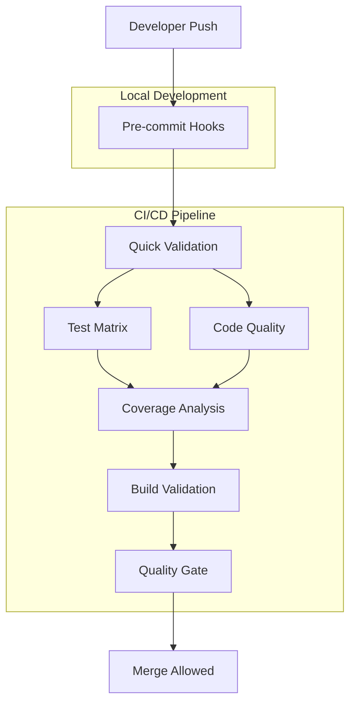

# CI/CD Pipeline Documentation

## Overview

This repository implements a comprehensive Continuous Integration and Continuous Deployment (CI/CD) pipeline designed to ensure code quality, reliability, and security through automated testing and quality gates.

## 🏗️ Architecture

### Pipeline Components



### Workflow Files

| Workflow                      | Purpose                                           | Triggers                       |
| ----------------------------- | ------------------------------------------------- | ------------------------------ |
| `ci-cd-pipeline.yml`          | Main CI/CD workflow with comprehensive testing    | Push, PR, Manual               |
| `coverage-monitoring.yml`     | Coverage analysis and trend tracking              | Push to main/develop, Schedule |
| `branch-protection-setup.yml` | Quality gates and branch protection configuration | Push to main, Manual           |

## 🚀 Getting Started

### Prerequisites

- Node.js >= 18.0.0
- npm >= 8.0.0
- Git >= 2.20.0

### Setup

1. **Clone repository**

   ```bash
   git clone <repository-url>
   cd infinite-continue-stop-hook
   ```

2. **Install dependencies**

   ```bash
   npm ci
   ```

3. **Setup Git hooks**

   ```bash
   npm run prepare
   ```

4. **Verify setup**
   ```bash
   npm run lint
   npm test
   npm run coverage:check
   ```

## 📋 Quality Gates

### Stage 1: Pre-commit Validation (Local)

**Duration**: 30-60 seconds
**Purpose**: Fast feedback to prevent CI/CD failures

- ✅ **Syntax validation** - package.json, JavaScript/TypeScript files
- ✅ **Lint check** - ESLint validation on staged files only
- ✅ **Quick tests** - API tests and critical unit tests
- ✅ **Security scan** - Basic dependency vulnerability check
- ⚠️ **Coverage validation** - For significant changes only

### Stage 2: Quick Validation (CI/CD)

**Duration**: 3-5 minutes
**Purpose**: Immediate feedback for basic issues

- ✅ **Package validation** - package.json syntax and dependencies
- ✅ **Lint validation** - Full ESLint check
- ✅ **Security audit** - npm audit for high/critical vulnerabilities
- ✅ **Dependency analysis** - Package structure validation

### Stage 3: Test Matrix (CI/CD)

**Duration**: 10-20 minutes
**Purpose**: Cross-platform and cross-version compatibility

**Test Matrix:**

- **Operating Systems**: Ubuntu, Windows, macOS
- **Node.js Versions**: 18.x, 20.x, 22.x
- **Test Suites**: Unit, Integration, RAG System, API

**Optimizations:**

- Excludes Windows/macOS for Node 18.x (optimization)
- Allows Node 22.x failures (compatibility testing)
- Parallel execution across matrix dimensions

### Stage 4: Code Quality & Security (CI/CD)

**Duration**: 5-10 minutes
**Purpose**: Comprehensive code analysis

- ✅ **ESLint analysis** - Comprehensive code quality check
- ✅ **Security scanning** - npm audit + Semgrep SAST
- ✅ **Dependency analysis** - Dependency tree and unused packages
- ✅ **Report generation** - Detailed security and quality reports

### Stage 5: Coverage Analysis (CI/CD)

**Duration**: 5-8 minutes
**Purpose**: Test coverage validation and trending

- ✅ **Coverage generation** - Jest coverage with all reporters
- ✅ **Threshold validation** - Configurable coverage thresholds
- ✅ **Trend tracking** - Historical coverage data
- ✅ **Report generation** - HTML, LCOV, JSON coverage reports
- ✅ **PR commenting** - Automated coverage feedback

### Stage 6: Build & Integration (CI/CD)

**Duration**: 3-5 minutes
**Purpose**: Application build and startup validation

- ✅ **Application startup** - Verify app starts without errors
- ✅ **Integration tests** - API endpoint validation
- ✅ **Smoke tests** - Critical functionality verification

### Stage 7: Final Quality Gate (CI/CD)

**Duration**: 1-2 minutes
**Purpose**: Overall validation and deployment readiness

- ✅ **Status aggregation** - Verify all stages passed
- ✅ **Quality summary** - Generate comprehensive report
- ✅ **Deployment approval** - Mark code as deployment-ready

## 📊 Coverage Requirements

### Thresholds

| Metric         | Target | Critical | Action                        |
| -------------- | ------ | -------- | ----------------------------- |
| **Statements** | 80%    | 70%      | Block merge if below critical |
| **Branches**   | 85%    | 75%      | Block merge if below critical |
| **Functions**  | 80%    | 70%      | Block merge if below critical |
| **Lines**      | 80%    | 70%      | Block merge if below critical |

### Coverage Monitoring

- **Trend Tracking**: Historical data for last 100 commits
- **Regression Detection**: Automatic alerts for significant drops
- **Report Generation**: HTML, LCOV, and JSON formats
- **Badge Generation**: Dynamic coverage badges for README

## 🔒 Security Integration

### Security Scanning Tools

1. **npm audit** - Dependency vulnerability scanning
2. **Semgrep** - Static Application Security Testing (SAST)
3. **ESLint Security Plugin** - Code pattern security analysis

### Security Thresholds

- **Critical/High vulnerabilities**: Block merge
- **Medium vulnerabilities**: Warning, allow with review
- **Low vulnerabilities**: Informational only

### Security Reports

- **Audit Results**: JSON format with vulnerability details
- **SAST Results**: Semgrep findings with severity levels
- **Dependency Analysis**: Complete dependency tree analysis

## 🛠️ Local Development

### Available Scripts

```bash
# Testing
npm test                    # Run all tests
npm run test:api           # API tests only
npm run test:rag          # RAG system tests
npm run test:rag:unit     # RAG unit tests
npm run test:rag:integration # RAG integration tests

# Code Quality
npm run lint              # Run ESLint
npm run lint:fix          # Auto-fix ESLint issues
npm run lint:focused     # Lint specific files

# Coverage
npm run coverage          # Generate coverage report
npm run coverage:check    # Validate coverage thresholds
npm run coverage:html     # Generate HTML coverage report
npm run coverage:monitor  # Comprehensive coverage analysis

# Git Hooks
npm run prepare           # Install Husky git hooks
```

### Pre-commit Hook Behavior

**Quick Checks** (always run):

- Package.json syntax validation
- ESLint on staged files only
- Large file detection
- Debugging code detection

**Conditional Checks** (based on changes):

- Test execution (if source code changed)
- Security audit (if dependencies changed)
- Coverage validation (if significant changes)

**Interactive Prompts**:

- Large files detected
- Debugging code found
- Coverage thresholds not met
- Security vulnerabilities found

### Pre-push Hook Behavior

**Comprehensive Validation**:

- Full test suite execution
- Complete RAG system validation
- Full ESLint check
- Coverage threshold validation
- Security audit
- Application startup test

**Timeout Management**:

- Tests: 120 seconds
- RAG tests: 90 seconds
- Lint: 30 seconds
- Coverage: 45 seconds
- Startup: 30 seconds

## 🔧 Configuration

### Environment Variables

| Variable             | Purpose                     | Default      |
| -------------------- | --------------------------- | ------------ |
| `CI`                 | CI environment detection    | `true` in CI |
| `NODE_ENV`           | Node environment            | `test`       |
| `COVERAGE_THRESHOLD` | Override coverage threshold | `80`         |
| `HUSKY_DEBUG`        | Debug git hooks             | `false`      |
| `DEBUG`              | Enable debug logging        | `false`      |

### Customization

**Coverage Thresholds** (`jest.config.js`):

```javascript
coverageThreshold: {
  global: {
    branches: 75,
    functions: 80,
    lines: 80,
    statements: 80
  }
}
```

**ESLint Configuration** (`eslint.config.mjs`):

```javascript
export default tseslint.config(
  eslint.configs.recommended
  // ... additional configurations
);
```

**Git Hooks** (`.husky/`):

- Modify `pre-commit` for local validation rules
- Modify `pre-push` for comprehensive validation rules

## 📈 Monitoring & Analytics

### Metrics Collected

1. **Test Execution**:
   - Test duration trends
   - Test success rates
   - Flaky test detection

2. **Coverage Trends**:
   - Historical coverage data
   - Coverage regression detection
   - Per-module coverage tracking

3. **Build Performance**:
   - CI/CD execution time
   - Resource utilization
   - Success/failure rates

4. **Security Metrics**:
   - Vulnerability discovery rate
   - Security fix time
   - Security scan effectiveness

### Reports Available

- **Coverage Reports**: `coverage/html-report/index.html`
- **Test Reports**: `coverage/jest-report.html`
- **Security Reports**: Uploaded to GitHub Actions artifacts
- **Quality Metrics**: Available in CI/CD logs

## 🚨 Troubleshooting

### Common Issues

**Tests Failing Locally**:

```bash
# Debug failing tests
npm test -- --verbose --detectOpenHandles

# Check test isolation
npm test -- --runInBand

# Debug specific test file
npm test -- test/specific-test.test.js
```

**Coverage Threshold Failures**:

```bash
# Generate detailed coverage report
npm run coverage:html

# Check uncovered lines
npm run coverage:report

# View coverage by file
npm run coverage:json && cat coverage/coverage-summary.json
```

**Lint Failures**:

```bash
# Auto-fix issues
npm run lint:fix

# Debug specific files
npm run lint:focused

# Check specific rules
npx eslint --print-config file.js
```

**Git Hook Issues**:

```bash
# Reinstall hooks
rm -rf .husky && npm run prepare

# Debug hook execution
HUSKY_DEBUG=1 git commit -m "test"

# Skip hooks temporarily
git commit --no-verify -m "emergency commit"
```

**CI/CD Pipeline Failures**:

1. Check GitHub Actions logs
2. Look for timeout issues
3. Verify environment variables
4. Check for dependency conflicts
5. Review recent changes impact

### Performance Optimization

**Local Development**:

- Use `npm run test:api` for quick feedback
- Run `npm run lint:focused` on specific files
- Use `npm run coverage:watch` during development

**CI/CD Pipeline**:

- Matrix exclusions reduce execution time
- Cached dependencies speed up builds
- Parallel job execution optimizes resource usage
- Timeout settings prevent hanging jobs

## 📚 Additional Resources

- [Jest Documentation](https://jestjs.io/docs/getting-started)
- [ESLint Configuration](https://eslint.org/docs/user-guide/configuring)
- [GitHub Actions Documentation](https://docs.github.com/en/actions)
- [Husky Git Hooks](https://typicode.github.io/husky/)
- [Semgrep Security Rules](https://semgrep.dev/docs/)

## 🤝 Contributing

1. **Fork the repository**
2. **Create feature branch**: `git checkout -b feature/amazing-feature`
3. **Make changes** with proper tests and documentation
4. **Run quality checks**: `npm run lint && npm run coverage:check && npm test`
5. **Commit changes**: `git commit -m "feat: add amazing feature"`
6. **Push to branch**: `git push origin feature/amazing-feature`
7. **Open Pull Request** and wait for CI/CD validation

The CI/CD pipeline will automatically validate your changes and provide feedback on:

- Test coverage
- Code quality
- Security vulnerabilities
- Build success
- Performance impact

All quality gates must pass before your PR can be merged!
