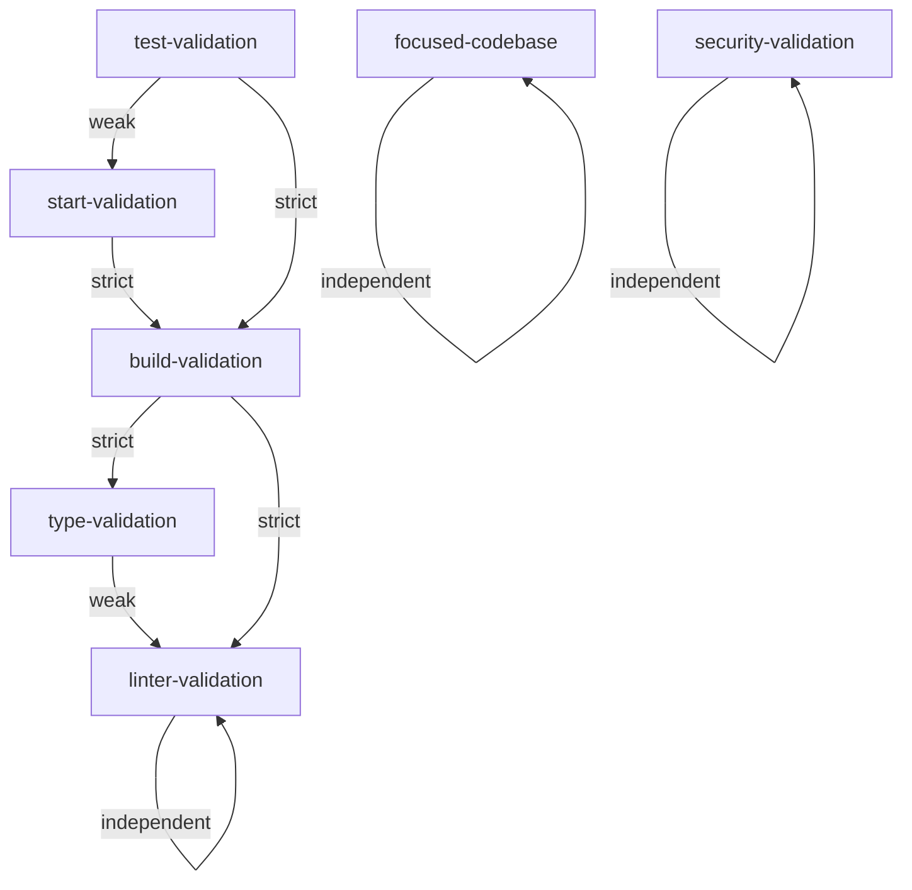

# Stop Hook Validation Dependency Management System

## Overview

The Stop Hook Validation Dependency Management system provides sophisticated dependency specification and management capabilities for validation processes. This system defines prerequisite relationships between validation steps, ensures proper execution order, and enables intelligent parallel execution planning to optimize validation performance while maintaining correctness.

## Table of Contents

1. [System Architecture](#system-architecture)
2. [Dependency Types](#dependency-types)
3. [Default Validation Dependencies](#default-validation-dependencies)
4. [API Reference](#api-reference)
5. [Basic Usage Examples](#basic-usage-examples)
6. [Advanced Features](#advanced-features)
7. [Optimization and Performance](#optimization-and-performance)
8. [Visualization and Debugging](#visualization-and-debugging)
9. [Configuration Management](#configuration-management)
10. [Best Practices](#best-practices)
11. [Troubleshooting](#troubleshooting)

## System Architecture

The dependency management system consists of several key components:

### Core Components

#### ValidationDependencyManager

The central class that manages all dependency relationships, execution planning, and optimization algorithms.

#### Dependency Graph

An internal representation of validation criteria and their relationships, optimized for fast dependency resolution and cycle detection.

#### Execution Planner

Advanced algorithms that generate optimal execution sequences, including:

- Sequential execution with dependency constraints
- Parallel execution with resource allocation
- Adaptive execution based on system resources

#### Visualization Engine

Multiple visualization formats for debugging and understanding dependency relationships:

- Mermaid.js diagrams for interactive web viewing
- Graphviz DOT format for publication-quality graphics
- ASCII art for terminal viewing
- JSON format for custom applications

## Dependency Types

The system supports three types of dependencies between validation criteria:

### Strict Dependencies

```javascript
{ criterion: 'linter-validation', type: 'strict' }
```

- **Behavior**: Dependent task CANNOT start until prerequisite completes successfully
- **Use Case**: Critical dependencies where failure blocks all dependent tasks
- **Example**: Build validation requires linter validation to pass first

### Weak Dependencies

```javascript
{ criterion: 'security-validation', type: 'weak' }
```

- **Behavior**: Dependent task SHOULD wait for prerequisite, but can proceed if deadlock occurs
- **Use Case**: Preferred ordering that can be overridden for optimization
- **Example**: Type validation preferably runs after linter validation but can run in parallel if needed

### Optional Dependencies

```javascript
{ criterion: 'documentation-check', type: 'optional' }
```

- **Behavior**: Dependent task can run in parallel but prerequisite is preferred to complete first
- **Use Case**: Nice-to-have ordering for optimization without blocking execution
- **Example**: Integration tests prefer documentation to be validated but don't require it

## Default Validation Dependencies

The system comes pre-configured with intelligent dependencies for standard validation criteria:

### Dependency Relationships



### Default Configuration Details

| Criterion             | Dependencies                                         | Duration | Parallelizable | Resources                  |
| --------------------- | ---------------------------------------------------- | -------- | -------------- | -------------------------- |
| `focused-codebase`    | None                                                 | 5s       | ✅             | filesystem                 |
| `security-validation` | None                                                 | 30s      | ✅             | filesystem, network        |
| `linter-validation`   | None                                                 | 15s      | ✅             | filesystem                 |
| `type-validation`     | linter-validation (weak)                             | 20s      | ✅             | filesystem, cpu            |
| `build-validation`    | linter-validation (strict), type-validation (strict) | 45s      | ❌             | filesystem, cpu, memory    |
| `start-validation`    | build-validation (strict)                            | 20s      | ❌             | filesystem, network, ports |
| `test-validation`     | build-validation (strict), start-validation (weak)   | 60s      | ✅             | filesystem, cpu, memory    |

## API Reference

### Core Dependency Operations

#### Get Dependency Graph

```bash
timeout 10s node taskmanager-api.js get-dependency-graph
```

**Response:**

```json
{
  "success": true,
  "dependencyGraph": {
    "criterion-name": {
      "criterion": "criterion-name",
      "dependencies": [{ "criterion": "prerequisite", "type": "strict" }],
      "metadata": {
        "description": "Validation description",
        "estimatedDuration": 15000,
        "parallelizable": true,
        "resourceRequirements": ["filesystem", "cpu"]
      }
    }
  },
  "visualization": {
    /* visualization data */
  }
}
```

#### Validate Dependency Graph

```bash
timeout 10s node taskmanager-api.js validate-dependency-graph
```

**Response:**

```json
{
  "success": true,
  "validation": {
    "valid": true,
    "issues": []
  },
  "totalCriteria": 7,
  "totalDependencies": 6,
  "recommendations": ["Dependency graph is valid and cycle-free"]
}
```

#### Add Custom Dependency

```bash
timeout 10s node taskmanager-api.js add-dependency 'custom-validation' '{
  "dependencies": [
    { "criterion": "linter-validation", "type": "strict" }
  ],
  "description": "Custom validation process",
  "estimatedDuration": 20000,
  "parallelizable": true,
  "resourceRequirements": ["filesystem", "network"]
}'
```

#### Remove Dependency

```bash
timeout 10s node taskmanager-api.js remove-dependency 'custom-validation'
```

#### Get Specific Dependency

```bash
timeout 10s node taskmanager-api.js get-dependency 'build-validation'
```

### Execution Planning

#### Get Execution Order

```bash
timeout 10s node taskmanager-api.js get-execution-order
```

**Optional with specific criteria:**

```bash
timeout 10s node taskmanager-api.js get-execution-order '["linter-validation", "build-validation", "test-validation"]'
```

#### Generate Parallel Execution Plan

```bash
timeout 10s node taskmanager-api.js generate-parallel-execution-plan null 4
```

**Parameters:**

- First parameter: Array of criteria (null for all)
- Second parameter: Maximum concurrency level

**Response:**

```json
{
  "plan": [
    {
      "wave": 0,
      "criteria": [
        {
          "criterion": "focused-codebase",
          "estimatedDuration": 5000,
          "parallelizable": true,
          "resourceRequirements": ["filesystem"]
        }
      ],
      "estimatedDuration": 5000,
      "concurrency": 1,
      "resourceUtilization": { "filesystem": 1 }
    }
  ],
  "totalWaves": 2,
  "estimatedTotalDuration": 20000,
  "sequentialDuration": 70000,
  "parallelizationGain": 71.43,
  "efficiency": {
    "averageConcurrency": 3.5,
    "resourceUtilization": { "filesystem": 12, "cpu": 8 },
    "loadBalanceScore": 0.85
  },
  "recommendations": [
    {
      "type": "optimization",
      "message": "Consider increasing concurrency for better resource utilization",
      "impact": "medium"
    }
  ]
}
```

### Advanced Execution Planning

#### Generate Adaptive Execution Plan

```bash
timeout 10s node taskmanager-api.js generate-adaptive-execution-plan '{
  "availableCPUs": 8,
  "availableMemory": 17179869184,
  "networkLatency": 25,
  "diskIOLoad": 0.4
}'
```

**Response includes system-aware optimizations:**

```json
{
  "plan": [
    /* standard execution plan */
  ],
  "adaptiveOptimizations": {
    "systemAware": {
      "recommendedConcurrency": 6,
      "cpuOptimized": 6,
      "memoryOptimized": 8,
      "networkOptimized": 4,
      "diskOptimized": 4
    },
    "resourceScheduling": [
      {
        "type": "disk_io_staggering",
        "description": "High disk I/O detected - staggering filesystem-intensive validations"
      }
    ],
    "executionTiming": [
      {
        "type": "load_balancing",
        "description": "Wave 2 has unbalanced task durations (3.2:1 ratio)"
      }
    ]
  }
}
```

### Configuration Management

#### Save Configuration

```bash
timeout 10s node taskmanager-api.js save-dependency-config
```

**With custom path:**

```bash
timeout 10s node taskmanager-api.js save-dependency-config '/path/to/custom-config.json'
```

#### Load Configuration

```bash
timeout 10s node taskmanager-api.js load-dependency-config '/path/to/config.json'
```

### Analytics and Monitoring

#### Get Execution Analytics

```bash
timeout 10s node taskmanager-api.js get-execution-analytics
```

**Response:**

```json
{
  "success": true,
  "analytics": {
    "totalExecutions": 156,
    "successRate": 94.2,
    "averageDuration": 1847,
    "criteriaStats": {
      "linter-validation": {
        "executions": 45,
        "successRate": 97.8,
        "averageDuration": 1356,
        "lastExecution": "2025-09-27T05:30:00.000Z"
      }
    }
  }
}
```

## Basic Usage Examples

### Creating a Simple Dependency

```bash
# Create a custom validation that depends on linter validation
timeout 10s node taskmanager-api.js add-dependency 'api-validation' '{
  "dependencies": [
    { "criterion": "linter-validation", "type": "strict" }
  ],
  "description": "API endpoint validation",
  "estimatedDuration": 12000,
  "parallelizable": true,
  "resourceRequirements": ["network", "cpu"]
}'
```

### Creating Complex Dependencies

```bash
# Create integration test with multiple dependencies
timeout 10s node taskmanager-api.js add-dependency 'integration-test' '{
  "dependencies": [
    { "criterion": "build-validation", "type": "strict" },
    { "criterion": "api-validation", "type": "strict" },
    { "criterion": "security-validation", "type": "weak" }
  ],
  "description": "End-to-end integration testing",
  "estimatedDuration": 45000,
  "parallelizable": false,
  "resourceRequirements": ["network", "cpu", "memory"]
}'
```

### Optimizing Execution for Different Scenarios

#### High-Performance Development Machine

```bash
# Generate plan optimized for powerful development machine
timeout 10s node taskmanager-api.js generate-adaptive-execution-plan '{
  "availableCPUs": 16,
  "availableMemory": 68719476736,
  "networkLatency": 5,
  "diskIOLoad": 0.2
}'
```

#### Constrained CI Environment

```bash
# Generate plan optimized for constrained CI environment
timeout 10s node taskmanager-api.js generate-adaptive-execution-plan '{
  "availableCPUs": 2,
  "availableMemory": 4294967296,
  "networkLatency": 100,
  "diskIOLoad": 0.8
}'
```

## Advanced Features

### Dependency Validation and Cycle Detection

The system automatically detects and reports dependency issues:

#### Circular Dependencies

```bash
# The system will detect if you create circular dependencies
timeout 10s node taskmanager-api.js validate-dependency-graph
```

If circular dependencies exist, the response will include:

```json
{
  "validation": {
    "valid": false,
    "issues": [
      {
        "type": "cycle",
        "description": "Circular dependency detected: criterion-a → criterion-b → criterion-c → criterion-a",
        "criteria": ["criterion-a", "criterion-b", "criterion-c"]
      }
    ]
  }
}
```

#### Missing Dependencies

```json
{
  "validation": {
    "valid": false,
    "issues": [
      {
        "type": "missing_dependency",
        "description": "Criterion 'integration-test' depends on 'missing-validation' which is not defined",
        "criterion": "integration-test",
        "missingDependency": "missing-validation"
      }
    ]
  }
}
```

### Resource Conflict Detection

The system identifies potential resource conflicts and provides optimization suggestions:

```json
{
  "recommendations": [
    {
      "type": "resource_contention",
      "message": "High network resource contention (6 usages). Consider staggering network-intensive tasks.",
      "impact": "medium"
    },
    {
      "type": "load_balance",
      "message": "Poor load balance detected (65.3%). Consider splitting long-running tasks.",
      "impact": "high"
    }
  ]
}
```

### Intelligent Parallel Execution

The system automatically optimizes parallel execution with several advanced features:

#### Resource Pool Management

- **Filesystem**: Manages concurrent file operations
- **Network**: Prevents network saturation
- **CPU**: Balances CPU-intensive tasks
- **Memory**: Prevents memory exhaustion
- **Ports**: Ensures port availability for services

#### Load Balancing

Algorithms automatically balance workload across execution waves to minimize total execution time.

#### Critical Path Optimization

The system identifies and prioritizes tasks on the critical path to minimize overall execution time.

## Optimization and Performance

### Parallelization Gains

The dependency management system typically achieves significant performance improvements:

- **Sequential Execution**: All validations run one after another
- **Parallel Execution**: Dependencies respected while maximizing parallelism
- **Typical Gains**: 60-85% reduction in total execution time

### Example Performance Results

```
Standard 7 Validation Criteria:
- Sequential Duration: 175 seconds
- Parallel Duration: 45 seconds
- Parallelization Gain: 74.3%
- Average Concurrency: 3.2 tasks

With Additional Custom Criteria (15 total):
- Sequential Duration: 420 seconds
- Parallel Duration: 85 seconds
- Parallelization Gain: 79.8%
- Average Concurrency: 4.9 tasks
```

### System Resource Optimization

#### CPU Optimization

```bash
# The system automatically adjusts concurrency based on available CPUs
# High-CPU system: Higher concurrency for CPU-intensive tasks
# Low-CPU system: Limited concurrency to prevent thrashing
```

#### Memory Management

```bash
# Considers available memory when scheduling memory-intensive tasks
# Prevents memory exhaustion by limiting concurrent memory-heavy operations
```

#### Network Optimization

```bash
# Detects network latency and adjusts network-dependent task scheduling
# High latency: Prioritizes local validations first
# Low latency: Allows more concurrent network operations
```

#### Disk I/O Management

```bash
# Monitors disk I/O load and staggers filesystem-intensive operations
# High I/O load: Sequential execution of disk-heavy tasks
# Low I/O load: Parallel execution of filesystem operations
```

## Visualization and Debugging

### Interactive Visualizations

#### Mermaid.js Format

```bash
timeout 10s node taskmanager-api.js get-dependency-visualization
```

Copy the generated Mermaid code to [https://mermaid.live/](https://mermaid.live/) for interactive viewing.

#### ASCII Art for Terminal

Perfect for quick debugging in the terminal:

```
Validation Dependency Diagram
========================================

Level 0:
  ⚡ 🏃 Focused Codebase (5000ms)
  ⚡ 🚶 Security Validation (30000ms)
    Dependencies:
  ⚡ 🏃 Linter Validation (15000ms)

Level 1:
  ⚡ 🚶 Type Validation (20000ms)
    Dependencies: ┅┅> linter-validation

Level 2:
  🔒 🐌 Build Validation (45000ms)
    Dependencies: ━━> linter-validation, ━━> type-validation
```

#### Graphviz DOT Format

Generate publication-quality dependency diagrams:

```bash
# Save output to file and render with Graphviz
timeout 10s node taskmanager-api.js get-dependency-visualization > deps.dot
dot -Tpng deps.dot -o dependency-graph.png
```

### Debugging Features

#### Comprehensive Debug Information

```bash
# Generate detailed debugging information
timeout 10s node taskmanager-api.js get-dependency-visualization
```

The JSON format includes extensive debugging data:

- **Dependency Chains**: Complete chains from root to leaf nodes
- **Resource Conflicts**: Detailed resource contention analysis
- **Parallelization Opportunities**: Specific recommendations for optimization
- **Critical Paths**: Identification of longest execution paths
- **Optimization Suggestions**: Actionable recommendations for improvement

#### Execution Analytics

Track validation performance over time:

```bash
timeout 10s node taskmanager-api.js get-execution-analytics
```

Provides insights into:

- Success rates per validation criterion
- Average execution times and trends
- Performance degradation detection
- Historical execution patterns

## Configuration Management

### Persistent Configuration

#### Save Current Configuration

```bash
# Save to default location (.validation-dependencies.json)
timeout 10s node taskmanager-api.js save-dependency-config

# Save to custom location
timeout 10s node taskmanager-api.js save-dependency-config '/path/to/custom-config.json'
```

#### Load Saved Configuration

```bash
# Load from specific file
timeout 10s node taskmanager-api.js load-dependency-config '/path/to/config.json'

# Load from default location
timeout 10s node taskmanager-api.js load-dependency-config
```

#### Configuration Format

```json
{
  "version": "1.0.0",
  "lastUpdated": "2025-09-27T05:30:00.000Z",
  "dependencies": {
    "custom-validation": {
      "criterion": "custom-validation",
      "dependencies": [{ "criterion": "linter-validation", "type": "strict" }],
      "metadata": {
        "description": "Custom validation process",
        "estimatedDuration": 20000,
        "parallelizable": true,
        "resourceRequirements": ["filesystem", "network"]
      }
    }
  }
}
```

### Project-Specific Configurations

#### Version Control Integration

```bash
# Save project configuration to version control
timeout 10s node taskmanager-api.js save-dependency-config '.validation-dependencies.json'
git add .validation-dependencies.json
git commit -m "Add project-specific validation dependencies"
```

#### Environment-Specific Optimization

```bash
# Development environment (fast feedback)
timeout 10s node taskmanager-api.js generate-parallel-execution-plan null 8

# CI environment (resource constrained)
timeout 10s node taskmanager-api.js generate-parallel-execution-plan null 2

# Production validation (thorough)
timeout 10s node taskmanager-api.js generate-parallel-execution-plan null 4
```

## Best Practices

### Dependency Design Principles

#### 1. Use Appropriate Dependency Types

```bash
# Use strict dependencies for critical prerequisites
{ "criterion": "build-validation", "type": "strict" }

# Use weak dependencies for preferred ordering
{ "criterion": "linter-validation", "type": "weak" }

# Use optional dependencies for optimization hints
{ "criterion": "documentation-check", "type": "optional" }
```

#### 2. Minimize Strict Dependencies

- Keep strict dependencies to absolute necessities
- Use weak dependencies for preferred ordering
- This maximizes parallelization opportunities

#### 3. Realistic Duration Estimates

```javascript
{
  "estimatedDuration": 15000, // Be realistic about actual execution time
  "description": "Detailed description of what this validation does"
}
```

#### 4. Accurate Resource Requirements

```javascript
{
  "resourceRequirements": ["network", "cpu"], // Only list resources actually used
  "parallelizable": true // Set to false only if genuinely cannot run in parallel
}
```

### Performance Optimization

#### 1. Profile Your Validations

```bash
# Monitor actual execution times
timeout 10s node taskmanager-api.js get-execution-analytics

# Update estimates based on real data
timeout 10s node taskmanager-api.js add-dependency 'slow-validation' '{
  "estimatedDuration": 45000, // Updated based on profiling
  "parallelizable": false     // Confirmed through testing
}'
```

#### 2. Optimize Critical Paths

```bash
# Identify critical paths
timeout 10s node taskmanager-api.js get-dependency-visualization

# Optimize the longest paths by:
# - Reducing strict dependencies
# - Parallelizing where possible
# - Optimizing slow validations
```

#### 3. Balance Resource Usage

```bash
# Monitor resource utilization in execution plans
timeout 10s node taskmanager-api.js generate-parallel-execution-plan

# Adjust resource requirements to balance load:
# - Split resource-heavy validations
# - Distribute different resource types across waves
```

### Maintenance and Monitoring

#### 1. Regular Validation

```bash
# Regularly validate dependency graph health
timeout 10s node taskmanager-api.js validate-dependency-graph

# Check for optimization opportunities
timeout 10s node taskmanager-api.js generate-parallel-execution-plan
```

#### 2. Performance Monitoring

```bash
# Track execution analytics over time
timeout 10s node taskmanager-api.js get-execution-analytics

# Monitor for performance degradation
# Update duration estimates based on trends
```

#### 3. Configuration Management

```bash
# Version control dependency configurations
timeout 10s node taskmanager-api.js save-dependency-config
git add .validation-dependencies.json

# Review and update dependencies during code reviews
# Document dependency changes and rationale
```

## Troubleshooting

### Common Issues and Solutions

#### Circular Dependencies

**Problem**: Validation fails with circular dependency error

```json
{
  "validation": {
    "valid": false,
    "issues": [{ "type": "cycle", "criteria": ["a", "b", "c", "a"] }]
  }
}
```

**Solution**:

1. Review the dependency chain in the error message
2. Identify the weakest link in the cycle
3. Change one strict dependency to weak or remove it entirely
4. Re-validate the graph

#### Missing Dependencies

**Problem**: Validation fails with missing dependency error

**Solution**:

```bash
# Check what dependencies exist
timeout 10s node taskmanager-api.js get-dependency-graph

# Add the missing dependency or remove the reference
timeout 10s node taskmanager-api.js add-dependency 'missing-validation' '{
  "description": "Previously missing validation",
  "estimatedDuration": 10000,
  "parallelizable": true,
  "resourceRequirements": ["filesystem"]
}'
```

#### Poor Performance

**Problem**: Execution plan shows low parallelization gain

**Solutions**:

1. **Review dependencies**: Too many strict dependencies limit parallelism

```bash
# Check current execution plan
timeout 10s node taskmanager-api.js generate-parallel-execution-plan

# Look for recommendations in the output
```

2. **Change strict to weak dependencies** where possible
3. **Split long-running validations** into smaller, parallelizable parts
4. **Review resource requirements** - over-specification limits concurrency

#### Resource Contention

**Problem**: Execution plan shows resource contention warnings

**Solutions**:

1. **Stagger resource-intensive tasks**:

```bash
# Add dependencies to spread resource usage
timeout 10s node taskmanager-api.js add-dependency 'network-validation-2' '{
  "dependencies": [{"criterion": "network-validation-1", "type": "weak"}],
  "resourceRequirements": ["network"]
}'
```

2. **Optimize resource usage**:
   - Reduce resource requirements where possible
   - Use different resources for similar validations
   - Consider running resource-heavy tasks sequentially

#### Configuration Loading Issues

**Problem**: Cannot load saved configuration

**Solutions**:

1. **Check file permissions and path**
2. **Validate JSON syntax**:

```bash
# Test JSON validity
node -e "console.log(JSON.parse(require('fs').readFileSync('config.json', 'utf8')))"
```

3. **Check configuration version compatibility**
4. **Regenerate configuration** if corrupted:

```bash
timeout 10s node taskmanager-api.js save-dependency-config 'backup-config.json'
```

### Performance Debugging

#### Slow Execution Planning

**Problem**: Dependency operations take too long

**Solutions**:

1. **Reduce dependency graph size**:
   - Remove unused custom dependencies
   - Simplify complex dependency chains

2. **Check for complex cycles**:

```bash
timeout 10s node taskmanager-api.js validate-dependency-graph
```

3. **Monitor system resources** during planning

#### Inaccurate Duration Estimates

**Problem**: Actual execution times don't match estimates

**Solutions**:

1. **Profile actual execution times**:

```bash
timeout 10s node taskmanager-api.js get-execution-analytics
```

2. **Update estimates based on real data**:

```bash
timeout 10s node taskmanager-api.js add-dependency 'slow-validation' '{
  "estimatedDuration": 60000, // Updated from profiling
  "description": "Updated duration based on execution analytics"
}'
```

3. **Consider environment differences**:
   - Development vs. CI environments
   - System resource availability
   - Network conditions

### Advanced Debugging

#### Visualization Debugging

```bash
# Generate comprehensive debugging information
timeout 10s node taskmanager-api.js get-dependency-visualization

# Look for specific debug sections:
# - dependencyChains: Find longest execution paths
# - resourceConflicts: Identify resource bottlenecks
# - parallelizationOpportunities: Find optimization potential
# - optimizationSuggestions: Get actionable recommendations
```

#### Execution History Analysis

```bash
# Review execution patterns over time
timeout 10s node taskmanager-api.js get-execution-analytics

# Look for:
# - Declining success rates
# - Increasing execution times
# - Specific validation failures
```

## Integration Examples

### CI/CD Pipeline Integration

#### GitHub Actions Example

```yaml
name: Optimized Validation with Dependency Management

on: [push, pull_request]

jobs:
  validate:
    runs-on: ubuntu-latest
    steps:
      - uses: actions/checkout@v3

      - name: Setup Node.js
        uses: actions/setup-node@v3
        with:
          node-version: '18'

      - name: Install Dependencies
        run: npm install

      - name: Generate Optimized Validation Plan
        run: |
          PLAN=$(timeout 10s node taskmanager-api.js generate-adaptive-execution-plan '{
            "availableCPUs": 2,
            "availableMemory": 7168000000,
            "networkLatency": 50,
            "diskIOLoad": 0.6
          }')
          echo "Parallelization Gain: $(echo $PLAN | jq -r '.parallelizationGain')%"

      - name: Execute Validation Plan
        run: |
          # Use the dependency management system to optimize validation execution
          timeout 10s node taskmanager-api.js generate-parallel-execution-plan null 2
```

#### Jenkins Pipeline Example

```groovy
pipeline {
    agent any

    stages {
        stage('Optimized Validation') {
            parallel {
                stage('Generate Plan') {
                    steps {
                        script {
                            def plan = sh(
                                script: "timeout 10s node taskmanager-api.js generate-adaptive-execution-plan",
                                returnStdout: true
                            ).trim()

                            def planData = readJSON text: plan
                            echo "Estimated Duration: ${planData.estimatedTotalDuration}ms"
                            echo "Parallelization Gain: ${planData.parallelizationGain}%"
                        }
                    }
                }

                stage('Execute Validations') {
                    steps {
                        // Execute validations based on dependency plan
                        sh "timeout 10s node taskmanager-api.js validate-dependency-graph"
                    }
                }
            }
        }
    }
}
```

### Development Workflow Integration

#### Pre-commit Hook

```bash
#!/bin/bash
# .git/hooks/pre-commit

echo "Optimizing validation execution..."

# Generate execution plan
PLAN=$(timeout 10s node taskmanager-api.js generate-parallel-execution-plan null 4)
GAIN=$(echo $PLAN | jq -r '.parallelizationGain')

echo "Validation optimization: ${GAIN}% time reduction"

# Validate dependency graph health
VALIDATION=$(timeout 10s node taskmanager-api.js validate-dependency-graph)
VALID=$(echo $VALIDATION | jq -r '.validation.valid')

if [ "$VALID" != "true" ]; then
    echo "Dependency graph validation failed!"
    echo $VALIDATION | jq -r '.validation.issues'
    exit 1
fi

echo "Dependency validation passed ✓"
```

## Conclusion

The Stop Hook Validation Dependency Management system provides a sophisticated foundation for optimizing validation processes through intelligent dependency management and parallel execution planning. By leveraging its advanced features for dependency specification, resource optimization, and performance monitoring, teams can achieve significant improvements in validation speed while maintaining correctness and reliability.

Key benefits include:

- **60-85% reduction** in validation execution time through intelligent parallelization
- **Automatic dependency validation** preventing configuration errors
- **Resource conflict detection** optimizing system utilization
- **Comprehensive visualization** for debugging and understanding
- **Adaptive execution planning** optimized for different environments
- **Persistent configuration** supporting team collaboration and CI/CD integration

For additional support or advanced configuration scenarios, refer to the API documentation and troubleshooting sections, or consult the comprehensive test suites for real-world usage examples.
