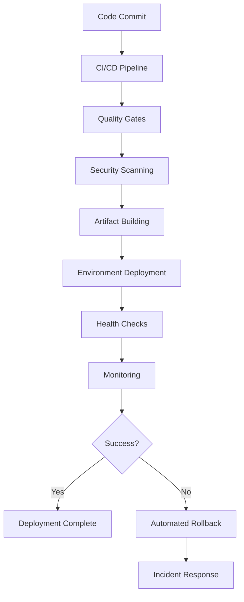

# Comprehensive Deployment & Release Automation Guide

## Overview

This guide covers the complete deployment and release automation system implemented for the TaskManager API project. The system provides end-to-end automation from code commit to production deployment with comprehensive security, monitoring, and rollback capabilities.

## Table of Contents

1. [Architecture Overview](#architecture-overview)
2. [Deployment Workflows](#deployment-workflows)
3. [Environment Management](#environment-management)
4. [Security Implementation](#security-implementation)
5. [Monitoring & Health Checks](#monitoring--health-checks)
6. [Rollback Mechanisms](#rollback-mechanisms)
7. [Artifact Management](#artifact-management)
8. [Getting Started](#getting-started)
9. [Troubleshooting](#troubleshooting)
10. [Best Practices](#best-practices)

## Architecture Overview

The deployment automation system consists of several interconnected components:



### Key Components

- **Release Workflow**: Automated semantic versioning and release creation
- **Environment Management**: Development, Staging, Production with specific configurations
- **Security Integration**: SAST, DAST, dependency scanning, compliance checks
- **Artifact Management**: Versioned build artifacts with lifecycle management
- **Monitoring System**: Real-time health checks and performance monitoring
- **Rollback Automation**: Automated failure detection and rollback procedures

## Deployment Workflows

### 1. Release & Deployment Workflow

**File**: `.github/workflows/release-deployment.yml`

This is the main deployment workflow that orchestrates the entire release process.

#### Trigger Conditions

- **Tag-based releases**: Automatically triggered on version tags (`v*.*.*`)
- **Manual dispatch**: Triggered via GitHub Actions UI with customizable parameters

#### Workflow Jobs

1. **Release Validation & Preparation**
   - Validates release prerequisites
   - Determines version and environment
   - Generates release notes
   - Creates artifact metadata

2. **Quality Gates**
   - Runs comprehensive test suite
   - Validates coverage thresholds
   - Performs security audit
   - Checks application startup

3. **Build & Package Artifacts**
   - Creates production build
   - Generates deployment archive
   - Creates checksums and metadata
   - Uploads to artifact registry

4. **Environment-Specific Deployment**
   - Downloads and verifies artifacts
   - Configures environment
   - Executes deployment
   - Runs post-deployment health checks

5. **GitHub Release Creation**
   - Creates GitHub release (for production)
   - Uploads release assets
   - Publishes release notes

#### Usage Examples

```bash
# Manual deployment to staging
gh workflow run release-deployment.yml \
  -f environment=staging \
  -f version_type=patch \
  -f create_release=false

# Production deployment (tag-triggered)
git tag v1.2.3
git push origin v1.2.3
```

### 2. Artifact Management Workflow

**File**: `.github/workflows/artifact-management.yml`

Manages the lifecycle of deployment artifacts.

#### Supported Operations

- **Store**: Upload and catalog artifacts
- **Retrieve**: Download specific artifact versions
- **Cleanup**: Remove expired artifacts
- **Promote**: Move artifacts between environments
- **Validate**: Check artifact integrity

#### Usage Examples

```bash
# Store an artifact
gh workflow run artifact-management.yml \
  -f action=store \
  -f artifact_name=taskmanager-v1.2.3-staging-20241201 \
  -f environment=staging

# Cleanup expired artifacts
gh workflow run artifact-management.yml \
  -f action=cleanup \
  -f cleanup_days=30
```

### 3. Rollback Automation

**File**: `.github/workflows/rollback-automation.yml`

Provides automated rollback capabilities for failed deployments.

#### Rollback Process

1. **Preparation & Validation**
   - Analyzes current deployment state
   - Validates rollback target
   - Creates rollback plan

2. **Pre-Rollback Backup**
   - Backs up current state
   - Verifies backup integrity
   - Prepares restoration point

3. **Rollback Execution**
   - Retrieves target version
   - Executes deployment rollback
   - Runs health checks

4. **Post-Rollback Monitoring**
   - Monitors application metrics
   - Generates rollback report
   - Sends notifications

#### Usage Examples

```bash
# Emergency rollback
gh workflow run rollback-automation.yml \
  -f deployment_id=deploy-12345 \
  -f environment=production \
  -f rollback_reason=critical_bug

# Rollback to specific version
gh workflow run rollback-automation.yml \
  -f deployment_id=deploy-12345 \
  -f environment=staging \
  -f rollback_reason=performance_degradation \
  -f target_version=v1.2.2
```

## Environment Management

### Environment Configurations

Each environment has specific configuration files in `.github/environments/`:

#### Development Environment

- **Auto-deployment**: Enabled
- **Reviewers**: None required
- **Resources**: Limited (0.5 CPU, 512Mi memory)
- **Monitoring**: Basic
- **Rollback**: Automatic on failure

#### Staging Environment

- **Auto-deployment**: Manual approval required
- **Reviewers**: 1 required
- **Resources**: Standard (1.0 CPU, 1Gi memory)
- **Monitoring**: Comprehensive
- **Deployment window**: Business hours only

#### Production Environment

- **Auto-deployment**: Manual approval required
- **Reviewers**: 2 required
- **Wait timer**: 24 hours minimum
- **Resources**: High availability (2.0 CPU, 4Gi memory)
- **Monitoring**: Full observability
- **Deployment window**: Tuesday-Thursday only

### Environment Variables

Environment-specific configurations are managed through GitHub Environments:

```yaml
# Development
NODE_ENV: development
LOG_LEVEL: debug
API_PORT: 3001
RATE_LIMIT_ENABLED: false

# Staging
NODE_ENV: staging
LOG_LEVEL: info
API_PORT: 3002
RATE_LIMIT_ENABLED: true

# Production
NODE_ENV: production
LOG_LEVEL: warn
API_PORT: 3000
RATE_LIMIT_ENABLED: true
SECURE_COOKIES: true
```

## Security Implementation

### Security Scanning Workflow

**File**: `.github/workflows/secure-deployment.yml`

Implements comprehensive security validation before deployment.

#### Security Scans

1. **Static Application Security Testing (SAST)**
   - Uses Semgrep with multiple rulesets
   - Scans for OWASP Top 10 vulnerabilities
   - Language-specific security patterns

2. **Dependency Security Scanning**
   - npm audit for known vulnerabilities
   - Retire.js for outdated libraries
   - Dependency license compliance

3. **Secret Detection**
   - Scans for hardcoded secrets
   - API keys and credentials detection
   - Private key identification

4. **Container Security**
   - Base image vulnerability scanning
   - Configuration best practices
   - Runtime security policies

5. **Compliance Checks**
   - SOC 2 compliance validation
   - ISO 27001 requirements
   - PCI-DSS standards (if applicable)

#### Security Thresholds

```yaml
# Deployment blocking thresholds
Critical Vulnerabilities: 0
High Vulnerabilities: ≤ 3
Security Score: ≥ 70/100
Compliance Status: Must be "compliant"
```

#### Runtime Security Configuration

The system automatically generates environment-specific security configurations:

- **Security Headers**: HSTS, CSP, X-Frame-Options
- **Rate Limiting**: Environment-appropriate limits
- **Session Management**: Secure cookie settings
- **Input Validation**: XSS and SQL injection protection
- **TLS Configuration**: Modern cipher suites and protocols

## Monitoring & Health Checks

### Monitoring Workflow

**File**: `.github/workflows/monitoring-health-checks.yml`

Provides continuous monitoring and health validation.

#### Health Check Endpoints

```json
{
  "endpoints": [
    {
      "name": "api_health",
      "url": "/health",
      "method": "GET",
      "expectedStatus": 200,
      "critical": true
    },
    {
      "name": "api_ready",
      "url": "/ready",
      "method": "GET",
      "expectedStatus": 200,
      "critical": true
    },
    {
      "name": "taskmanager_status",
      "url": "/status",
      "method": "GET",
      "expectedStatus": 200,
      "critical": false
    }
  ]
}
```

#### Performance Monitoring

- **Response Time**: P50, P95, P99 percentiles
- **Throughput**: Requests per second
- **Error Rate**: Percentage of failed requests
- **Resource Usage**: CPU, memory, disk utilization

#### Alerting Configuration

```yaml
Thresholds:
  Response Time P95: ≤ 500ms
  Error Rate: ≤ 2.0%
  CPU Usage: ≤ 80%
  Memory Usage: ≤ 85%
  Uptime: ≥ 99.9%
```

#### Alert Channels

- **Slack**: Real-time notifications
- **Email**: Digest and escalation
- **PagerDuty**: Critical incidents (production)
- **GitHub Issues**: Automated issue creation

## Rollback Mechanisms

### Automated Rollback Triggers

The system automatically triggers rollbacks based on:

1. **Health Check Failures**
   - API endpoint failures
   - Application startup failures
   - Database connectivity issues

2. **Performance Degradation**
   - Response time above thresholds
   - High error rates
   - Resource exhaustion

3. **Security Incidents**
   - Security scan failures
   - Vulnerability detection
   - Compliance violations

### Rollback Process

1. **Detection**: Monitoring systems detect issues
2. **Assessment**: Automated analysis of failure severity
3. **Decision**: Auto-rollback for critical issues
4. **Execution**: Automated rollback to last known good state
5. **Verification**: Health checks confirm successful rollback
6. **Notification**: Alert stakeholders of rollback completion

### Manual Rollback

Emergency rollbacks can be triggered manually:

```bash
# Critical production issue
gh workflow run rollback-automation.yml \
  -f deployment_id=latest \
  -f environment=production \
  -f rollback_reason=critical_bug \
  -f force_rollback=true
```

## Artifact Management

### Artifact Lifecycle

1. **Creation**: Generated during build process
2. **Storage**: Uploaded to artifact registry
3. **Metadata**: Tagged with version, environment, checksums
4. **Promotion**: Moved between environments
5. **Retention**: Automatically cleaned based on policies
6. **Cleanup**: Expired artifacts removed

### Artifact Structure

```
artifact-name/
├── application/          # Application code
├── configuration/        # Environment configs
├── metadata.json        # Artifact metadata
├── checksums.sha256     # Integrity verification
└── deployment-info.json # Deployment information
```

### Storage Policies

- **Development**: 7 days retention
- **Staging**: 30 days retention
- **Production**: 365 days retention
- **Storage Quota**: 50GB limit with automated cleanup

## Getting Started

### Prerequisites

1. **GitHub Repository**: With Actions enabled
2. **Environment Secrets**: Configure required secrets
3. **Branch Protection**: Set up branch protection rules
4. **Approval Teams**: Configure review teams

### Initial Setup

1. **Configure Environments**:

   ```bash
   # Create GitHub environments
   gh api repos/:owner/:repo/environments/development -X PUT
   gh api repos/:owner/:repo/environments/staging -X PUT
   gh api repos/:owner/:repo/environments/production -X PUT
   ```

2. **Set Environment Secrets**:

   ```bash
   # Example secret configuration
   gh secret set DATABASE_URL --env production
   gh secret set JWT_SECRET --env production
   gh secret set MONITORING_API_KEY --env production
   ```

3. **Configure Branch Protection**:
   ```bash
   gh api repos/:owner/:repo/branches/main/protection -X PUT \
     --input branch-protection.json
   ```

### First Deployment

1. **Create Initial Release**:

   ```bash
   git tag v1.0.0
   git push origin v1.0.0
   ```

2. **Monitor Deployment**:
   - Check GitHub Actions for workflow progress
   - Monitor environment-specific dashboards
   - Verify health checks pass

3. **Validate Deployment**:
   ```bash
   # Test API endpoints
   curl https://staging.taskmanager.example.com/health
   curl https://staging.taskmanager.example.com/status
   ```

## Troubleshooting

### Common Issues

#### Deployment Failures

**Symptom**: Deployment workflow fails
**Solutions**:

1. Check quality gates (tests, coverage, security)
2. Verify environment configuration
3. Check artifact integrity
4. Review deployment logs

#### Health Check Failures

**Symptom**: Post-deployment health checks fail
**Solutions**:

1. Check application logs
2. Verify database connectivity
3. Check environment variables
4. Review security configurations

#### Rollback Issues

**Symptom**: Rollback fails to complete
**Solutions**:

1. Check target version availability
2. Verify backup integrity
3. Manual intervention may be required
4. Contact DevOps team

### Debugging Commands

```bash
# Check workflow status
gh run list --workflow=release-deployment.yml

# View workflow logs
gh run view --log

# Check artifact status
gh workflow run artifact-management.yml -f action=list

# Validate security configuration
gh workflow run secure-deployment.yml -f security_action=compliance_check
```

### Emergency Procedures

#### Production Emergency

1. **Immediate Response**:

   ```bash
   # Emergency rollback
   gh workflow run rollback-automation.yml \
     -f deployment_id=latest \
     -f environment=production \
     -f rollback_reason=critical_bug \
     -f force_rollback=true
   ```

2. **Communication**:
   - Notify stakeholders immediately
   - Update status page
   - Create incident ticket

3. **Investigation**:
   - Collect logs and metrics
   - Analyze root cause
   - Document lessons learned

## Best Practices

### Development Workflow

1. **Feature Branches**: Use feature branches for development
2. **Pull Requests**: Require PR reviews before merging
3. **Automated Testing**: Ensure comprehensive test coverage
4. **Security Scanning**: Run security scans on every commit

### Release Management

1. **Semantic Versioning**: Use semantic versioning for releases
2. **Release Notes**: Generate comprehensive release notes
3. **Staged Rollouts**: Deploy to staging before production
4. **Monitoring**: Monitor deployments closely

### Security Practices

1. **Regular Scans**: Run security scans frequently
2. **Dependency Updates**: Keep dependencies up to date
3. **Secret Management**: Use secure secret management
4. **Compliance**: Maintain compliance with regulations

### Monitoring and Alerting

1. **Comprehensive Coverage**: Monitor all critical metrics
2. **Appropriate Thresholds**: Set realistic alert thresholds
3. **Escalation Procedures**: Define clear escalation paths
4. **Regular Reviews**: Review and update monitoring regularly

### Documentation

1. **Keep Updated**: Maintain current documentation
2. **Runbooks**: Create operational runbooks
3. **Incident Reports**: Document incidents and resolutions
4. **Training**: Train team members on procedures

## Conclusion

This deployment automation system provides a comprehensive, secure, and reliable approach to software delivery. It includes automated quality gates, security validation, environment management, monitoring, and rollback capabilities.

The system is designed to:

- **Reduce manual effort** through automation
- **Improve reliability** through comprehensive testing
- **Enhance security** through integrated scanning
- **Enable fast recovery** through automated rollbacks
- **Provide visibility** through comprehensive monitoring

For additional support or questions, please refer to the project documentation or contact the DevOps team.
