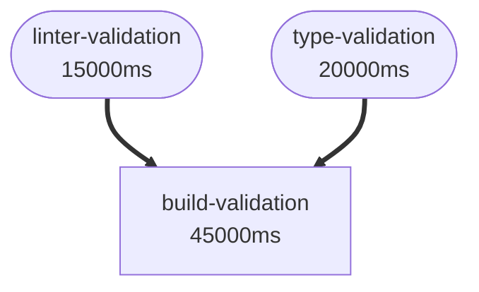

# Validation Dependency Management System

A comprehensive system for managing validation dependencies, optimizing parallel execution, and providing advanced debugging and visualization tools for the Stop Hook Validation framework.

## Table of Contents

- [Overview](#overview)
- [Architecture](#architecture)
- [Core Features](#core-features)
- [API Reference](#api-reference)
- [Command Line Interface](#command-line-interface)
- [Configuration](#configuration)
- [Visualization Tools](#visualization-tools)
- [Performance Optimization](#performance-optimization)
- [Advanced Features](#advanced-features)
- [Testing](#testing)
- [Troubleshooting](#troubleshooting)
- [Examples](#examples)

## Overview

The Validation Dependency Management System provides sophisticated dependency tracking, parallel execution planning, and intelligent optimization for validation workflows. It enables complex validation scenarios while maintaining reliability and performance.

### Key Benefits

- **Intelligent Dependency Management**: Define complex dependency relationships with different types (strict, weak, optional)
- **Optimized Parallel Execution**: Automatically generate optimal execution plans that maximize concurrency while respecting dependencies
- **Advanced Visualization**: Generate interactive diagrams in multiple formats (Mermaid, Graphviz, ASCII, JSON)
- **Performance Analytics**: Real-time monitoring, execution analytics, and optimization recommendations
- **Resource Management**: Intelligent resource allocation and conflict detection
- **Adaptive Planning**: System-aware execution planning that adapts to available resources

## Architecture

### Core Components

```
┌─────────────────────────────────────────────────────────────┐
│                    TaskManager API                          │
├─────────────────────────────────────────────────────────────┤
│              ValidationDependencyManager                    │
├─────────────────────────────────────────────────────────────┤
│  Dependency   │  Execution  │  Visualization │  Analytics  │
│  Management   │  Planning   │  & Debugging   │ & Monitoring │
└─────────────────────────────────────────────────────────────┘
```

### Dependency Types

- **STRICT**: Must complete successfully before dependents can start
- **WEAK**: Should complete before dependents, but failure doesn't block
- **OPTIONAL**: Preferred to complete first, but can run in parallel

### Resource Types

- **filesystem**: File system operations
- **network**: Network-dependent operations
- **cpu**: CPU-intensive operations
- **memory**: Memory-intensive operations
- **ports**: Operations requiring specific ports

## Core Features

### 1. Dependency Configuration

Define validation criteria with dependencies:

```javascript
const dependencyConfig = {
  dependencies: [
    { criterion: 'linter-validation', type: 'strict' },
    { criterion: 'security-validation', type: 'weak' }
  ],
  description: 'Build validation with dependencies',
  estimatedDuration: 45000,
  parallelizable: false,
  resourceRequirements: ['filesystem', 'cpu', 'memory']
};
```

### 2. Execution Planning

Generate optimized execution plans:

```javascript
const executionPlan = manager.generateParallelExecutionPlan(criteria, maxConcurrency);

// Results include:
// - Execution waves with optimal concurrency
// - Resource utilization analysis
// - Load balancing metrics
// - Parallelization efficiency gains
```

### 3. Real-time Monitoring

Execute with comprehensive monitoring:

```javascript
const result = await manager.executeParallelValidationPlan(executionPlan, {
  onWaveStart: (info) => console.log(`Starting wave ${info.wave}`),
  onCriterionComplete: (info) => console.log(`Completed ${info.criterion}`),
  onError: (info) => console.error(`Failed ${info.criterion}: ${info.error}`)
});
```

## API Reference

### ValidationDependencyManager

#### Constructor

```javascript
const manager = new ValidationDependencyManager(options);
```

**Options:**
- `projectRoot` (string): Project root directory path

#### Core Methods

##### addDependency(criterion, config)

Add or update a dependency configuration.

```javascript
manager.addDependency('custom-validation', {
  dependencies: [
    { criterion: 'linter-validation', type: 'strict' }
  ],
  description: 'Custom validation step',
  estimatedDuration: 15000,
  parallelizable: true,
  resourceRequirements: ['filesystem']
});
```

##### validateDependencyGraph()

Validate the dependency graph for cycles and invalid references.

```javascript
const validation = manager.validateDependencyGraph();
// Returns: { valid: boolean, issues: Array }
```

##### generateParallelExecutionPlan(criteria, maxConcurrency)

Generate an optimized parallel execution plan.

```javascript
const plan = manager.generateParallelExecutionPlan(null, 4);
// Returns comprehensive execution plan with waves, metrics, and recommendations
```

##### generateInteractiveVisualization(format)

Generate interactive visualizations in various formats.

```javascript
const mermaid = manager.generateInteractiveVisualization('mermaid');
const ascii = manager.generateInteractiveVisualization('ascii');
```

**Supported formats:** `mermaid`, `graphviz`, `json`, `ascii`

#### Advanced Methods

##### generateAdaptiveExecutionPlan(criteria, systemInfo)

Generate system-aware execution plans.

```javascript
const adaptivePlan = manager.generateAdaptiveExecutionPlan(null, {
  availableCPUs: 8,
  availableMemory: 8 * 1024 * 1024 * 1024,
  networkLatency: 10,
  diskIOLoad: 0.3
});
```

##### executeParallelValidationPlan(executionPlan, options)

Execute validation plan with real-time monitoring.

```javascript
const result = await manager.executeParallelValidationPlan(plan, {
  onWaveStart: (info) => { /* handle wave start */ },
  onCriterionComplete: (info) => { /* handle completion */ },
  timeout: 300000,
  maxRetries: 2
});
```

### TaskManager API Integration

#### Validation Dependency Methods

- `getValidationDependencies()` - Get all dependency configurations
- `updateValidationDependency(criterion, config)` - Update dependency
- `generateValidationExecutionPlan(criteria, maxConcurrency)` - Generate plan
- `validateDependencyGraph()` - Validate graph integrity
- `getDependencyVisualization()` - Get visualization data

#### Enhanced Methods

- `generateInteractiveVisualization(format)` - Generate interactive visualizations
- `generateDependencyAnalysisReport()` - Comprehensive analysis report
- `executeParallelValidation(criteria, options)` - Execute with monitoring

## Command Line Interface

### Basic Commands

```bash
# Get current dependencies
node taskmanager-api.js get-validation-dependencies

# Generate execution plan
node taskmanager-api.js generate-validation-execution-plan

# Validate dependency graph
node taskmanager-api.js validate-dependency-graph

# Get visualization data
node taskmanager-api.js get-dependency-visualization
```

### Visualization Commands

```bash
# Generate Mermaid diagram
node taskmanager-api.js generate-interactive-visualization mermaid

# Generate ASCII diagram for terminal
node taskmanager-api.js generate-interactive-visualization ascii

# Generate comprehensive analysis
node taskmanager-api.js generate-dependency-analysis-report
```

### Configuration Commands

```bash
# Update dependency
node taskmanager-api.js update-validation-dependency "criterion-name" '{
  "dependencies": [{"criterion": "other", "type": "strict"}],
  "description": "Custom validation",
  "estimatedDuration": 10000,
  "parallelizable": true,
  "resourceRequirements": ["filesystem"]
}'

# Execute parallel validation
node taskmanager-api.js execute-parallel-validation '["criterion1", "criterion2"]'
```

## Configuration

### Default Validation Criteria

The system includes default validation criteria:

- **focused-codebase**: Validates only user-outlined features exist
- **security-validation**: Runs security scans and vulnerability checks
- **linter-validation**: Runs code linting and style checks
- **type-validation**: Runs type checking and compilation checks
- **build-validation**: Tests application build process
- **start-validation**: Tests application startup capabilities
- **test-validation**: Runs automated test suites

### Configuration File

Dependencies are automatically saved to `.validation-dependencies.json`:

```json
{
  "version": "1.0.0",
  "lastUpdated": "2025-09-27T04:42:10.444Z",
  "dependencies": {
    "criterion-name": {
      "criterion": "criterion-name",
      "dependencies": [...],
      "metadata": {...}
    }
  }
}
```

### Custom Configuration

```javascript
// Add custom validation pipeline
const customPipeline = [
  {
    name: 'environment-setup',
    config: {
      dependencies: [],
      description: 'Initialize environment',
      estimatedDuration: 5000,
      parallelizable: true,
      resourceRequirements: ['filesystem']
    }
  },
  {
    name: 'code-analysis',
    config: {
      dependencies: [
        { criterion: 'environment-setup', type: 'strict' }
      ],
      description: 'Static code analysis',
      estimatedDuration: 20000,
      parallelizable: true,
      resourceRequirements: ['filesystem', 'cpu']
    }
  }
];

// Add to manager
for (const step of customPipeline) {
  manager.addDependency(step.name, step.config);
}
```

## Visualization Tools

### Mermaid Diagrams

Interactive web-based diagrams with color coding:



### ASCII Diagrams

Terminal-friendly visualization:

```
Validation Dependency Diagram
═══════════════════════════════════════

Level 0:
  ⚡ 🏃 Focused Codebase (5000ms)
  ⚡ 🚶 Security Validation (30000ms)
  ⚡ 🚶 Linter Validation (15000ms)

Level 1:
  ⚡ 🚶 Type Validation (20000ms)
    Dependencies: ━━> linter-validation

Level 2:
  🔒 🐌 Build Validation (45000ms)
    Dependencies: ━━> linter-validation, ━━> type-validation

Legend:
  ⚡ = Parallelizable, 🔒 = Sequential
  🏃 = Fast (<10s), 🚶 = Medium (10-30s), 🐌 = Slow (>30s)
  ━━> = Strict dependency, ┅┅> = Weak dependency
```

### Comprehensive Analysis

JSON format includes detailed debugging information:

```json
{
  "visualization": { /* graph data */ },
  "debugInfo": {
    "dependencyChains": [ /* longest chains */ ],
    "resourceConflicts": [ /* potential conflicts */ ],
    "parallelizationOpportunities": [ /* optimization opportunities */ ],
    "criticalPaths": [ /* performance bottlenecks */ ],
    "optimizationSuggestions": [ /* actionable recommendations */ ]
  }
}
```

## Performance Optimization

### Execution Efficiency

The system provides multiple optimization strategies:

#### Resource Pool Management

```javascript
const resourcePools = {
  filesystem: { maxConcurrent: 4, current: 0 },
  network: { maxConcurrent: 2, current: 0 },
  cpu: { maxConcurrent: 3, current: 0 },
  memory: { maxConcurrent: 2, current: 0 },
  ports: { maxConcurrent: 1, current: 0 }
};
```

#### Priority Scheduling

Criteria are prioritized based on:
- Number of dependents (higher priority for blocking criteria)
- Estimated duration (longer tasks start earlier)
- Resource requirements (fewer resources = easier to schedule)

#### Load Balancing

The system calculates load balance scores and provides recommendations:
- Balance score: 1.0 = perfect balance, lower = more imbalanced
- Recommendations for splitting long tasks or adjusting durations

### Adaptive Planning

System-aware execution planning adapts to:

```javascript
const systemInfo = {
  availableCPUs: 8,              // CPU cores available
  availableMemory: 8 * 1024³,    // Memory in bytes
  networkLatency: 10,            // Network latency in ms
  diskIOLoad: 0.3                // Disk I/O load (0-1)
};

const adaptivePlan = manager.generateAdaptiveExecutionPlan(null, systemInfo);
```

**Optimizations include:**
- CPU-based concurrency limits
- Memory-aware task scheduling
- Network latency adaptations
- Disk I/O load management

## Advanced Features

### Real-time Execution Monitoring

```javascript
const executionResult = await manager.executeParallelValidationPlan(plan, {
  onWaveStart: (info) => {
    console.log(`Wave ${info.wave}: ${info.concurrency} parallel tasks`);
  },
  onCriterionStart: (info) => {
    console.log(`Starting ${info.criterion} (estimated ${info.estimatedDuration}ms)`);
  },
  onCriterionComplete: (info) => {
    console.log(`Completed ${info.criterion} in ${info.duration}ms - ${info.status}`);
  },
  onWaveComplete: (info) => {
    console.log(`Wave ${info.wave}: ${info.successCount}/${info.totalCount} successful`);
  },
  onError: (info) => {
    console.error(`Failed ${info.criterion}: ${info.error}`);
  }
});
```

### Dependency Chain Analysis

Automatically identifies:
- Longest dependency chains
- Critical paths that block execution
- Opportunities for parallelization
- Resource bottlenecks

### Optimization Recommendations

The system generates actionable recommendations:

```javascript
const analysis = manager.generateInteractiveVisualization('json');
const suggestions = analysis.debugInfo.optimizationSuggestions;

// Example recommendations:
// - "Consider parallelizing tasks or reducing dependency strictness"
// - "Stagger execution of filesystem-intensive tasks"
// - "Run network-dependent validations after local validations"
```

### Error Recovery

- **Graceful Failure Handling**: Continue execution when non-critical validations fail
- **Retry Logic**: Configurable retry attempts for failed validations
- **State Recovery**: Maintain execution state during failures
- **Critical Path Protection**: Halt execution only for critical failures

## Testing

### Test Coverage

Comprehensive test suite with 275+ test cases:

- **Unit Tests**: Core functionality, edge cases, error handling
- **Integration Tests**: API integration, CLI commands, workflows
- **End-to-End Tests**: Complete workflows, performance, stress testing

### Running Tests

```bash
# Run all tests
npm test

# Run specific test categories
npx jest --project=unit
npx jest --project=integration
npx jest --project=e2e

# Run with coverage
npm run test:coverage

# Run performance tests
npm run test:performance
```

### Test Configuration

```javascript
// jest.config.js
module.exports = {
  coverageThreshold: {
    global: { branches: 80, functions: 80, lines: 80, statements: 80 },
    './lib/validation-dependency-manager.js': {
      branches: 85, functions: 90, lines: 90, statements: 90
    }
  }
};
```

## Troubleshooting

### Common Issues

#### Circular Dependencies

**Problem**: Validation fails with circular dependency error.

**Solution**:
```bash
# Check dependency graph
node taskmanager-api.js validate-dependency-graph

# View visualization to identify cycles
node taskmanager-api.js generate-interactive-visualization ascii
```

#### Resource Conflicts

**Problem**: Tasks fail due to resource conflicts.

**Solution**:
```bash
# Generate analysis report
node taskmanager-api.js generate-dependency-analysis-report

# Look for resource optimization recommendations
```

#### Poor Performance

**Problem**: Execution is slower than expected.

**Solution**:
1. Check parallelization efficiency in execution plan
2. Review resource utilization metrics
3. Consider system-adaptive planning
4. Optimize dependency strictness

### Debug Information

Enable verbose logging:

```javascript
const plan = manager.generateParallelExecutionPlan(null, 4);
console.log('Parallelization gain:', plan.parallelizationGain.toFixed(1) + '%');
console.log('Average concurrency:', plan.efficiency.averageConcurrency.toFixed(1));
console.log('Recommendations:', plan.recommendations.length);
```

### Performance Tuning

1. **Optimize Concurrency**: Start with system CPU count, adjust based on resource conflicts
2. **Adjust Dependencies**: Use 'weak' instead of 'strict' where appropriate
3. **Resource Planning**: Stagger resource-intensive tasks
4. **Duration Estimates**: Accurate estimates improve scheduling

## Examples

### Basic Usage

```javascript
const { ValidationDependencyManager } = require('./lib/validation-dependency-manager');

// Initialize manager
const manager = new ValidationDependencyManager({ projectRoot: process.cwd() });

// Add custom validation
manager.addDependency('api-tests', {
  dependencies: [
    { criterion: 'build-validation', type: 'strict' }
  ],
  description: 'API integration tests',
  estimatedDuration: 30000,
  parallelizable: true,
  resourceRequirements: ['network', 'filesystem']
});

// Generate execution plan
const plan = manager.generateParallelExecutionPlan();
console.log(`Execution plan: ${plan.totalWaves} waves, ${plan.parallelizationGain.toFixed(1)}% efficiency gain`);

// Visualize dependencies
const ascii = manager.generateInteractiveVisualization('ascii');
console.log(ascii.diagram);
```

### Advanced Workflow

```javascript
// Create complex validation pipeline
const pipeline = [
  {
    name: 'setup',
    config: {
      dependencies: [],
      description: 'Environment setup',
      estimatedDuration: 5000,
      parallelizable: true,
      resourceRequirements: ['filesystem']
    }
  },
  {
    name: 'lint',
    config: {
      dependencies: [{ criterion: 'setup', type: 'strict' }],
      description: 'Code linting',
      estimatedDuration: 15000,
      parallelizable: true,
      resourceRequirements: ['filesystem']
    }
  },
  {
    name: 'test',
    config: {
      dependencies: [{ criterion: 'lint', type: 'strict' }],
      description: 'Unit tests',
      estimatedDuration: 25000,
      parallelizable: false,
      resourceRequirements: ['filesystem', 'cpu']
    }
  }
];

// Add pipeline to manager
for (const step of pipeline) {
  manager.addDependency(step.name, step.config);
}

// Generate adaptive plan
const systemInfo = {
  availableCPUs: require('os').cpus().length,
  availableMemory: require('os').freemem(),
  networkLatency: 10,
  diskIOLoad: 0.3
};

const adaptivePlan = manager.generateAdaptiveExecutionPlan(
  pipeline.map(s => s.name),
  systemInfo
);

// Execute with monitoring
const result = await manager.executeParallelValidationPlan(adaptivePlan, {
  onWaveComplete: (info) => console.log(`Wave ${info.wave} completed`),
  timeout: 120000
});

console.log(`Pipeline completed: ${result.success ? 'SUCCESS' : 'FAILED'}`);
if (result.success) {
  console.log(`Total time: ${result.summary.totalDuration}ms`);
  console.log(`Parallelization gain: ${result.summary.parallelizationGain.toFixed(1)}%`);
}
```

### CI/CD Integration

```bash
#!/bin/bash
# ci-validation.sh

# Generate execution plan
PLAN=$(node taskmanager-api.js generate-validation-execution-plan)
echo "Execution plan generated"

# Validate dependencies
VALIDATION=$(node taskmanager-api.js validate-dependency-graph)
if [[ $(echo $VALIDATION | jq -r '.validation.valid') != "true" ]]; then
  echo "Dependency validation failed"
  exit 1
fi

# Generate analysis report
node taskmanager-api.js generate-dependency-analysis-report > validation-report.json

# Execute validations
node taskmanager-api.js execute-parallel-validation
```

---

## Contributing

When contributing to the validation dependency management system:

1. **Add Tests**: All new features must include comprehensive tests
2. **Update Documentation**: Keep this documentation current with changes
3. **Performance Testing**: Validate performance impact of changes
4. **Visualization**: Ensure new features integrate with visualization tools

## License

This system is part of the Stop Hook Validation framework and follows the same licensing terms as the parent project.